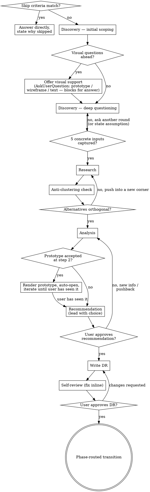

# AI-DLC Brainstorming & Decision-Making

Structured brainstorming to find optimal solutions while maintaining brutal honesty about feasibility and trade-offs. Every recommendation honors **YAGNI**, **KISS**, and **DRY**.

**Hard gate — advise, don't implement.** This skill evaluates decisions and records them. It never writes implementation code, scaffolds projects, or invokes implementation skills — however simple the winning option looks. The terminal state of every session is the phase-routed [Transition](#transition); implementation begins there, after the DR is approved. (Rendering decision *artifacts* — wireframes, prototypes for comparison — is part of brainstorming, not implementation.)

## When to Skip This Skill

A Decision Record is overhead. If the situation doesn't merit one, say so and answer directly — wasting the user's time on ceremony erodes trust. Skip the full workflow when:

- **The user has clearly already decided** and is asking for execution ("we're going with Postgres, help me set it up"). Acknowledge the choice, raise one concern if you have a real one, and move on.
- **There's only one realistic option** given the constraints. Name the constraint, confirm, and proceed.
- **The decision is trivially reversible and low-blast-radius** (a variable name, a log format, a CSS unit). Pick a default, mention you picked it, and move on.
- **It's a factual question, not a decision** ("what does ETag do?"). Answer it.
- **A prior DR already settled this** — link to it and proceed unless something has materially changed.
- **The user asks to create detailed user stories, requirements, or acceptance criteria** and no directional decision is unresolved. Route to `aidlc-requirements-engineering` instead.

If you skip, say *why* in one sentence so the user can push back if they actually wanted the full workflow.

## Setup

Before the first question:

- **User-story boundary:** if the user asks to brainstorm user stories, treat it as an Inception direction decision: clarify scope, compare decomposition/prioritization approaches, and capture the chosen direction in a DR. Do not write detailed user stories, story IDs, personas, or Given/When/Then acceptance criteria in this skill; transition to `aidlc-requirements-engineering` after the approach is approved, passing the saved DR path as its input.
- Load `aidlc-docs/foundation/*` if present — prevents decisions that contradict established patterns. Priority: project-overview, system-architecture, code-standards, codebase-summary, uiux-guideline (if UI-related).
- **Scout the codebase** when Foundation docs are missing or stale, or when the decision touches existing code: check the manifest (`package.json`, `pyproject.toml`, `go.mod`, …), the modules the decision would touch, patterns already in use for similar problems, and related in-flight specs under `aidlc-docs/specs/`. Then summarize what you found to the user in 3–6 bullets — *"here's what I found relevant to this decision"* — before deep questioning begins. Questions asked without codebase context get vague answers back; scout first so every question is specific.
- Scan `aidlc-docs/brainstorming/` for prior DRs on this topic — don't re-debate settled questions.
- **Design-system detection** (gates the Prototype tier): note whether *any* design system is present — evident in the current context (named in the request/foundation, or a component/token library in `package.json`/imports, e.g. MUI, Chakra, Magenta/MDS — examples only) or documented in `aidlc-docs/foundation/uiux-guideline.md`. See [`references/prototype-tier.md`](references/prototype-tier.md).
- Identify the project's lifecycle stage. For AI-DLC projects this is Foundation / Inception / Construction; for other projects use your team's equivalent (e.g., concept / scope / build). This drives the transition step at the end.
- **Scope check:** if the request bundles independent decisions ("tech stack AND deployment AND pricing"), use the `AskUserQuestion` tool to present each as a choice and ask which to tackle first. Each gets its own session and DR.

DRs are saved to `aidlc-docs/brainstorming/NNNN-kebab-title.md` with sequential numbering regardless of phase.

## Brutal Honesty (applies in every phase)

You're the trusted advisor, not a yes-machine. Challenge initial preferences when evidence doesn't support them. Be unsparing about cons of *recommended* options — same voice as for discarded ones. Surface hidden assumptions the moment you spot them. Consider 10× scale and 18-month implications, not just today's problem.

A confirmed-but-wrong decision is worse than a re-debated one.

## Brainstorming Workflow

### Workflow Checklist

Create a task for each of these and complete them in order. The checklist makes phase progression observable — both you and the user can see where you are.

1. **Discovery — initial scoping** — establish problem, constraints, success criteria from the user's request, loaded Foundation docs, and the Setup codebase scout (share the 3–6 bullet scout summary when the decision touches existing code); do the Decompose-Before-You-Refine check
2. **Offer visual support** — if upcoming questions involve visual content, offer the tier via `AskUserQuestion` (blocks for the answer — see [`## Visual Companion`](#visual-companion) for tier options and ordering). Skip entirely when the upcoming questions are textual.
3. **Discovery — deep questioning** — one question at a time using the `AskUserQuestion` tool (preferred for finite-choice questions; fall back to free text only if the answer space is genuinely open). Use terminal or browser per question based on the test "would the user understand this better by seeing it?" Loop until the concrete-inputs gate passes (five one-sentence answers — see Phase 1)
4. **Research** — gather LLM knowledge + targeted web research where current/specific info is needed
5. **Anti-clustering check** — verify alternatives are genuinely orthogonal (see Phase 2)
6. **Analysis** — pros/cons/complexity/YAGNI alignment for each viable option
7. **Prototype render & review** *(only if the Prototype tier was accepted at step 2)* — **read [`references/prototype-tier.md`](references/prototype-tier.md) in full before acting** (the flow has exact mechanics not captured here). Hard gate: do not advance to Recommendation until the HTML has been rendered and shown — the user agreed to see it first.
8. **Recommendation** — lead with your recommended option, show each viable option's pros/cons and complexity in visible text, be honest about what you're giving up, invite pushback
9. **Approval of recommendation** — get the user's explicit alignment on the choice *before* writing anything down. If they push back with new info, return to Analysis (or earlier). Don't write the DR while the recommendation is still being debated.
10. **Write the DR** — pick lite vs full template, fill the skeleton
11. **Self-review** — placeholder scan, decision clarity, internal consistency, scope, reversibility (see *After the DR*)
12. **User review of the written DR** — confirm the document accurately captures what was agreed; this is a different gate from step 9 (recommendation alignment vs document fidelity)
13. **Transition** — phase-routed next step (Foundation doc / `aidlc-requirements-engineering` / `aidlc-spec-driven`); do **not** invoke other skills before this point

### Process Flow

<!-- Graphviz DOT — read as a text reference; won't render in standard markdown viewers -->


### Phase 1: Discovery

Two parts, with the visual-support offer(s) between them. See [`## Visual Companion`](#visual-companion) for the offer rule and the wireframe-vs-prototype tier choice.

**Initial scoping:** read the request and any loaded Foundation docs; identify the highest-leverage unknown. Don't ask anything yet.

**Decompose Before You Refine:** if the request bundles independent decisions ("tech stack AND deployment AND pricing"), name the seams and ask which to tackle first — each gets its own DR. Skipping this produces shallow DRs that get re-debated. If a hidden decision surfaces during deep questioning, pause and re-decompose.

**Deep questioning:** one question at a time, starting with the highest-leverage unknown. **Use the `AskUserQuestion` tool** (or whatever your harness's structured-question tool is called) for any question with a finite set of plausible answers — it gives the user clean choices and gives you structured signal back, instead of forcing them to type a paragraph. Free-text questions are reserved for genuinely open answers ("describe the failure mode you're worried about"). Even with `AskUserQuestion`, ask one question per turn — a list of three questions overwhelms and breaks the collaborative flow.

Ground options in what Setup found: *"keep the existing socket.io pattern in `src/realtime/` or move to a managed service?"* beats *"build vs buy?"*. Don't ask an abstract question the codebase already constrains.

**Concrete-inputs gate** — don't advance to Research until each of these is answerable in one specific sentence:

1. **Decision outcome** — what direction or artifact should this session produce?
2. **Decision criteria** — what makes one option win? Measurable where possible.
3. **Scope boundary** — what is explicitly *not* being decided here?
4. **Non-negotiable constraints** — stack, budget, deadline, compatibility.
5. **Touchpoints** — which existing files, modules, or systems does this decision affect?

If an answer is still hand-wavy ("make it better", "add some caching"), ask another round rather than proceeding — analysis built on vague inputs produces a DR that gets re-litigated. If the user is unavailable or says "just decide", state your assumption for the vague item explicitly and move on: an explicit assumption is auditable, a silent one isn't.

### Phase 2: Research

Use LLM knowledge for established patterns, failure modes, ecosystem maturity. Use web search for version-specific info, security advisories, real-world adoption, benchmarks. Prioritize official docs. Conflicting sources usually signal a legitimate trade-off, not a clear winner.

**Anti-clustering check** (run before finalizing alternatives): LLMs anchor on the most familiar solution and generate variations of it ("JWT", "JWT with refresh", "JWT with short expiry" — all the same option). Force coverage across these axes:

- **Build vs buy** — is there a managed/hosted option that removes the problem?
- **Simple vs powerful** — what does the deliberately minimal solution look like?
- **Conventional vs unconventional** — what would a different paradigm look like?
- **Do nothing / defer** — what if this decision is deferred or the current approach kept?

If alternatives cluster in one corner, push to another corner before moving on. Test: could someone with different constraints reasonably pick each option? **Output: 2–4 alternatives with meaningfully different trade-off profiles.**

### Phase 3: Analysis

For each alternative, document:
- **How it works** (1–3 sentences)
- **Pros** — specific; quantify where possible
- **Cons** — honest; don't minimize
- **Complexity:** Low / Medium / High
- **YAGNI/KISS/DRY alignment**

Compare across the dimensions that matter for *this* decision. See [references/decision-frameworks.md](references/decision-frameworks.md) for SWOT, Decision Matrix, Cost-Benefit, etc.

### Phase 4: Recommendation

After analysis, you've earned an opinion. Use it. A balanced "here are the trade-offs, what do you think?" hands the decision back without doing the work the user engaged you for. Lead with your recommendation and explain why it tipped.

Conversational, not slide-deck. The aim is alignment, not approval theatre.

- **Lead with the choice in the first sentence.** "I'd go with X." Don't bury the lede behind a recap of alternatives.
- **Show the trade-off basis in the same message.** After the lead, give each viable option 2–4 visible bullets — top pros/cons and complexity — so the user approves against the comparison, not just your conclusion. Analysis done in your head (or in extended thinking) is invisible to the user; a recommendation without visible alternatives reads as "trust me". Keep it compact — the full analysis still lives in the DR's *Alternatives Considered*.
- **Explain why it won, briefly.** One or two reasons that actually tipped it. If you cite five, none of them is the real reason. Tie the reasons to constraints the user stated — show them you heard them.
- **Name the strongest con in the same breath.** "I'd go with X. The honest cost is Y, but Z outweighs it." Softening cons is how the team gets surprised in three months.
- **Note reversibility.** Goes into the DR formally; the failure signal should shape consequences, mitigations, or revisit triggers.
- **Invite pushback, then get explicit alignment.** "Does this match your read?" is your green light to write the DR — don't write while the recommendation is still being debated.

If the user pushes back with new info or a constraint you didn't have, return to Phase 3 (or earlier).

---

## Choosing the DR Format

| Use | When |
|---|---|
| [`assets/dr-lite.md`](assets/dr-lite.md) | Decision is isolated and a clear winner is likely (~80% of cases) |
| [`assets/decision-record-template.md`](assets/decision-record-template.md) | Decision is contested, cascades across phases, or likely to be revisited |

Both templates include: Context, Decision (named explicitly), Alternatives Considered, Consequences, and Reversibility. The lite template is paste-and-fill; open it before writing.

If the lite/full choice isn't obvious from the table above, ask the user via `AskUserQuestion` rather than guessing.

**Scaffold with CLI** — run before filling the DR body:

```bash
# Lite DR (default — ~80% of cases)
python .claude/skills/aidlc-brainstorm/scripts/brainstorm_cli.py init SLUG --format lite --phase inception|construction|foundation

# Full DR (contested decisions, 3+ alternatives, cross-phase)
python .claude/skills/aidlc-brainstorm/scripts/brainstorm_cli.py init SLUG --format full --phase PHASE

# Construction DR tied to a unit
python .claude/skills/aidlc-brainstorm/scripts/brainstorm_cli.py init SLUG --format lite --phase construction --unit UNIT_SLUG
```

The CLI auto-assigns the next 4-digit DR number, renders metadata frontmatter via `_aidlc-shared/scripts/artifact_metadata.py`, and does not overwrite an existing file. After `init`, replace every placeholder with real content.

Check status of an existing DR:

```bash
python .claude/skills/aidlc-brainstorm/scripts/brainstorm_cli.py status SLUG --phase PHASE
```

---

## After the DR

### Self-review (before saving)

Look at the DR with fresh eyes. Fix issues inline; no need to re-review:

1. **Placeholder scan** — any "TBD", "TODO", incomplete sections, vague requirements?
2. **Decision clarity** — is the chosen option named explicitly, with rationale tied to the analysis? See anti-pattern below.
3. **Internal consistency** — does the rationale flow from the pros/cons? Do the consequences acknowledge what's being given up, not just the wins?
4. **Scope** — one decision, or did a second sneak in? If two, split.
5. **Reversibility** — is the unwind cost stated clearly enough that the team knows how expensive a reversal would be?

#### Anti-pattern: Describing Without Deciding

The most common DR failure: thoroughly describing every alternative, weighing them carefully, then... never naming a winner. The reader is left with "we considered Postgres and DynamoDB and Mongo" and no sense of what was chosen.

A reader scanning this in six months should answer "what did we decide?" from the *Decision* section alone. Lead with the chosen option named explicitly ("We are using Postgres."), then state the one or two reasons that tipped it. The full pro/con analysis lives in *Alternatives Considered*.

### User review

After saving: *"I've written the Decision Record to `[path]`. Does this capture the decision correctly, or do you want to adjust anything before we proceed?"* If changes requested, update and re-save.

### Transition

| Phase | Next step |
|---|---|
| Foundation | Continue with the relevant Foundation doc (architecture, code standards, etc.) |
| Inception | Proceed to user story creation (`aidlc-requirements-engineering`), then unit decomposition (`aidlc-units-decomposition`) and roadmap (`aidlc-units-roadmap`) |
| Construction | Return to `aidlc-spec-driven` to create the design doc for the unit |

**Hand off the DR, not just the baton.** Pass the saved DR path explicitly to the next skill — e.g., *"Direction settled in `aidlc-docs/brainstorming/NNNN-slug.md`; user stories must align with its Decision and Scope boundary."* Continuity has to survive a fresh session or a compacted conversation: the DR file is the contract, the chat is not.

For phase-specific integration details and mermaid diagrams, see [references/integration-guide.md](references/integration-guide.md).

---

## Visual Companion

A browser-based companion for showing option cards, decision matrices, architecture diagrams, and high-fidelity UI prototypes during the brainstorm. Available as a tool — not a mode. Accepting the companion means it's available for questions that benefit from visual treatment; it does NOT mean every question goes through the browser.

**Three fidelity tiers, one browser substrate:**

| Tier | Renders | Who authors | Fires when |
|---|---|---|---|
| Terminal | text Q&A, A/B/C, tradeoff tables | main agent | the answer is a sentence |
| **Wireframe** | rough layouts, option cards, matrices, diagrams | main agent, inline fragments | structural/layout questions |
| **Prototype** | design-system-faithful UI options (static) | delegated `ai-design-orchestrator` | look-and-feel decisions, esp. with a design system present |

The Wireframe tier is documented below and in [visual-companion.md](visual-companion.md). The Prototype tier — the delegated subagent contract, the file-based render, and the review gate — lives in [references/prototype-tier.md](references/prototype-tier.md). **If the prototype tier is in play, reading that file in full is mandatory before you act on it** — don't run the flow from this summary.

**When to offer:** When you anticipate that upcoming questions will involve visual content — mockups, layouts, architecture diagrams, side-by-side option cards, decision matrices, or any comparison that's easier to *see* than to read. If the next questions are textual ("what does success look like?", "REST vs GraphQL?"), don't offer — burning a turn on an offer the user will decline is worse than not offering at all.

**How to offer — use `AskUserQuestion`, not prose.** A prose offer can't stop the turn: the model tends to "helpfully" continue into analysis without waiting (the exact failure this guards against). An `AskUserQuestion` tool call **blocks the turn until the user selects**, so the wait is enforced by the harness, not by willpower. Ask one question — *"How should we work through the visual parts of this decision?"* — with options chosen from:

- **Full prototype (design-system-styled)** — a design specialist renders real, design-system-faithful options in the browser; slower and more token-intensive. Offer this as the **first/recommended** option when the crux is *look-and-feel* and a design system is present (its primary trigger). With no design system it's still selectable for a genuine look-and-feel decision, but it's not the default.
- **Wireframe (quick sketches)** — option cards, a decision matrix, or rough layout/architecture diagrams in the browser; the main agent hand-authors them inline. The right choice when the crux is *structure/layout*.
- **Text only** — keep it in the terminal. Always include this so the user can decline the browser entirely.

Order the options by what fits the upcoming questions (prototype first when look-and-feel dominates; wireframe first when structure dominates). Put the recommended option first. Don't send a separate prose message before or after — the `AskUserQuestion` call *is* the offer, and it must be the only thing on that turn. If the user picks Text only, proceed text-only.

**Per-question decision:** Even after the user picks a browser tier, decide FOR EACH QUESTION whether to use the browser or the terminal. The test: **would the user understand this better by seeing it than reading it?**

- **Use the browser** for content that IS visual — option cards, decision matrices, architecture diagrams, side-by-side mockups
- **Use the terminal** for content that is text — discovery questions, conceptual A/B/C choices, tradeoff lists, scope decisions, anything where the answer is a sentence not a click

A question *about* a UI topic is not automatically a visual question. "What kind of authentication?" is conceptual — terminal. "Which login layout feels right?" is visual — browser.

**After acceptance:** The next action must be activating the companion through [visual-companion.md](visual-companion.md) before asking the next visual question. The companion is not active until the server has started, `url` / `screen_dir` / `state_dir` are captured, the browser has been opened or the URL has been handed off, and the first useful screen is written. If startup, reachability, or browser handoff fails, state the blocker explicitly and continue text-only rather than silently skipping the visual path.

### Prototype tier (delegated, design-system-faithful)

When the decision hinges on look-and-feel — and especially when a design system is present (detected in Setup) — wireframes misrepresent the options. The Prototype tier (the "Full prototype" option in the step-2 `AskUserQuestion`) has a dedicated `ai-design-orchestrator` subagent render design-system-faithful UI options as HTML files. **No server** — the subagent writes the files, the main agent opens them.

When the user selects **Full prototype**, **read [references/prototype-tier.md](references/prototype-tier.md) in full before doing anything else** — the flow has exact mechanics (parallel subagents, file assembly, the review gate) that memory won't reliably reproduce. Two invariants to hold regardless:

- **Render before you recommend.** Don't advance to Recommendation until the HTML is rendered and shown — the user agreed to see it first.
- **On failure or no design system**, say so and fall back to the wireframe tier rather than silently skipping.

---

## Examples

Worked examples covering Foundation (pricing, architecture), Inception (MVP prioritization), and Construction (auth, plus a design-direction decision that exercises the Prototype tier) live in **[references/examples.md](references/examples.md)**. Each example traces the full workflow checklist on a representative prompt, showing where the Visual Companion fits and what reversibility/success-signal sentences look like. Read 2–3 real DRs from `aidlc-docs/brainstorming/` alongside the examples to see both the procedure and the depth.
