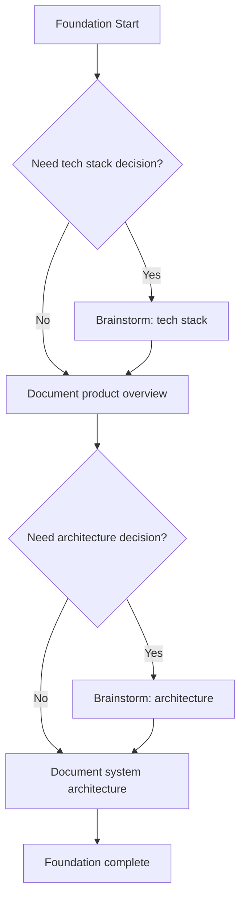
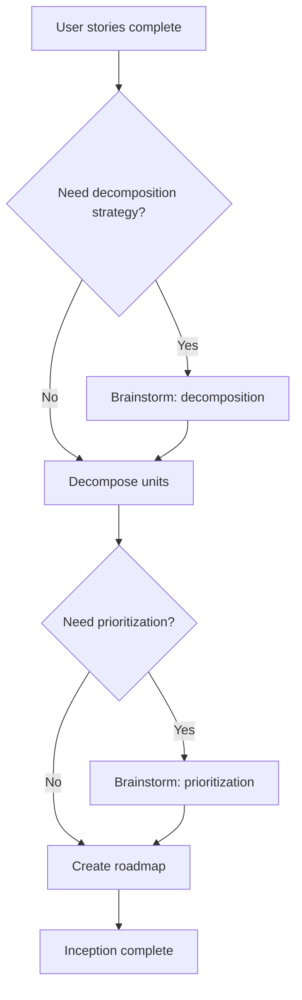
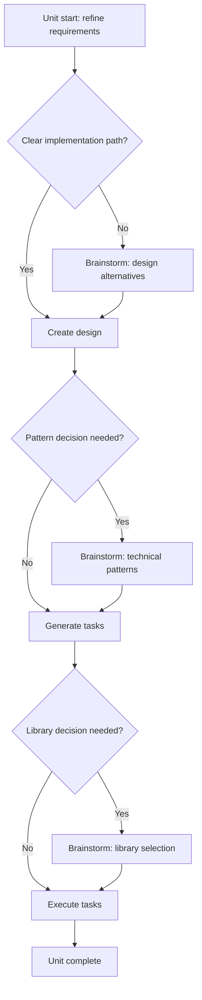

# AI-DLC Brainstorming Integration Guide

How brainstorming integrates into the three AI-DLC workflows. SKILL.md handles the brainstorming process itself; this guide covers the *integration points* — when brainstorming fires, what context to load, and how decisions cascade across phases.

## Table of Contents
- [Plan → Brainstorm → Approve → Execute](#plan--brainstorm--approve--execute)
- [Foundation integration](#foundation-integration)
- [Inception integration](#inception-integration)
- [Construction integration](#construction-integration)
- [Decision cascade across phases](#decision-cascade-across-phases)
- [Sequential vs parallel unit decisions](#sequential-vs-parallel-unit-decisions)

---

## Plan → Brainstorm → Approve → Execute

Traditional AI-DLC: `Plan → Approve → Execute`.
With brainstorming: `Plan → Brainstorm (if a decision is needed) → Approve → Execute`.

Brainstorming gates are natural checkpoints where alternatives must be evaluated before proceeding. They are *not* speed bumps — they only fire when a real decision exists. The skip criteria in SKILL.md exist precisely so the gate doesn't add friction to non-decisions.

---

## Foundation integration

Foundation brainstorming is **special**: no prior Foundation docs exist yet. Context comes from the existing codebase (if brownfield), business requirements docs, team capability assessments, and industry benchmarks gathered during research.

**Common Foundation decisions:** product positioning, pricing model, tech stack, architecture pattern, code organization, design system.

**Context to load:** existing codebase, business requirements, team capabilities, industry benchmarks (no Foundation docs yet to load).

---

## Inception integration

Inception brainstorming has Foundation as the canonical context. **Always load Foundation docs first** — decisions made here must be consistent with Foundation choices.

**Common Inception decisions:** MVP scope, feature prioritization, user-story decomposition, NFR targets, unit boundaries.

**Context to load:**
1. Foundation docs (all 5)
2. User stories from `aidlc-docs/story-artifacts/`
3. Existing Decision Records from Foundation

The benefit: ensures decomposition aligns with architecture, code standards, and design system already chosen in Foundation.

---

## Construction integration

Construction brainstorming is **per-unit** — each unit may make independent technical decisions, but every unit inherits Foundation + Inception choices.

**Common Construction decisions:** UX flow, feature scope refinement, design alternatives, technical patterns (repository vs active record, hooks vs render props), library selection (build vs buy).

**Context to load** (in priority order):
1. Foundation docs (all 5) — *critical*
2. Unit requirements: `aidlc-docs/specs/{unit-slug}/requirements.md`
3. Related unit specs (dependencies)
4. Existing Decision Records for this unit
5. Inception decisions from `aidlc-docs/brainstorming/`

The benefit: consistency across units, pattern reuse, alignment with standards set earlier.

---

## Decision cascade across phases

Decisions have downstream effects. The earlier the phase, the wider the blast radius:

| Phase | Blast radius |
|---|---|
| Foundation | All subsequent phases, all units |
| Inception | All units in Construction |
| Construction | Usually only the unit making the decision |

### Example cascade

**Foundation:** "Use microservices."
**↓**
**Inception:** "How do we decompose by service boundaries? Define service interfaces. Plan inter-service communication."
**↓**
**Construction (per service):** "Define OpenAPI specs. Implement service-mesh patterns. Add circuit breakers."

Each later decision builds on earlier ones. A Construction DR that contradicts a Foundation DR is a sign that one of them needs revisiting — not silently overridden.

---

## Sequential vs parallel unit decisions

**Sequential:** when a decision in one phase locks in constraints for the next.

> Example — Authentication strategy:
> 1. Foundation → "What auth approach?" → DR: OAuth 2.1 + JWT
> 2. Inception → "How to decompose auth?" → DR: separate `login-unit`, `profile-unit`
> 3. Construction (`login-unit`) → "Which OAuth library?" → DR: `better-auth`
> 4. Construction (`profile-unit`) → "Session storage?" → DR: Redis

Each later DR references the earlier ones. Coherence comes from this chain.

**Parallel:** when independent units can legitimately make different choices.

> Example — API style:
> - `admin-dashboard-unit` → GraphQL (complex queries, internal tool)
> - `public-api-unit` → REST (simple, cacheable, external consumers)

Valid when units have different constraints, consumers, or requirements. Each DR must explain *why this unit's context justifies a different choice* — silent divergence is a coherence failure.
