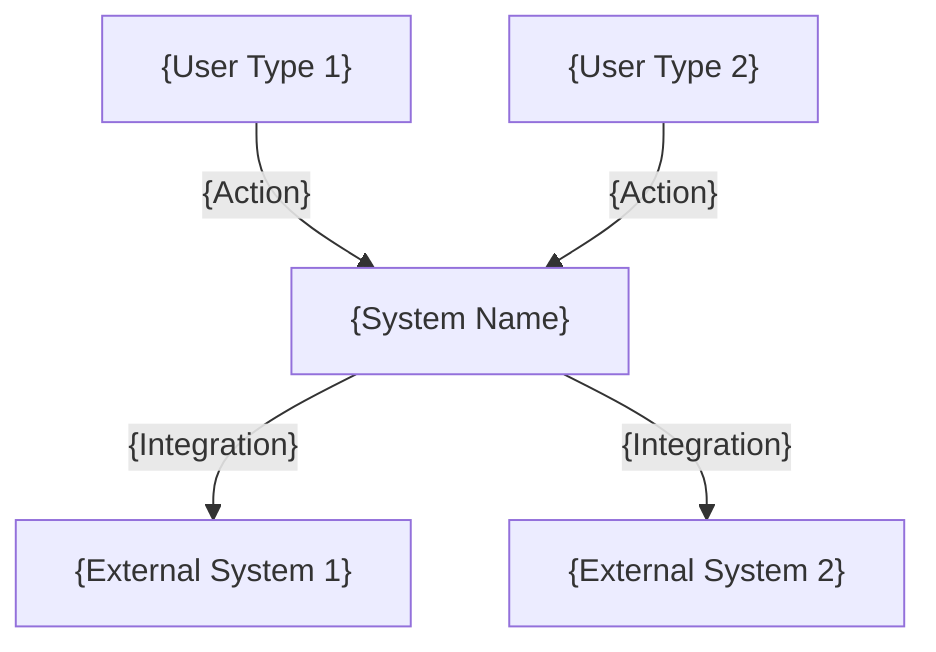
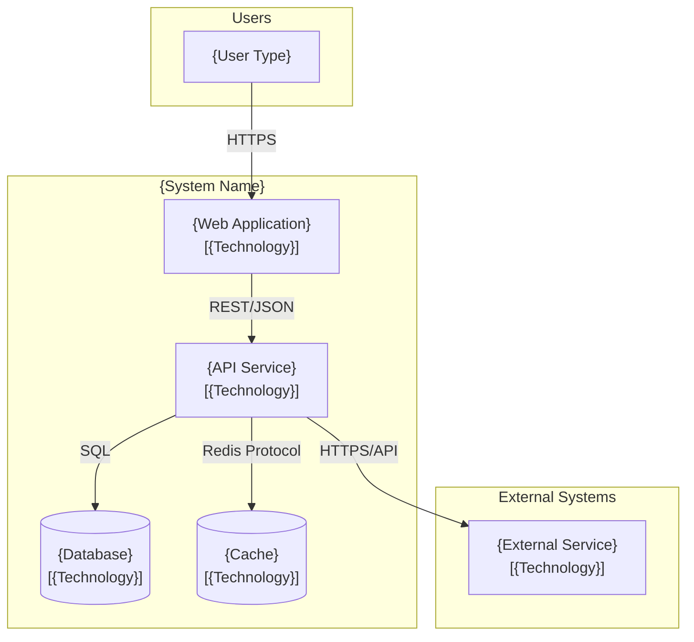
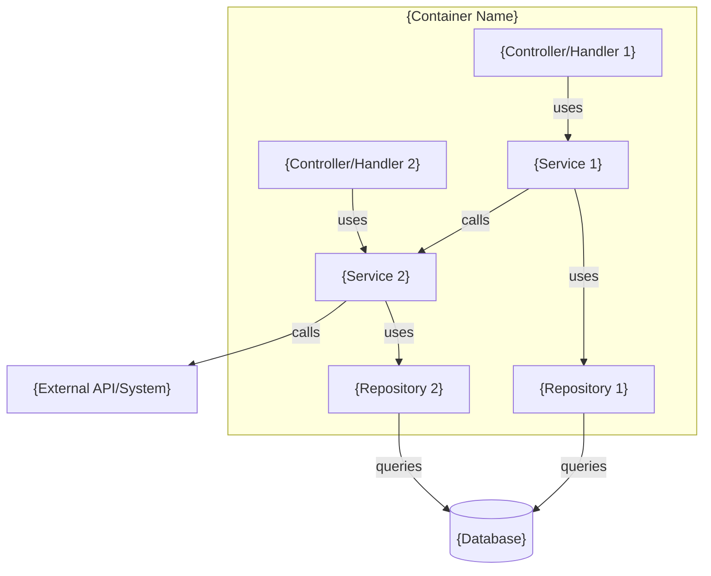

# System Architecture - {Project Name}

**Project**: {Project Name}
**Architecture Type**: {Pattern Type}
**Created**: {Date}
**Status**: Foundation Phase

---

## Table of Contents

1. [Architecture Overview](#architecture-overview)
2. [C4 Model Diagrams](#c4-model-diagrams)
   - [Level 1: System Context](#level-1-system-context-diagram)
   - [Level 2: Container](#level-2-container-diagram)
   - [Level 3: Component](#level-3-component-diagram)
3. [Technology Stack](#technology-stack)
4. [Application Architecture](#application-architecture)
5. [Infrastructure Architecture](#infrastructure-architecture)

> **Using this template:** replace every `{placeholder}`, keep the section order, and expand any section as needed — completeness beats a line count (see `workflow.md` for length guidance).

---

## Architecture Overview

### Architecture Pattern

**{Pattern Name}** with {Framework}:
- **{Component}**: {Description}
- **{Component}**: {Description}

### Deployment Model

**{Deployment Type}**:
- {Key feature}
- {Key feature}

---

## C4 Model Diagrams

### Level 1: System Context Diagram

**Purpose**: Shows the big picture - who uses the system and what external systems it interacts with.

**Audience**: Business stakeholders, product owners, non-technical roles



**Key Elements**:
- **{User Type}**: {Description}
- **{External System}**: {Description}

---

### Level 2: Container Diagram

**Purpose**: High-level technical view showing major containers (apps, APIs, databases) and technology choices.

**Audience**: Architects, senior developers, DevOps



**Containers**:
- **{Container Name}** [{Technology}]: {Purpose and responsibilities}

**Communication**:
- {Container A} → {Container B}: {Protocol/Format} - {Purpose}

---

### Level 3: Component Diagram

**Purpose**: Shows the internal structure of a key container - services, modules, and their dependencies.

**Audience**: Developers, technical leads



**Components**:
- **{Component Name}**: {Responsibility}

**Dependencies**:
- {Component A} depends on {Component B} for {reason}

---

## Technology Stack

### {Component Category}

**{Technology Name}**

**Rationale**:
- {Reason 1}
- {Reason 2}

**Key Features Used**:
- {Feature 1}
- {Feature 2}

---

## Application Architecture

### Directory Structure (High-Level)

```
{project}/
├── {dir}/  # {Purpose}
├── {dir}/  # {Purpose}
└── {dir}/  # {Purpose}
```

**Note**: For detailed component architecture and data flow, see C4 Model Diagrams above.

---

## Infrastructure Architecture

### Hosting & CDN

**{Platform}**:
- {Feature}
- {Feature}

### Build & Deployment Pipeline

{Description of pipeline}

---

## Assumptions & Open Inputs

*Omit this section entirely when every decision and rationale above is Observed or Confirmed.*

| Item | Value used above | Basis | Affects | To confirm |
|---|---|---|---|---|
| {e.g. Database engine} | {e.g. PostgreSQL} | Assumed — inferred from ORM, no infra config | {Container diagram, Infrastructure} | {infra owner} |

**Open inputs** (deliberately left unstated — decision still pending):
- {input}: {which section or diagram element is affected}

---

**Document Status**: Foundation - Draft
**Created By**: AI Solutions Architect
**Last Updated**: {Date}
