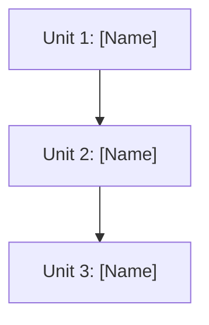

# Units Definition & Prioritization - [Project Name]

## Summary

**[X] units** decomposed from [Y] user stories.

- [Insight 1 — e.g., "3 units can execute in parallel"]
- [Insight 2 — e.g., "Unit 1 is foundation for 60% of features"]
- [Insight 3 — e.g., "High-risk auth unit prioritized early"]

---

## Unit Prioritization

### Priority Summary

| Priority | Unit | User Story IDs | Dependencies | Technical Risk | Rationale |
|----------|------|----------------|--------------|----------------|-----------|
| 1 | [Unit Name] | US-001, US-002 | None | [Risk] | [Reason - foundation/blocker] |
| 2 | [Unit Name] | US-003 | Unit 1 | [Risk] | [Reason - dependency] |
| 3 | [Unit Name] | US-004, US-005 | Unit 1 | [Risk] | [Reason - dependency] |

### Prioritization Criteria

Priority is determined by **technical dependencies** (primary) and **technical risk** (secondary):

1. **Dependency Order**: Units with no dependencies first, then follow dependency chain
2. **Risk Mitigation**: Higher-risk units earlier to identify issues sooner
3. **Parallel Opportunities**: Independent units can be built in parallel

### Execution Strategy

- **Sequential**: Units that must be built in order due to dependencies
- **Parallel**: Independent units that can be built simultaneously

---

## Unit Dependency Map

---

## Source Artifacts

This decomposition is based on the following user story artifacts:

- `aidlc-docs/requirements/001_feature-name_user-stories.md`
- `aidlc-docs/requirements/002_another-feature_user-stories.md`

---

## Unit Structure

### Unit 1: [Unit Name]

**Purpose**: [One-sentence business capability]
**Value Proposition**: As a [user type], I can [capability] so that [outcome]
**Deployable Independently**: YES
**Dependencies**: None
**Technical Risk**: Low | Medium | High

**Scope**:
- [Scope item]

**User Stories**:
- [US-ID]: [Story Title]

---

<!-- Add more units following the same structure -->

## Next Steps

1. Validate unit boundaries and priorities
2. Create roadmap based on priority order
3. Plan bolt execution batches
