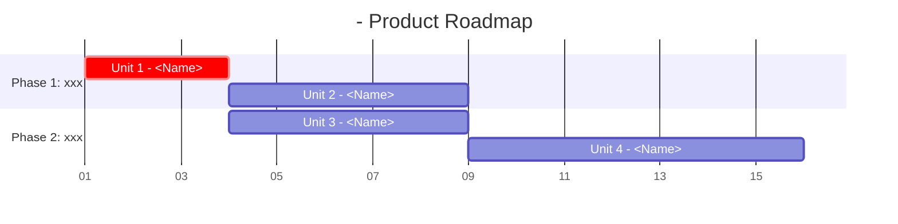
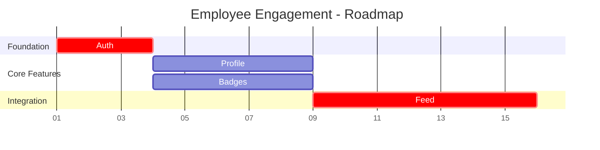

# Unit Roadmap Creation

Create unit-level product roadmaps using Mermaid Gantt charts to visualize delivery timeline.

## Overview

A **Product Roadmap** visualizes the sequence and timing for delivering units. It shows:
- Unit delivery order based on dependencies
- Relative unit sizing (based on user story count)
- Critical path identification
- Parallel vs sequential execution opportunities

## Prerequisites

Before creating roadmap, ensure:
- Units decomposition completed (`aidlc-docs/requirements/{id}_{feature-name}_units_decomposition.md`)
- User stories documented with story counts per unit
- Unit dependencies identified

Optional but preferred (produces real durations instead of relative sizing):
- Per-unit BCP estimates (`**Estimation (BCP)**` lines in the decomposition file, written by `aidlc-estimation`)
- Team capacity in `{docs-root}/foundation/team-info.md` (Delivery Capacity section)

## Roadmap Creation Workflow

### Step 1: Review Input Artifacts

1. Read units decomposition document
2. Extract unit names, user story counts, and any `**Estimation (BCP)**` lines
3. Identify unit dependencies from dependency map

### Step 2: Determine Unit Durations

Use the best available source — real durations beat relative guesses:

**Source 1 (preferred): per-unit BCP + team capacity.**
If units have `**Estimation (BCP)**` lines, derive durations with the
estimation skill's deterministic script (never convert BCP to days by hand —
same inputs always give the same numbers, so recomputing is always fresh):

```bash
python3 .claude/skills/aidlc-estimation/scripts/estimate_time.py \
  --units-json units.json --parallel-fte <N> --team-size <N> \
  --rate <rate> --rate-source <org-default|team-calibrated>
```

Read capacity values from `{docs-root}/foundation/team-info.md` (Delivery
Capacity section). If the section is missing, use the org default rate
(170 BCP per man-month) and say so in the roadmap's Assumptions. Take each
unit's likely duration (working days), rounded up to whole days for the Gantt.

**Source 2 (fallback): story-count relative sizing.**
Only when no BCP estimates exist. Map story counts to relative duration:
- 1-3 stories: 3d (small)
- 4-6 stories: 5d (medium)
- 7-10 stories: 7d (large)
- 11+ stories: 10d (extra large)

Whichever source is used, record it in the roadmap's Assumptions section
(e.g. "Durations derived from per-unit BCP via estimate_time.py at
170 BCP/man-month" or "Relative sizing from story counts — no BCP estimates
available; bars show relative size, not real durations"). Suggest running
`aidlc-estimation` when falling back to Source 2, so the roadmap can be
upgraded to real durations later.

### Step 3: Determine Execution Order

1. **Foundation Units**: No dependencies, build first
2. **Sequential Units**: Must wait for dependencies
3. **Parallel Units**: Independent, can build simultaneously

### Step 4: Generate Gantt Chart

Use Mermaid Gantt syntax:



**Key syntax**:
- `:crit` - marks critical path items
- `after u1` - sequential dependency
- `after u1 u2` - multiple dependencies (waits for both)
- Parallel: same start date, no `after` clause

### Step 5: Document Execution Strategy

Include:
1. Critical path units
2. Risk mitigation timeline
3. Assumptions and constraints
4. Next steps

## Output Format

### Scaffold with CLI

Use `scripts/roadmap_cli.py` to create the output file deterministically:

```bash
python .claude/skills/aidlc-units-roadmap/scripts/roadmap_cli.py init FEATURE_SLUG
```

The CLI:
- Resolves the AI-DLC docs root (`--docs-root` → `.mtv-aidlc/extension-config.json` `aidlcDocsPath` → `aidlc-docs`)
- Renders metadata frontmatter via `_aidlc-shared/scripts/artifact_metadata.py`
- Does not overwrite an existing file

After `init`, replace every placeholder in the scaffolded file with real content.

**Output location**: `{docs-root}/roadmap/{feature-slug}_product_roadmap.md`

Check status of an existing artifact:

```bash
python .claude/skills/aidlc-units-roadmap/scripts/roadmap_cli.py status FEATURE_SLUG
```

**IMPORTANT**:
- Follow template structure exactly. Do NOT add extra sections or creative elaborations.
- Use AI-DLC terminology only. Avoid Scrum/Agile terms (no "sprint", "storypoint", "velocity").
- Keep content concise. No unnecessary explanations beyond template requirements.

## Gantt Chart Best Practices

### Naming Conventions
- Use `u1`, `u2` for unit IDs
- Include unit name in display text
- Group by logical phases/sections

### Critical Path
- Mark foundation units as `:crit`
- Mark units on longest dependency chain
- Highlight risk items

### Sizing Guidelines
- Bar length = likely duration in working days (Source 1, BCP-based) or relative complexity (Source 2 fallback)
- With BCP-based durations, dates can be real calendar dates; with fallback sizing they are relative placeholders
- Document the duration source and sizing rationale in the Assumptions section

## Example

**Input**: 4 units from decomposition (no BCP estimates → Source 2 fallback sizing)
- Unit 1: Auth (3 stories, no deps)
- Unit 2: Profile (5 stories, deps: Unit 1)
- Unit 3: Badges (4 stories, deps: Unit 1)
- Unit 4: Feed (8 stories, deps: Unit 2, 3)

**Output Gantt**:


## Resources

### assets/
- `product_roadmap_template.md` - Output template for roadmap document
