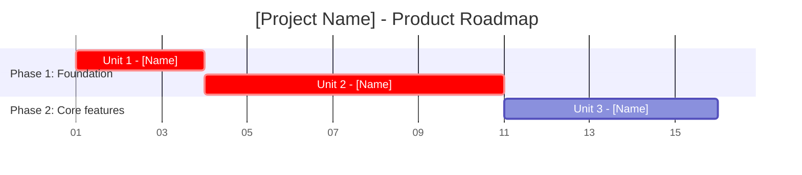

# Product Roadmap - [Project Name]

## Executive Summary

This roadmap provides a timeline for delivering [Number] units. It visualizes build sequence, relative sizing, and critical path.

**Total Scope**: [Number] units
**Team Capacity**: [From {docs-root}/foundation/team-info.md — e.g. "3 developers, 170 BCP/man-month (org-default)"]
**Duration Source**: [per-unit BCP + estimate_time.py | story-count relative sizing (fallback)]
**Build Strategy**: [Strategy]

---

## Roadmap Visualization

**Notes**: [With BCP-based durations: bar length = likely duration in working days. With fallback sizing: dates are relative placeholders and bar length represents relative size only.]

---

## Risk Mitigation Timeline

### High-Risk Items

| Risk | Unit | Mitigation | Timeline |
|------|------|------------|----------|
| [Risk] | [Unit] | [Mitigation] | [Phase] |

---

## Assumptions

1. [Assumption 1]
2. [Assumption 2]

---

## Risks & Constraints

1. **Risk**: [Description]
2. **Constraint**: [Description]

---

## Next Steps

1. Human Approval
2. Complete Inception Phase
3. Begin Construction
