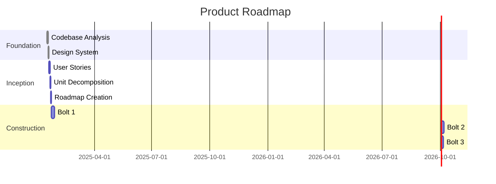
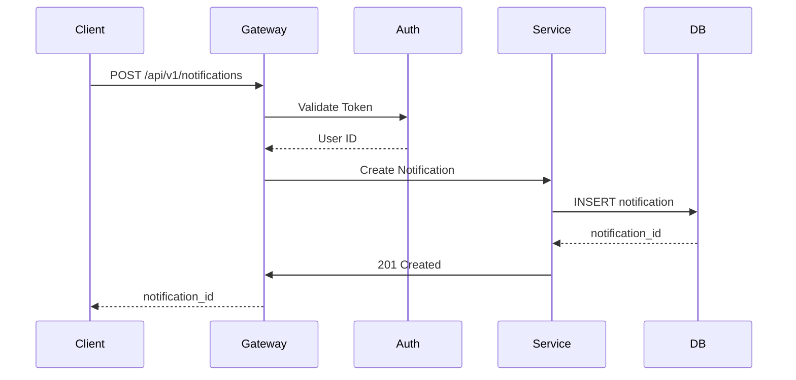
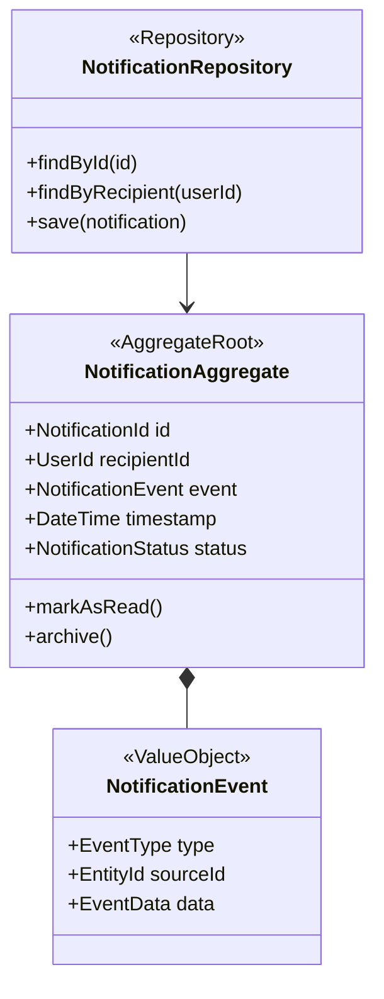
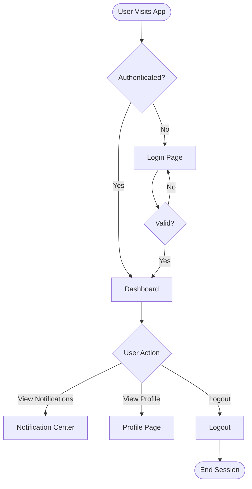
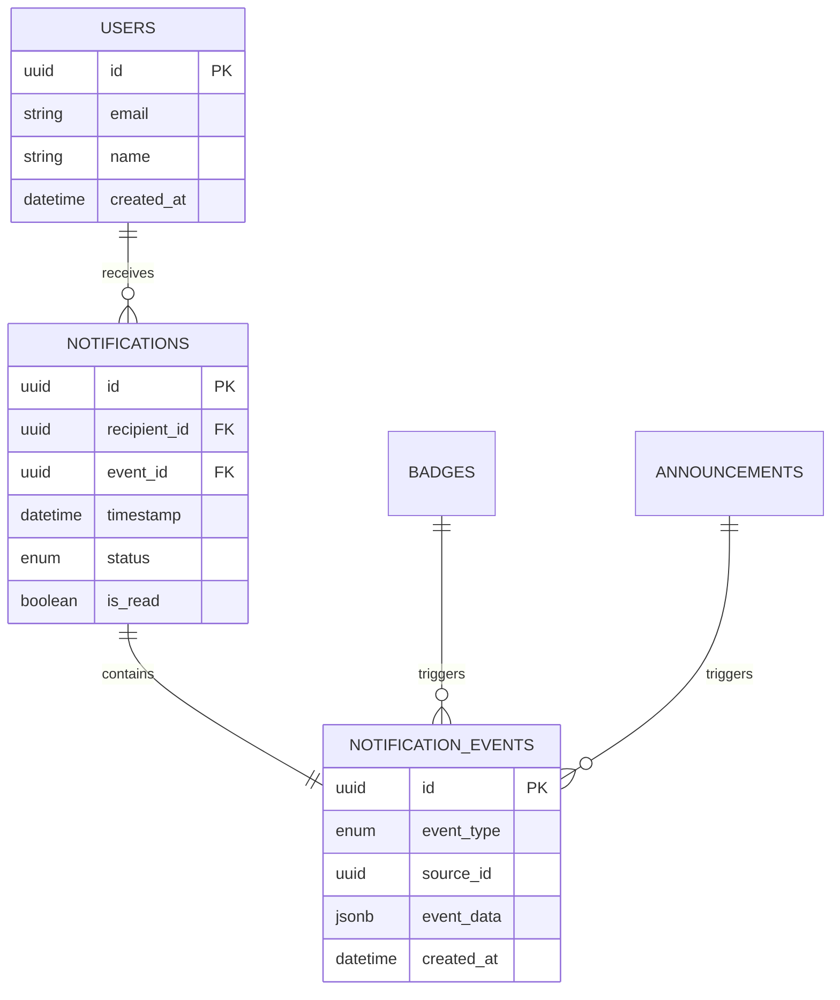
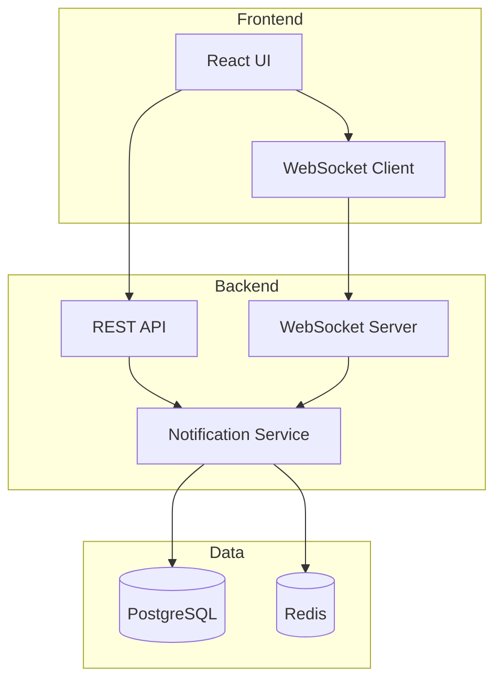
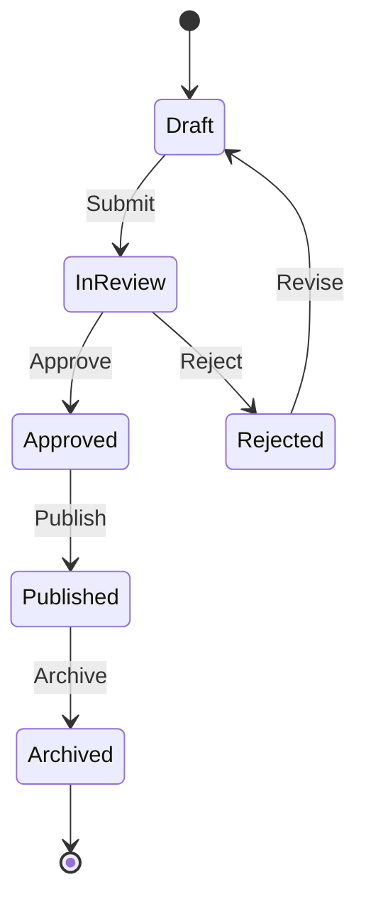
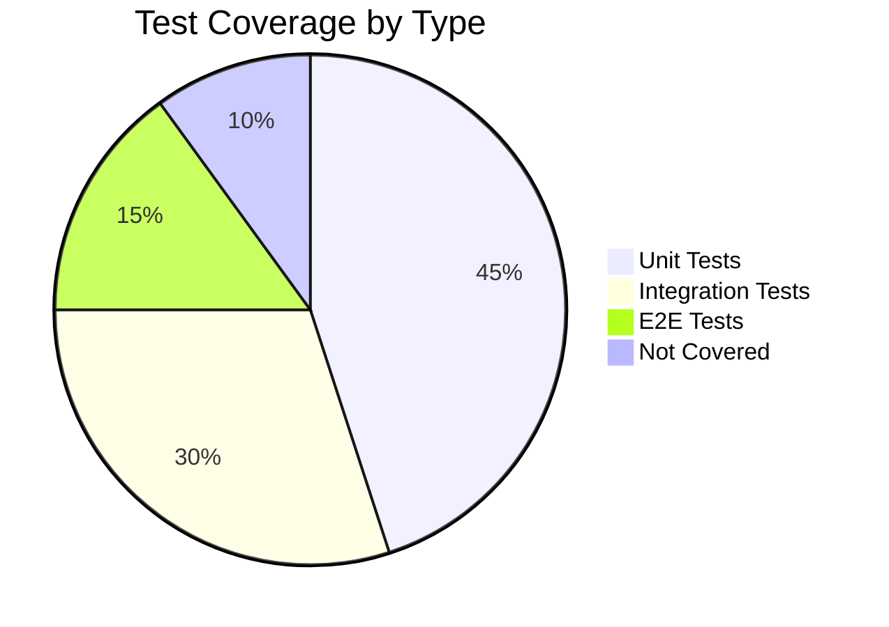
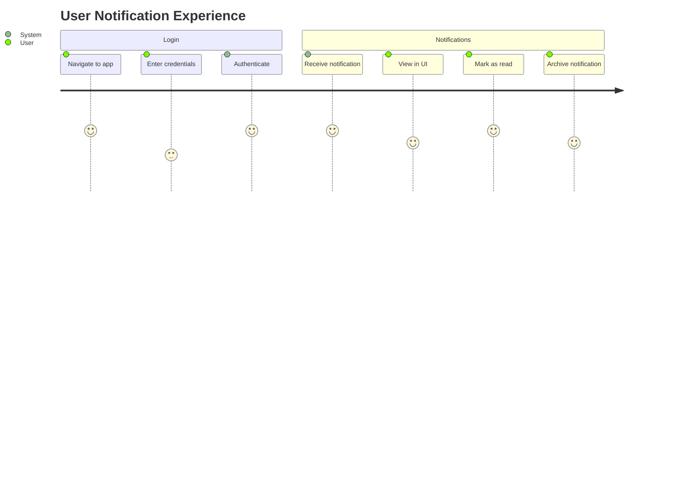
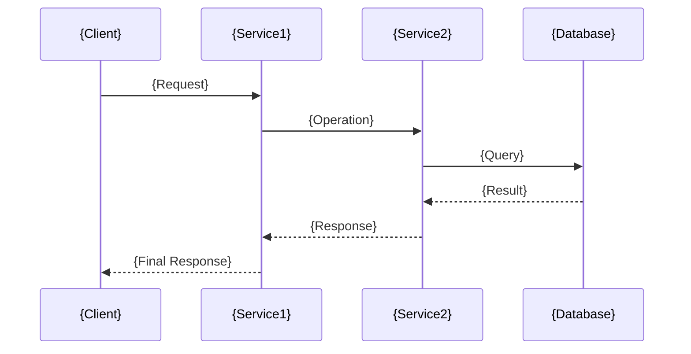

# Mermaid Diagramming Skill

## Overview

The Mermaid Diagramming skill provides templates and patterns for creating visual diagrams using Mermaid syntax to enhance documentation and communication across AI-DLC workflows.

**Purpose**: Enable visual communication through diagrams embedded in markdown documents.

**Used By**: All agents (AI Delivery Manager, AI Solutions Architect, AI Design Orchestrator, AI Orchestration Engineer, AI Quality Orchestrator, AI Assistant Product Owner)

## Supported Diagram Types

### 1. Gantt Charts (Roadmaps & Timelines)

**Used By**: AI Delivery Manager  
**Purpose**: Project roadmaps, sprint planning, milestone tracking



### 2. Sequence Diagrams (API Flows & Interactions)

**Used By**: AI Solutions Architect, AI Orchestration Engineer  
**Purpose**: API interactions, service communication, user flows



### 3. Class Diagrams (Domain Models & DDD)

**Used By**: AI Solutions Architect  
**Purpose**: Domain models, entity relationships, DDD aggregates



### 4. Flowcharts (Processes & User Flows)

**Used By**: AI Design Orchestrator, AI Quality Orchestrator  
**Purpose**: User flows, business processes, test flows



### 5. Entity Relationship Diagrams (Database Models)

**Used By**: AI Solutions Architect, AI Orchestration Engineer  
**Purpose**: Database schema, entity relationships



### 6. Component/Architecture Diagrams

**Used By**: AI Solutions Architect  
**Purpose**: System architecture, component dependencies



### 7. State Diagrams

**Used By**: AI Design Orchestrator, AI Solutions Architect  
**Purpose**: State machines, workflow states



### 8. Pie & Bar Charts (Metrics & Statistics)

**Used By**: AI Quality Orchestrator, AI Delivery Manager  
**Purpose**: Test coverage, quality metrics, progress tracking



### 9. User Journey Maps

**Used By**: AI Design Orchestrator  
**Purpose**: User experience flows, customer journeys



### 10. Git Graph (Version Control)

**Used By**: AI Orchestration Engineer  
**Purpose**: Branch strategies, release flows

```mermaid
gitgraph
    commit id: "Initial commit"
    branch develop
    checkout develop
    commit id: "Add foundation"
    branch feature/notifications
    checkout feature/notifications
    commit id: "Add domain model"
    commit id: "Add API"
    checkout develop
    merge feature/notifications
    checkout main
    merge develop tag: "v1.0.0"
```

## Diagram Templates by Use Case

### Template 1: Product Roadmap

```mermaid
gantt
    title {Project Name} Roadmap
    dateFormat YYYY-MM-DD

    section Phase 0: Foundation
    {Task 1}    :done, {id}, {start-date}, {duration}
    {Task 2}    :active, {id}, after {prev-id}, {duration}

    section Phase 1: Inception
    {Task 3}    :{status}, {id}, after {prev-id}, {duration}

    section Phase 2: Construction
    Bolt 1      :{status}, {id}, after {prev-id}, {duration}
    Bolt 2      :{status}, {id}, after {prev-id}, {duration}
```

### Template 2: API Sequence



### Template 3: Domain Model

```mermaid
classDiagram
    class {AggregateRoot} {
        <<AggregateRoot>>
        +{Id} id
        +{Properties}
        +{Methods}()
    }

    class {Entity} {
        <<Entity>>
        +{Properties}
        +{Methods}()
    }

    class {ValueObject} {
        <<ValueObject>>
        +{Properties}
    }

    class {Repository} {
        <<Repository>>
        +find()
        +save()
    }

    {AggregateRoot} *-- {Entity}
    {AggregateRoot} *-- {ValueObject}
    {Repository} --> {AggregateRoot}
```

### Template 4: User Flow

```mermaid
flowchart TD
    Start([{Entry Point}]) --> Step1[{Action}]
    Step1 --> Decision1{Decision?}
    Decision1 -->|Yes| Step2[{Action}]
    Decision1 -->|No| Step3[{Alternative}]
    Step2 --> End([{Exit Point}])
    Step3 --> End
```

### Template 5: Database Schema

```mermaid
erDiagram
    {ENTITY1} ||--o{ {ENTITY2} : {relationship}
    {ENTITY1} {
        {type} {field1} PK
        {type} {field2}
        {type} {field3}
    }

    {ENTITY2} {
        {type} {field1} PK
        {type} {field2} FK
        {type} {field3}
    }
```

### Template 6: System Architecture

```mermaid
graph TB
    subgraph "{Tier1 Name}"
        {Component1}[{Name}]
        {Component2}[{Name}]
    end

    subgraph "{Tier2 Name}"
        {Component3}[{Name}]
        {Component4}[{Name}]
    end

    subgraph "{Tier3 Name}"
        {Component5}[({Name})]
    end

    {Component1} --> {Component3}
    {Component2} --> {Component4}
    {Component3} --> {Component5}
    {Component4} --> {Component5}
```

## Best Practices

### Diagram Clarity

1. **Keep It Simple**: One diagram, one concept
2. **Use Consistent Naming**: Match code/documentation
3. **Add Context**: Include title and labels
4. **Limit Complexity**: Max 10-15 nodes per diagram
5. **Use Subgraphs**: Group related components

### Styling Guidelines

**Colors**:

- Use sparingly for emphasis
- Maintain accessibility (contrast)
- Be consistent across diagrams

**Labels**:

- Clear and concise
- Use domain language
- Avoid abbreviations unless well-known

**Arrows**:

- Solid for strong relationships
- Dashed for weak/optional
- Different arrow types for different meanings

### Integration in Documentation

**Placement**:

````markdown
## Architecture Overview

[Explanatory text about the architecture]

```mermaid
[diagram code]
```
````

**Key Components**:

- Component A: [description]
- Component B: [description]

```

**Accessibility**:
- Add alt text descriptions
- Provide text alternative
- Explain diagram purpose

## Common Patterns by Agent

### AI Delivery Manager
- Gantt charts for roadmaps
- Pie charts for progress tracking
- Flowcharts for process workflows

### AI Solutions Architect
- Class diagrams for domain models
- Sequence diagrams for API flows
- ER diagrams for database schema
- Component diagrams for architecture

### AI Design Orchestrator
- Flowcharts for user flows
- User journey maps
- State diagrams for UI states

### AI Orchestration Engineer
- Sequence diagrams for implementation
- ER diagrams for database
- Git graphs for branching strategy

### AI Quality Orchestrator
- Flowcharts for test flows
- Pie charts for coverage
- State diagrams for test states

### AI Assistant Product Owner
- Flowcharts for feature flows
- User journey maps
- Simple dependency graphs

## Success Criteria

- [ ] Diagram accurately represents concept
- [ ] Clear and easy to understand
- [ ] Consistent with other diagrams
- [ ] Properly labeled
- [ ] Renders correctly in markdown
- [ ] Accessible (alt text provided)
- [ ] Maintained and updated

## References

- Mermaid documentation: https://mermaid.js.org/
- Diagram templates by type
- Agent-specific diagram examples
- Best practices guide

---

*Mermaid Diagramming Skill v1.0.0*
```
