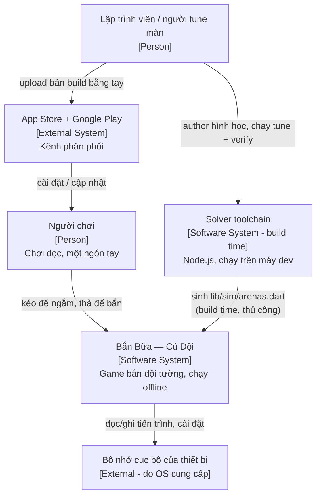
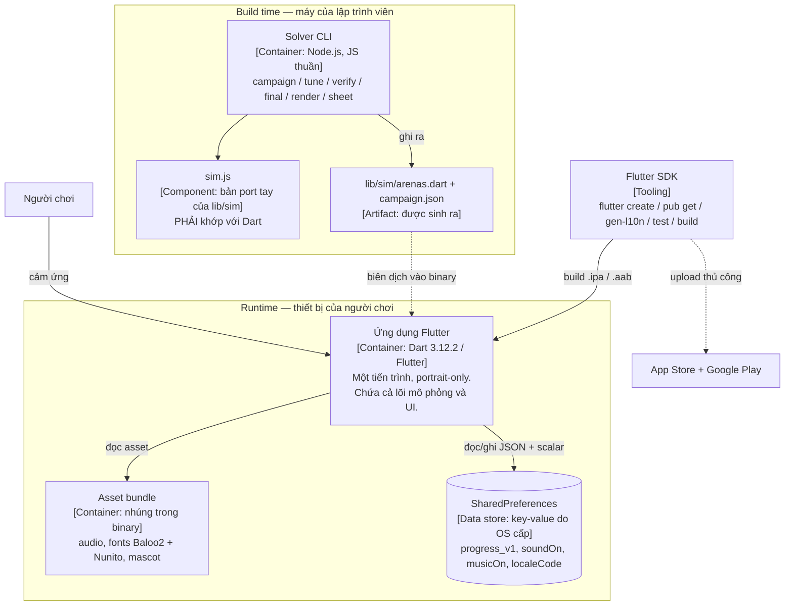
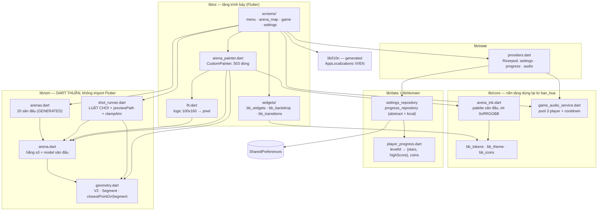
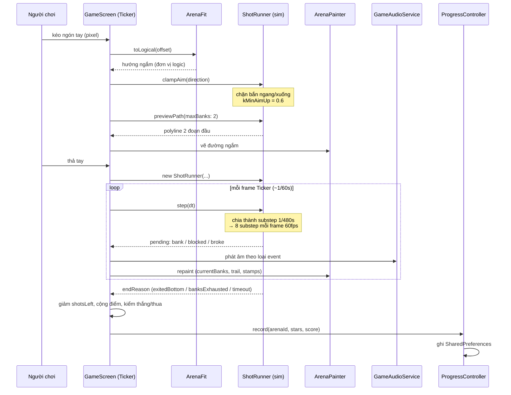
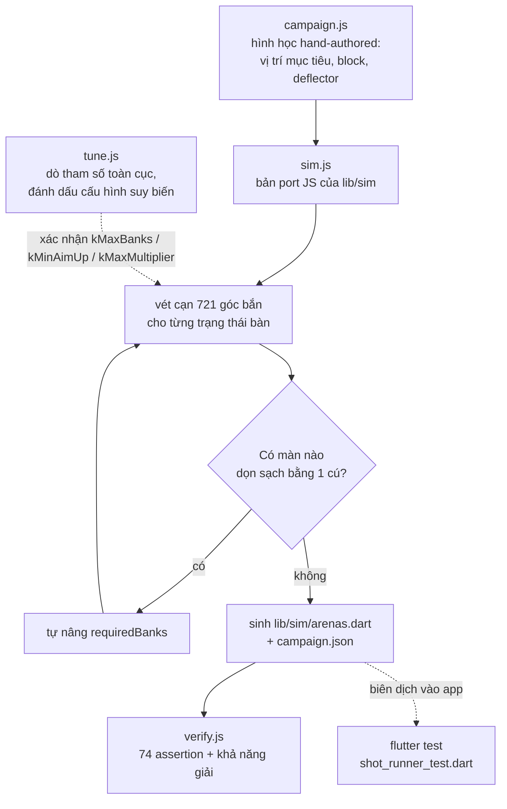
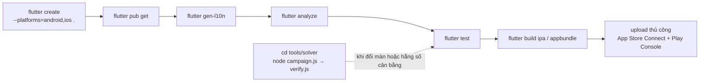

# Bắn Bừa — Cú Dội · Kiến trúc hệ thống

**Dự án**: `ban_bua_tuong`
**Loại kiến trúc**: Ứng dụng mobile một tiến trình, offline-first, với **lõi mô phỏng Dart thuần** và một **toolchain sinh nội dung ở thời điểm build**
**Ngày tạo**: 2026-08-05
**Trạng thái**: Foundation — Draft

> Tài liệu này sở hữu **lý do đằng sau các quyết định kỹ thuật** và mô hình C4.
> Luật chơi, hằng số cân bằng, bảng 20 màn, bảy bất biến và phạm vi sản phẩm thuộc
> [Mô tả sản phẩm](./project-overview-pdr.md). Ở đây chỉ nhắc lại một hằng số khi
> nó **là** một ràng buộc kiến trúc.

---

## Mục lục

1. [Tổng quan kiến trúc](#1-tổng-quan-kiến-trúc)
2. [Mô hình C4](#2-mô-hình-c4)
   - [Mức 1: System Context](#mức-1-system-context-diagram)
   - [Mức 2: Container](#mức-2-container-diagram)
   - [Mức 3: Component](#mức-3-component-diagram)
3. [Technology Stack](#3-technology-stack)
4. [Kiến trúc ứng dụng](#4-kiến-trúc-ứng-dụng)
5. [Kiến trúc hạ tầng](#5-kiến-trúc-hạ-tầng)
6. [Giả định và đầu vào còn mở](#6-giả-định-và-đầu-vào-còn-mở)

---

## 1. Tổng quan kiến trúc

### 1.1 Mẫu kiến trúc

**Pure-core + Layered client + Build-time content pipeline.** Ba khối, ba lý do
khác nhau:

| Khối | Nội dung | Vì sao tách ra |
|---|---|---|
| **Lõi mô phỏng** (`lib/sim/`) | Dart thuần, không import Flutter | Kiểm chứng luật chơi bằng `flutter test` không cần thiết bị; và cho phép port sang JS để vét cạn |
| **Client phân tầng** (`lib/core`, `data`, `domain`, `state`, `ui`) | Flutter + Riverpod, một tiến trình | Phụ thuộc một chiều từ UI xuống dữ liệu; đổi tầng lưu trữ không chạm UI |
| **Toolchain sinh nội dung** (`tools/solver/`) | Node.js, chạy trên máy dev | Độ khó 20 màn là **kết quả mô phỏng**, không phải con số ai đó gõ ra |

Đây không phải kiến trúc chọn theo thói quen. Nó là hệ quả trực tiếp của hai
điều kiện của dự án:

1. **Cơ chế phải kiểm chứng được bằng máy.** Repo này tồn tại vì game tiền nhiệm
   bị từ chối theo Guideline 4.3(a) — lý do đầy đủ ở
   [Mô tả sản phẩm §2](./project-overview-pdr.md#2-vì-sao-game-này-tồn-tại). Cơ
   chế mới là một bài toán hình học, và một bài toán hình học thì **sai hay đúng
   là chứng minh được**: mục tiêu có phá được không, màn có giải được bằng đúng
   ngân sách không, có tồn tại chiến thuật suy biến không. Kiến trúc phải cho
   phép chạy chứng minh đó — nên luật chơi bị đẩy ra khỏi mọi thứ dính Flutter.
2. **Không có Flutter toolchain khi viết code.** Toàn bộ codebase được viết trong
   môi trường không tải được Dart/Flutter SDK. Điều đó biến một quyết định "nên
   làm" (tách lõi thuần) thành một quyết định "bắt buộc": nếu luật chơi nằm lẫn
   trong widget, sẽ **không có cách nào** kiểm chứng nó trước khi ai đó cài SDK.
   Bản port JS trong `tools/solver/` là câu trả lời cho ràng buộc này.

### 1.2 Ba ranh giới chịu lực

Ba thứ này là kiến trúc thật của repo — phá một trong ba thì tài liệu này vô
nghĩa:

**(a) `lib/sim/` không được import Flutter.**
`geometry.dart` tự định nghĩa `V2` thay vì dùng `Offset` của `dart:ui`; `arena.dart`
mang cả `name` và `nameEn` dạng `String` thay vì đi qua ARB, đúng vì tầng này
không được biết `AppLocalizations` tồn tại. Đổi lấy: một chút trùng lặp so với
`Offset` và so với `l10n`. Nhận được: `flutter test` chạy được luật chơi trên máy
không có thiết bị, và bản dịch sang JS là dịch trực tiếp chứ không phải viết lại.

**(b) `lib/sim/arenas.dart` là output, không phải source.**
417 dòng, được sinh ra. Hình học hand-authored trong `tools/solver/campaign.js`;
`requiredBanks`, `shots`, `starThresholds` do solver chạy mô phỏng thật trên 721
góc bắn cho từng trạng thái bàn mà ra. Hệ quả kiến trúc: **có một tầng build ngoài
Flutter mà không có bước build nào tự động gọi.** Nó chạy bằng tay, và không có
thứ gì trong repo phát hiện được `arenas.dart` đã lệch khỏi `campaign.js`.

**(c) Luật chơi tồn tại hai bản, và phải khớp nhau.**
`lib/sim/shot_runner.dart` (Dart, ship trong app) và `tools/solver/sim.js` (JS,
sinh ra các con số được ship). `tools/solver/README.md` nói rõ Dart là nguồn sự
thật và liệt kê 4 điểm phải khớp thủ công (`kMaxBanks`, `kMaxMultiplier`,
`clampAim`/`kMinAimUp`, `kArenas`). Không có test nào so hai bản với nhau. Đây là
**rủi ro kiến trúc hạng nhất**: nếu hai bản lệch, solver vẫn báo "20 màn giải
được" nhưng nó đang nói về một game khác với game người chơi đang chơi, và không
có tín hiệu lỗi nào xuất hiện.

### 1.3 Mô hình triển khai

**Ứng dụng mobile độc lập, một tiến trình, chạy hoàn toàn offline.**

- Không backend, không API, không auth, không telemetry, **không một tích hợp
  mạng nào**. Toàn bộ trạng thái người chơi nằm trong `SharedPreferences` trên
  máy.
- Nội dung màn chơi được **biên dịch vào binary** (`arenas.dart` là code Dart, không
  phải asset JSON tải về). Không có cơ chế cập nhật nội dung ngoài việc phát hành
  bản mới.
- **Portrait-only**, cố định trong `main.dart` qua `SystemChrome.setPreferredOrientations`.
  Lý do là kiến trúc chứ không phải thẩm mỹ: sân đấu là không gian logic 100×160
  cố định, không có bố cục landscape nào tồn tại.
- Phát hành đồng thời **iOS và Android**, một lần, hai store.
- Thư mục `android/` và `ios/` **không có trong repo** — sinh bằng
  `flutter create --platforms=android,ios .`. Chi tiết ở [§5.2](#52-scaffolding-nền-tảng-không-nằm-trong-repo).

### 1.4 Bảng quyết định kiến trúc (ADR rút gọn)

| # | Quyết định | Lý do | Nơi ghi lý do trong code |
|---|---|---|---|
| ADR-1 | `lib/sim/` là Dart thuần, không Flutter | Kiểm chứng luật chơi không cần thiết bị; port được sang JS | `geometry.dart` doc comment, `arena.dart` `ArenaSpec.name` |
| ADR-2 | Mô phỏng làm việc trong đơn vị logic 100×160, không bao giờ thấy pixel | Hành vi giống nhau trên mọi máy — App Review đã test trên iPad | `arena.dart` đầu file, `ui/fit.dart` |
| ADR-3 | Va chạm bằng tích phân substep cố định 1/480s, không swept-analytic | Thô nhưng **hiển nhiên đúng**; dư an toàn 8× so với bán kính bi | `shot_runner.dart` doc comment của `ShotRunner` |
| ADR-4 | Render bằng `CustomPainter` + `Ticker`, **không** dùng Flame game loop | Không cần entity/component system; painter một hàm dễ port sang canvas JS để render ảnh | `pubspec.yaml` comment ở `flame_audio` |
| ADR-5 | `ProgressRepository` là abstraction, bản local là một implementation | Firestore drop-in được sau này mà không chạm state/UI | `data/progress_repository.dart`, `state/providers.dart` |
| ADR-6 | Độ khó do solver sinh, không tune tay | "Giải được" là tính chất phải chứng minh, và trực giác con người bỏ sót chiến thuật suy biến | `tools/solver/README.md`, `arena.dart` `kMaxBanks` |
| ADR-7 | Màu sân đấu lưu dạng `int 0xRRGGBB`, không phải `Color` | API tạo biến thể alpha của `Color` liên tục bị deprecate giữa các bản Flutter; `Color.fromARGB` với int thì không đổi | `core/arena_ink.dart` doc comment |
| ADR-8 | Không sinh `android/`, `ios/` sẵn trong repo | Config copy tay mang theo bundle ID cũ, flavor cũ, plugin Firebase/AdMob đã bỏ — lỗi chỉ lộ khi build ký số | `README.md` |

---

## 2. Mô hình C4

### Mức 1: System Context Diagram

**Mục đích**: ai dùng hệ thống, và hệ thống nói chuyện với cái gì ở ngoài.
**Đối tượng đọc**: product owner, stakeholder.

Sơ đồ này **thưa một cách chính đáng**. Ứng dụng không gọi mạng, nên phần lớn
"external system" mà một sơ đồ context thường có ở đây đơn giản là không tồn tại.
Hai tương tác ngoài duy nhất là **phân phối** (hai store) và **sinh nội dung ở
thời điểm build** (toolchain solver do lập trình viên chạy).



**Các thành phần**:

- **Người chơi**: người dùng duy nhất. Không có tài khoản, không có vai trò nào
  khác. Persona chi tiết: [Mô tả sản phẩm](./project-overview-pdr.md).
- **Solver toolchain**: hệ thống **thời điểm build**, không có mặt lúc runtime.
  Nó là nhà sản xuất `arenas.dart`.
- **App Store / Google Play**: chỉ là kênh phân phối. Không có SDK store nào được
  link vào app (không IAP, không ads, không leaderboard).
- **Bộ nhớ cục bộ**: `SharedPreferences` — `NSUserDefaults` trên iOS,
  `SharedPreferences` trên Android.

**Không xuất hiện, và đó là chủ ý**: backend, API, CDN, Firebase, dịch vụ quảng
cáo, telemetry/analytics, crash reporting. Xem
[§3.4](#34-những-thứ-cố-tình-chưa-có) và [§6](#6-giả-định-và-đầu-vào-còn-mở).

---

### Mức 2: Container Diagram

**Mục đích**: các khối chạy được / triển khai được và công nghệ của từng khối.
**Đối tượng đọc**: kiến trúc, dev senior.



**Các container**:

| Container | Công nghệ | Trách nhiệm |
|---|---|---|
| **Ứng dụng Flutter** | Dart `^3.12.2`, Flutter | Toàn bộ runtime: mô phỏng, render, state, lưu trữ, i18n, âm thanh. Một tiến trình duy nhất. |
| **Asset bundle** | nhúng trong binary | Âm thanh, 2 font variable TTF, ảnh mascot. Khai báo trong `pubspec.yaml`. |
| **SharedPreferences** | do OS cung cấp | Key-value duy nhất. `progress_v1` là một chuỗi JSON; settings là 3 scalar. |
| **Solver CLI** | Node.js, JS thuần | Author + tune + verify + render campaign. **Không cần Flutter.** |
| **Artifact được sinh** | Dart source + JSON | `lib/sim/arenas.dart` là input biên dịch của app; `campaign.json` là dữ liệu trung gian của toolchain. |

**Giao tiếp**:

- Người chơi → App: cảm ứng. Không có giao thức mạng nào trong toàn hệ thống.
- App → SharedPreferences: đọc/ghi đồng bộ qua instance được resolve **một lần
  trong `main()`** rồi inject vào Riverpod (`sharedPreferencesProvider` bị
  override). Nhờ vậy không tầng nào phía dưới phải là `async` chỉ để đọc settings.
- Solver → App: **không phải giao tiếp runtime**, mà là quan hệ *sinh code*. Mũi
  tên nét đứt vì nó chỉ tồn tại ở thời điểm build và **được chạy bằng tay**.

---

### Mức 3: Component Diagram

**Mục đích**: cấu trúc bên trong container "Ứng dụng Flutter".
**Đối tượng đọc**: dev.

Điều quan trọng nhất trên sơ đồ này là **không có mũi tên nào đi vào `lib/sim/` từ
phía Flutter mang theo phụ thuộc Flutter**. `lib/sim/` nằm dưới cùng, không biết gì
về widget, theme, locale, hay `dart:ui`.



**Các component và trách nhiệm**:

| Component | Trách nhiệm | Ghi chú kiến trúc |
|---|---|---|
| `sim/geometry.dart` | `V2`, `Segment`, khoảng cách điểm–đoạn | Tự định nghĩa vector thay vì `Offset` — cái giá của ADR-1 |
| `sim/arena.dart` | Hằng số cân bằng, `TargetSpec` / `BlockSpec` / `DeflectorSpec` / `ArenaSpec`, `buildSegments()` | Làm phẳng sân đấu thành "segment soup"; mọi segment được test mỗi substep |
| `sim/shot_runner.dart` | **Luật chơi** (`_resolveTargets`), `previewPath`, `clampAim` | Đọc hàm này trước nếu muốn hiểu game |
| `sim/arenas.dart` | 20 `ArenaSpec` | **Generated** — đừng sửa tay |
| `ui/fit.dart` | Letterbox logic → screen, và ngược lại (`toLogical`) | Điểm duy nhất pixel gặp đơn vị logic |
| `ui/arena_painter.dart` | Vẽ toàn bộ sân đấu trong một `paint()` | Nhận `currentBanks` để làm mục tiêu phát sáng — xem [bất biến #7](./project-overview-pdr.md#8-bất-biến-không-được-phá) |
| `ui/screens/game_screen.dart` | Sở hữu `Ticker`, vòng lặp game, drain event, ghi kết quả | Đây là "game loop" — không có engine nào ở dưới nó |
| `state/providers.dart` | Riverpod: settings, progress, audio | `gameAudioProvider` cố tình **không** `watch(settingsProvider)` |
| `data/progress_repository.dart` | Interface + bản local | Seam của ADR-5 |
| `domain/player_progress.dart` | Model tiến trình bất biến, suy ra unlock | Hoàn toàn tổng quát: `levelId → {stars, highScore}` |
| `core/game_audio_service.dart` | Pool 3 player, cooldown, scope | Copy nguyên trạng từ `ban_bua` — lý do `flame_audio` có trong `pubspec` |
| `core/arena_ink.dart` | Palette sân đấu | ADR-7; đồng thời neo brand hue về `BbTokens` |

**Các phụ thuộc đáng nói**:

- `ui/screens/game_screen.dart` phụ thuộc **trực tiếp** vào `sim/shot_runner.dart`,
  không qua một service hay controller trung gian. Đây là quyết định có ý thức:
  vòng lặp game là một `Ticker` gọi `runner.step(dt)` rồi drain `runner.pending`;
  thêm một tầng gián tiếp chỉ để "đúng kiến trúc" sẽ làm mất tính đọc-được của
  vòng lặp mà không mua được gì, vì chỉ có **một** screen chơi game.
- `arena_painter.dart` phụ thuộc `sim/` (đọc `ArenaSpec`, `V2`) nhưng chiều ngược
  lại **không tồn tại** — `sim/` không biết có painter.
- `providers.dart` là nơi duy nhất `SharedPreferences` được nối vào cây phụ thuộc.
  `sharedPreferencesProvider` mặc định **throw** `StateError`: đọc nó mà chưa
  override là lỗi lập trình, không phải điều kiện runtime cần xử lý.

---

## 3. Technology Stack

### 3.1 Runtime

**Dart `^3.12.2` + Flutter (mobile)**

Lý do:
- Một codebase cho iOS + Android, và hai store là mục tiêu phát hành đồng thời.
- `CustomPainter` + `Canvas` là đủ để vẽ toàn bộ game này — không cần một engine.
- Dart cho phép **cùng một ngôn ngữ** viết luật chơi và viết UI, mà vẫn tách được
  luật chơi ra khỏi Flutter (Dart thuần là một tập con thật, không phải quy ước).
- Kế thừa trực tiếp từ `ban_bua`: theme, token, audio service, repository, widget
  copy được nguyên trạng, tiết kiệm phần lớn công dựng lại vỏ ngoài.

**Riverpod — `flutter_riverpod ^2.6.1`**

Lý do:
- Cần inject `SharedPreferences` **đã resolve** từ `main()` xuống mọi tầng.
  `ProviderScope.overrides` làm việc này bằng một dòng, và giữ toàn bộ phía dưới
  ở dạng đồng bộ.
- `Provider` + `ref.listen` cho phép `GameAudioService` được **tạo một lần** rồi
  cập nhật theo settings, thay vì bị rebuild. Nếu dùng `ref.watch` ở đây thì mỗi
  lần người chơi bật/tắt âm là pool 3 player bị dựng lại và cắt tiếng đang phát —
  lý do này được ghi thẳng trong `providers.dart`.
- Test override được không cần widget tree.

**Tính năng dùng tới**: `Provider`, `StateNotifierProvider`, `ProviderScope.overrides`,
`ref.listen`, `ref.onDispose`, `ConsumerWidget` / `ConsumerStatefulWidget`.

### 3.2 Lưu trữ và i18n

**`shared_preferences ^2.3.3`**

Lý do:
- Dữ liệu cần lưu là *một* JSON nhỏ (`progress_v1`) và 3 scalar cài đặt. Một
  database nhúng (sqflite/Hive/Isar) là hạ tầng thừa cho hình dạng dữ liệu đó.
- Nằm sau `ProgressRepository`, nên nếu dữ liệu lớn lên thì đổi implementation,
  không đổi kiến trúc (ADR-5).
- `LocalProgressRepository` **không bao giờ throw lên UI**: lỗi đọc trả về
  `PlayerProgress()` rỗng, lỗi ghi chỉ log qua `dart:developer`. Đánh đổi có ý
  thức — mất một lần ghi tiến trình tốt hơn là một dialog lỗi giữa game.

**`flutter_localizations` + `intl`, sinh code bằng `gen-l10n`**

Lý do:
- Song ngữ VI/EN với **VI là mặc định** (`localeCode` mặc định `'vi'`;
  `l10n.yaml` lấy `app_vi.arb` làm template).
- `nullable-getter: false` để `AppLocalizations.of(ctx)` dùng được không cần
  null-check ở mọi điểm gọi.
- **Ngoại lệ có chủ ý**: tên và hint của sân đấu **không** đi qua ARB. Chúng nằm
  trong `ArenaSpec` dạng cặp `name`/`nameEn` với hàm `forLocale()`, vì `lib/sim/`
  không được import Flutter (ADR-1). Đây là chỗ ADR-1 phải trả giá rõ nhất.

**Font: Baloo 2 + Nunito** (variable TTF nhúng kèm giấy phép OFL) — tiếp nối
ngôn ngữ thương hiệu của `ban_bua` ở phần vỏ ngoài.

### 3.3 Âm thanh, và một quyết định dễ bị đọc sai

**`flame_audio ^2.12.1`**

Đây là mục dễ gây hiểu nhầm nhất trong `pubspec.yaml`, nên nói rõ:

- `flame_audio` kéo `flame` vào **theo phụ thuộc gián tiếp**.
- **Không có Flame game loop nào được dùng.** Không `FlameGame`, không component
  system, không `SpriteComponent`. Render là `CustomPainter` được lái bởi một
  `Ticker` do `game_screen.dart` sở hữu (ADR-4).
- Dependency tồn tại **chỉ** để `lib/core/game_audio_service.dart` copy được
  nguyên trạng từ `ban_bua` — 363 dòng quản lý pool 3 player, cooldown và scope,
  đã có đúng bộ âm cần cho game dội tường (`wallImpact`, `blockedGap`,
  `comicImpact`, `politeClap`).

Vì sao **không** chuyển sang Flame game loop:
- Game này có một entity di động (viên bi) và một tập segment tĩnh. Entity/component
  system không giải quyết vấn đề nào ở đây.
- `arena_painter.dart` là **một hàm `paint()`**, nên nó port được sang canvas JS —
  đó là cách `docs/levels/01..20.png` và contact sheet được render khi không build
  được app. Một cây component Flame thì không port được như vậy.
- Vòng lặp `Ticker` giữ nguyên quyền kiểm soát `dt`, và `ShotRunner.step()` tự
  clamp `dt > 0.05` để một app vừa quay lại từ background không mô phỏng cả một
  giây bay trong một frame.

Cái giá phải chấp nhận: kích thước binary mang theo `flame` không dùng tới. Đã
cân và chấp nhận, vì viết lại audio service không mua được gì.

### 3.4 Những thứ cố tình chưa có

`pubspec.yaml` ghi rõ những dependency **không** có mặt, kèm lý do. Đây là **seam
đã thiết kế**, không phải thiếu sót:

| Chưa có | Lý do | Seam đã có sẵn |
|---|---|---|
| `firebase_core` / `cloud_firestore` / `firebase_auth` | Tiến trình để cục bộ cho tới khi vòng chơi lõi được đánh giá là ổn | `ProgressRepository` (ADR-5). `firestore_progress_repository.dart` của `ban_bua` implement đúng interface này và thay vào `progressRepositoryProvider` là xong |
| `google_mobile_ads` | Ngoài phạm vi MVP; sẽ là tiếng ồn khi đang đánh giá vòng chơi | — |
| Analytics / crash reporting | Không có tích hợp mạng nào trong hệ thống | — |

Ghi chú kỹ thuật: `player_progress.dart` còn comment nhắc tới
`users/{uid}.bestScore` trong "Firestore schema (GAME_SPEC §1)", và
`progress_repository.dart` nhắc `US-017 AC-1.1`. Đó là **tham chiếu kế thừa từ
`ban_bua`** tới artifact không tồn tại trong repo này. Vô hại về hành vi, nhưng là
nợ tài liệu nên dọn khi có dịp.

### 3.5 Toolchain thứ hai: solver (Node.js)

**Node.js, JavaScript thuần, không framework, không package bắt buộc**
(`sheet.js` cần `playwright` nếu muốn render ảnh).

Lý do tồn tại: khi codebase được viết, **không có Dart/Flutter toolchain**. Đây là
cách duy nhất chạy được luật chơi. Nhưng nó đáng giữ lại cả sau khi Flutter chạy
được, vì nó làm việc mà `flutter test` không làm: **vét cạn không gian góc bắn**.

| Script | Việc |
|---|---|
| `campaign.js` | Author hình học + tự tune `requiredBanks`/`shots`/`starThresholds` + kiểm suy biến → ghi `campaign.json` |
| `verify.js` | 74 assertion cơ chế (khớp `shot_runner_test.dart`) + kiểm khả năng giải |
| `tune.js` | Dò 48 cấu hình tham số toàn cục, đánh dấu cấu hình suy biến |
| `final.js` | BFS đầy đủ: số cú tối thiểu, trần điểm, đề xuất mốc sao |
| `render.js` / `sheet.js` / `shoot.js` | Render sân đấu ra ảnh (port của `arena_painter`) |

Giới hạn được ghi rõ trong `tools/solver/README.md`: solver **không** kiểm được
Dart có biên dịch không, game có vui không, và liệu con người có tìm ra được cú mà
máy vét 721 góc tìm ra.

### 3.6 Chất lượng code

`flutter_lints ^6.0.0` qua `analysis_options.yaml` (include
`package:flutter_lints/flutter.yaml`, **không có rule tự thêm hay tắt**).
`flutter_launcher_icons ^0.14.4` sinh icon — xem [§5.3](#53-icon-và-cấu-hình-nền-tảng).

Kiểm chứng hiện có: **2 file test**. `test/shot_runner_test.dart` (luật chơi) và
`test/app_smoke_test.dart`. Tương ứng chính xác với hình dạng kiến trúc: thứ được
kiểm chặt là lõi mô phỏng, còn tầng UI thì chưa.

---

## 4. Kiến trúc ứng dụng

### 4.1 Cấu trúc mức cao

```
ban_bua_tuong/
├── lib/
│   ├── sim/        # Dart THUẦN — luật chơi + hình học + 20 sân đấu (generated)
│   ├── core/       # token, theme, icon, palette sân đấu, audio service
│   ├── data/       # settings + progress repository (SharedPreferences)
│   ├── domain/     # player_progress: sao, điểm cao, xu, suy ra unlock
│   ├── state/      # provider Riverpod
│   ├── ui/         # fit, arena_painter, 4 screen, widget dùng chung
│   ├── l10n/       # localization được sinh (VI/EN)
│   └── main.dart   # bootstrap: portrait, prefs, ProviderScope
├── tools/solver/   # toolchain Node.js: author, tune, verify, render campaign
├── test/           # shot_runner_test (luật chơi) + app_smoke_test
├── assets/         # audio, fonts, icon, mascot
└── docs/levels/    # 20 ảnh render + contact sheet của campaign
```

Chiều phụ thuộc: `ui → state → data → domain`, và `ui`/`sim` gặp nhau **chỉ** tại
`fit.dart` (đổi hệ toạ độ) và `arena_painter.dart` (đọc để vẽ). `sim` không phụ
thuộc bất cứ gì phía trên.

### 4.2 Luồng dữ liệu: một cú bắn

Đây là luồng nóng của toàn bộ ứng dụng và là nơi mọi quyết định kiến trúc gặp
nhau.



Bốn điều đáng chú ý về mặt kiến trúc:

1. **`ShotRunner` không biết thời gian thực là gì.** Nó nhận `dt` và chia thành
   substep cố định. Cùng một chuỗi `dt` cho ra cùng một kết quả trên mọi máy —
   đó là điều kiện để bản JS và bản Dart nói về cùng một game.
2. **Pixel chỉ tồn tại ở hai đầu.** `toLogical` ở đầu vào, `toScreen` ở đầu ra.
   Ở giữa là đơn vị logic 100×160 (ADR-2).
3. **Event là pull, không phải push.** `ShotRunner` đẩy event vào `pending`; tầng
   trình bày **drain** nó mỗi frame. Nhờ vậy `sim/` không cần callback, không cần
   stream, không cần biết ai đang nghe — và test có thể để event tích lại rồi
   assert một lần (đúng cách `shot_runner_test.dart` làm).
4. **`alive` bị mutate tại chỗ.** `ShotRunner` sửa trực tiếp `List<bool> alive`
   của caller. Doc comment nói rõ và `previewPath` tự truyền `List.of(alive)` để
   không làm bẩn trạng thái thật. Đây là tối ưu có ý thức trong vòng lặp nóng,
   nhưng cũng là bẫy: bất kỳ ai gọi `ShotRunner` để "thử" đều phải copy trước.

### 4.3 Luồng nội dung: pipeline sinh campaign

Đây là luồng chạy **bằng tay, trên máy dev**, và là thứ khiến độ khó của 20 màn là
dữ liệu chứ không phải ý kiến.



Pipeline đảm bảo cho **từng** màn: mọi mục tiêu phá được từ bàn đầy; không màn nào
dọn sạch được bằng 1 cú; `shots` = một đường greedy thật cộng một cú dự phòng; mốc
sao = 50%/72%/90% điểm mà đúng đường đó ăn được. Bảng kết quả 20 màn:
[Mô tả sản phẩm §6](./project-overview-pdr.md#6-nội-dung-20-màn-4-chương).

**Hệ quả kiến trúc phải nhớ**: `kMaxBanks`, `kMinAimUp`, `kMaxMultiplier` là ba
hằng số cân bằng **toàn cục**. Chúng không phải "config" — chúng là input của
pipeline trên. Đổi một trong ba mà không chạy lại `campaign.js` thì 20 màn đang
ship trở thành số rác. Chi tiết bất biến:
[Mô tả sản phẩm §8](./project-overview-pdr.md#8-bất-biến-không-được-phá).

Điểm yếu của pipeline này, nói thẳng: **không có gate tự động nào**. Không có
test nào so `sim.js` với `shot_runner.dart`, và không có bước build nào phát hiện
`arenas.dart` đã lệch khỏi `campaign.js`. Nó dựa vào việc người sửa đọc
`AGENTS.md`. Xem [§6](#6-giả-định-và-đầu-vào-còn-mở).

### 4.4 Luồng trạng thái người chơi

```
main() → SharedPreferences.getInstance()
       → ProviderScope(overrides: [sharedPreferencesProvider])
           → settingsProvider   (đọc đồng bộ, VI mặc định)
           → progressProvider   (đọc async trong constructor, seed rỗng trước)
           → gameAudioProvider  (tạo một lần, ref.listen theo settings)
```

- `SettingsController` đọc **đồng bộ** (`_repo.load()` trả `AppSettings` ngay) vì
  `SharedPreferences` đã resolve. Locale sẵn sàng ngay frame đầu, không có nháy
  ngôn ngữ.
- `ProgressController` khởi tạo bằng `PlayerProgress()` rỗng rồi `_restore()`
  async. Đánh đổi: một frame đầu có thể hiện tiến trình rỗng, nhưng menu không
  phải chờ I/O.
- `PlayerProgress` **bất biến**: `withResult()` trả về instance mới, giữ sao/điểm
  tốt nhất, và cộng xu chỉ theo phần điểm mới. Unlock **được suy ra** từ
  `completedMax + 1`, không lưu riêng — nên không thể có trạng thái unlock lệch
  với kết quả.
- Arena id **dùng lại đúng keyspace level id** của `ban_bua`, nên
  `player_progress.dart` copy sang không cần sửa một dòng.

### 4.5 Kiến trúc trình bày

- **Một `CustomPainter` vẽ toàn bộ sân đấu.** `paint()` gọi lần lượt backdrop →
  frame → block → deflector → ghost trail → trail → target → aim → launcher →
  ball → multiplier → stamp. Thứ tự là z-order, tường minh, không có tree.
- **Repaint do `Ticker` lái, và chỉ khi có việc.** `game_screen.dart` giữ cờ
  `dirty`: chỉ `setState()` khi có bi đang bay, có stamp đang sống, hoặc màn đang
  rung. Ở trạng thái nghỉ, screen không repaint mỗi frame.
- **Không có `Random` trong pass vẽ.** Hiệu ứng rung dùng `sin`/`cos` của biến
  `shake` để jitter tất định — nếu không, hai frame liên tiếp sẽ khác nhau vô lý
  và không repro được.
- **`currentBanks` được truyền xuống painter** để mục tiêu phát sáng theo tầng khi
  số dội tăng. Đây là bất biến sản phẩm số 7, và nó là lý do painter cần biết
  trạng thái cú bắn đang bay thay vì chỉ biết trạng thái bàn.
- **[Approved 2026-08-11]** Shell ngoài sân dùng hệ **Vietnamese karst adventure**:
  `BbCanyonBackdrop`, panel jade/teal, khung bronze/gold và asset
  `assets/images/ui/karst/`. Golden `test/ui/goldens/arena_map_390x844.png` là
  nguồn trực quan chuẩn. `ArenaInk` vẫn tối để sân đấu, trail cyan và tín hiệu
  `armed` có tương phản; điều này không biến toàn app thành galaxy/indigo/navy.
  Quyết định cũ ngày 09/08 về một hệ arcade đêm navy thống nhất đã bị thay thế.
  Đây vẫn chỉ là thay đổi tầng trình bày; không đổi `lib/sim/`, hình học sân hay
  pipeline solver. `ArenaInk` tiếp tục lưu `int` thay vì `Color` (ADR-7). Xem
  `uiux-guideline.md` cho thứ tự ưu tiên và token.

---

## 5. Kiến trúc hạ tầng

### 5.1 Không có hạ tầng phía server

Nói cho hết ý, vì đây là điều bất thường so với phần lớn tài liệu kiến trúc:
**không có hosting, không có CDN, không có database phía server, không có cloud
service nào.** Ứng dụng chạy trọn trên thiết bị. Hệ quả:

- Không có SLA khả dụng để đặt, vì không có gì có thể ngừng khả dụng.
- Không có bề mặt tấn công phía mạng. Dữ liệu duy nhất được lưu là điểm/sao/xu/cài
  đặt, trong sandbox của app, không phải dữ liệu cá nhân.
- Không có observability tập trung. Chẩn đoán duy nhất là `dev.log()` trong
  `progress_repository.dart` — đọc được qua devtools khi cắm máy, không thu về đâu
  cả. Nếu sau này cần biết người chơi tắc ở màn nào thì đó là **một quyết định
  mới** phải cân với phạm vi hiện tại, không phải một khoảng trống cần lấp.

Firebase là lối vào tự nhiên nếu điều đó thay đổi, và seam đã có sẵn — xem
[§3.4](#34-những-thứ-cố-tình-chưa-có).

### 5.2 Scaffolding nền tảng không nằm trong repo

`android/`, `ios/` (và `web/`) **không tồn tại trong repo**. Sinh bằng:

```
flutter create --platforms=android,ios .
```

Đây là quyết định kiến trúc, không phải việc chưa làm (ADR-8): một Xcode project
và Gradle config copy tay từ `ban_bua` rất dễ mang theo bundle ID cũ, flavor cũ,
và plugin Firebase/AdMob không còn dùng — loại lỗi đó chỉ lộ ra khi build ký số,
đúng lúc muộn nhất. `flutter create` sinh scaffolding sạch và **không ghi đè**
`lib/`, `test/`, `pubspec.yaml`, `assets/`.

Cái giá: mọi tuỳ biến ở tầng native (permission, capability, cấu hình signing)
phải được ghi lại ở đâu đó, vì thư mục chứa chúng không được version. Hiện chưa có
tuỳ biến nào cần.

### 5.3 Icon và cấu hình nền tảng

`flutter_launcher_icons` trong `pubspec.yaml` hiện cấu hình:

- `ios: true`, kèm biến thể dark/tinted và `remove_alpha_ios: true` (App Store từ
  chối icon có alpha channel);
- **`android: false`**.

Đó là một **khoảng trống cụ thể**: cả hai nền tảng đều là mục tiêu phát hành, nên
icon launcher Android chưa được cấu hình. Việc cần làm: bật `android: true` (và
cân nhắc `adaptive_icon_background` / `adaptive_icon_foreground` cho adaptive
icon) rồi chạy lại `dart run flutter_launcher_icons`. Không tự quyết trong tài
liệu này — ghi lại ở [§6](#6-giả-định-và-đầu-vào-còn-mở).

### 5.4 Pipeline build và phát hành

**Hiện trạng: build cục bộ, thủ công. Không có CI.**

Nói chính xác: `.github/` trong repo chỉ chứa prompt file của AI-DLC và một hook
config. **Không có workflow file, không có fastlane, không có Codemagic hay Xcode
Cloud.** Pipeline thật là:



Bước (A) chỉ chạy một lần. Nhánh solver chạy **khi và chỉ khi** hình học sân đấu
hoặc một trong ba hằng số cân bằng thay đổi.

Chưa có CI là **hiện trạng được ghi nhận**, không phải khuyến nghị. Nếu sau này
thêm, hai gate rẻ và có giá trị nhất — vì chúng bảo vệ đúng hai ranh giới chịu lực
ở [§1.2](#12-ba-ranh-giới-chịu-lực) — là:

- `flutter analyze && flutter test` (bảo vệ ranh giới `lib/sim/` và luật chơi);
- `node verify.js` (bảo vệ tính giải được của campaign).

### 5.5 Mục tiêu phi chức năng

| NFR | Mức | Cơ sở kiến trúc |
|---|---|---|
| **Hiệu năng** | **60 fps ổn định, không drop frame giữa cú bắn** | Đọc một đường carom phụ thuộc vào frame ổn định trong lúc bi bay: nếu frame giật, người chơi không phân biệt được "mình ngắm sai" với "hình bị nhảy". Tích phân substep 1/480s nghĩa là **8 substep mỗi frame 60fps**, mỗi substep test toàn bộ segment soup của sân đấu — đó là ngân sách CPU thật cần giữ trong tầm. Cờ `dirty` trong `game_screen.dart` đảm bảo trạng thái nghỉ không tiêu ngân sách đó. |
| **Tính đúng của cơ chế** | Kiểm chứng bằng máy, không bằng cảm nhận | `lib/sim/` Dart thuần → `shot_runner_test.dart` chạy không cần thiết bị; `verify.js` chạy 74 assertion + khả năng giải không cần Flutter |
| **Độc lập độ phân giải** | Hành vi giống nhau trên mọi máy | Mô phỏng trong đơn vị logic 100×160, letterbox bằng `ArenaFit` (ADR-2). Quan trọng vì App Review đã test trên iPad. |
| **Offline** | Hoạt động đầy đủ, không mạng | Không có tích hợp mạng nào |
| **Sàn thiết bị / OS** | **Theo mặc định của Flutter SDK** — dự án không khai sàn riêng | `pubspec.yaml` chỉ ràng buộc `sdk: ^3.12.2`; không có `minSdkVersion` hay deployment target nào được đặt trong repo (vì `android/`, `ios/` chưa sinh) |
| **Khả dụng / scale** | Không áp dụng | Không có thành phần phía server |

Không có mục tiêu nào khác được đặt. Cụ thể: **chưa có ngân sách kích thước
binary, chưa có mục tiêu thời gian khởi động, chưa có mục tiêu tiêu thụ pin.**
Nếu cần, chúng là quyết định mới.

### 5.6 Bundle ID

**Chưa quyết định** — và đó là quyết định về App Store, không phải về code.
`README.md` phân tích hai phương án: dùng lại `com.tungbogin.banBua` (khớp với
điều Apple yêu cầu — "review the app concept" hàm ý nộp lại chính app record đó
với concept đã sửa) so với một bundle ID mới (tạo app thứ hai cùng thương hiệu
trên một account vừa bị 4.3(a)). README khuyến nghị dùng lại. Tài liệu này
**không chốt** — ghi lại ở [§6](#6-giả-định-và-đầu-vào-còn-mở).

---

## 6. Giả định và đầu vào còn mở

Mọi phát biểu ở trên đều là **Observed** (đọc từ code/config trong repo) hoặc
**Confirmed** (người dùng xác nhận trong lượt chạy này). Không có giá trị nào
được suy đoán rồi trình bày như đã quyết.

### 6.1 Đầu vào còn mở — chưa quyết, đừng đọc như đã quyết

| Đầu vào | Trạng thái | Ảnh hưởng tới mục nào | Cần ai quyết |
|---|---|---|---|
| **Bundle ID** | Chưa chọn. README phân tích và khuyến nghị dùng lại `com.tungbogin.banBua`, nhưng chưa chốt | [§5.2](#52-scaffolding-nền-tảng-không-nằm-trong-repo), [§5.6](#56-bundle-id) — cũng là input của `flutter create` | Chủ account App Store |
| **Cấu hình icon launcher Android** | `flutter_launcher_icons` đang `android: false`, trong khi Android là mục tiêu phát hành đã xác nhận | [§5.3](#53-icon-và-cấu-hình-nền-tảng) | Việc cần làm, không phải câu hỏi thiết kế |
| **Sàn thiết bị / OS cụ thể** | Không khai. Dùng mặc định Flutter SDK | [§5.5](#55-mục-tiêu-phi-chức-năng) | Chỉ quyết khi có lý do (thư viện, API, hoặc thị trường) |
| **Có thêm CI hay không** | Chưa có gì. Hiện trạng: build cục bộ thủ công | [§5.4](#54-pipeline-build-và-phát-hành) | Quyết sau khi app build được lần đầu |

### 6.2 Rủi ro kiến trúc đang mở

Bốn rủi ro dưới đây là rủi ro **của kiến trúc**, không phải rủi ro sản phẩm — rủi
ro sản phẩm nằm ở
[Mô tả sản phẩm §10](./project-overview-pdr.md#10-rủi-ro-đã-biết).

| # | Rủi ro | Vì sao là rủi ro kiến trúc | Giảm thiểu |
|---|---|---|---|
| R-1 | **Chưa dòng code nào được biên dịch.** Toàn bộ codebase viết trong môi trường không có Dart/Flutter toolchain, nên chưa qua `flutter analyze` hay `flutter build` | Mọi phát biểu về tầng `lib/ui/` trong tài liệu này là phát biểu về **code đã đọc**, không phải code đã chạy. `lib/sim/` được kiểm chứng bằng solver nên rủi ro thấp; `lib/ui/` là nơi lỗi biên dịch gần như chắc chắn nằm | `flutter analyze && flutter test` là việc số 1 — xem [Mô tả sản phẩm §11](./project-overview-pdr.md#11-việc-tiếp-theo-theo-thứ-tự) |
| R-2 | **Hai bản luật chơi có thể lệch nhau.** Dart (`shot_runner.dart`) và JS (`sim.js`) khớp nhau **bằng tay** | Nếu lệch, solver vẫn báo "20 màn giải được" nhưng đang nói về game khác. Không có tín hiệu lỗi. `tools/solver/README.md` liệt kê 4 điểm phải khớp nhưng không có test nào kiểm | Cần một gate so hai bản (ví dụ: bộ trace tham chiếu chạy được ở cả hai phía). Chưa tồn tại |
| R-3 | **`arenas.dart` có thể lệch khỏi `campaign.js`** mà không ai biết | File generated nằm trong repo, không có bước build nào tái sinh hay kiểm nó. Một lần sửa tay "cho nhanh" là im lặng phá cân bằng 20 màn | `AGENTS.md` + comment cảnh báo. Đây là biện pháp mang tính quy ước, không phải kỹ thuật |
| R-4 | **Chỉ có 2 file test**, và cả hai đều không phủ tầng UI | Vòng lặp game, drain event, ghi tiến trình, và điều kiện thắng/thua đều nằm trong `game_screen.dart` (480 dòng) mà không có test | Sau khi build được, tầng này là nơi test đáng thêm trước tiên |

### 6.3 Nợ tài liệu nhỏ

`player_progress.dart` và `progress_repository.dart` còn comment tham chiếu tới
`GAME_SPEC §1`, `ADR-5`, `US-002`, `US-010`, `US-011`, `US-015`, `US-016`,
`US-017` — artifact của `ban_bua`, không tồn tại trong repo này. Không ảnh hưởng
hành vi; nên dọn hoặc trỏ lại vào bảng ADR ở [§1.4](#14-bảng-quyết-định-kiến-trúc-adr-rút-gọn).

---

**Trạng thái tài liệu**: Foundation — Draft
**Tạo bởi**: AI Solutions Architect
**Cập nhật lần cuối**: 2026-08-05
