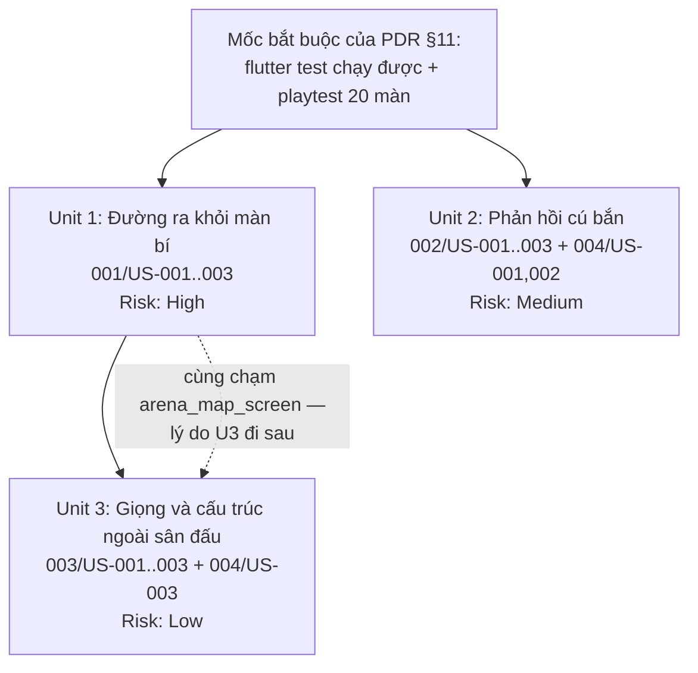

# Units Definition & Prioritization — Phạm vi còn lại

## Cách đọc mã story

Bốn story artifact được đánh số độc lập, nên cả bốn đều có `US-001..US-003`. Trong
tài liệu này mã story luôn ghi đủ dạng **`{artifact}/{story}`** — ví dụ `001/US-002`
là "Bỏ qua màn đang tắc bằng xu" trong artifact 001.

## Summary

**3 unit** phân rã từ **12 user story** trong 4 story artifact.

- **Không có cơ hội song song, và đó là kết luận đúng chứ không phải hạn chế.**
  `team-info.md` ghi 1 người làm, nên 3 unit xếp tuần tự theo ưu tiên.
- **Unit gộp theo *nguồn sự kiện*, không theo file story.** Hiệu ứng truyện tranh
  (artifact 002) và rung tay (artifact 004) móc vào **cùng một dòng sự kiện** từ
  `ShotRunner`: dội tường, phá mục tiêu, bắn thẳng bị chặn, kết màn. Chúng cùng bị
  một bất biến ràng buộc (không được làm mờ tín hiệu `armed`). Tách chúng ra hai unit
  là buộc một người đi qua cùng chỗ móc sự kiện hai lần.
- **Unit 1 là unit duy nhất ghi state gameplay/economy vào `PlayerProgress`.** Nó
  thêm dấu bỏ qua, bộ đếm thua và giao dịch xu. Unit 3 chỉ ghi seen-set thoại vào
  khoá riêng `dialogue_seen_v1`; lỗi khoá đó không làm mất sao/xu/mở màn.
- **Rủi ro cao nhất được xếp trước.** Unit 1 chạm vào suy luận mở màn và schema tiến
  trình đã lưu; đó là chỗ sai thì mất tiến trình người chơi.
- **Cả 3 unit nằm sau mốc playtest** của PDR §11. Đây là quyết định của PDR, không
  phải của tài liệu này.

---

## Unit Prioritization

### Priority Summary

| Priority | Unit | User Story IDs | Dependencies | Technical Risk | Rationale |
|----------|------|----------------|--------------|----------------|-----------|
| 1 | Đường ra khỏi màn bí | `001/US-001`, `001/US-002`, `001/US-003` | None | **High** | PDR §10 gọi đây là bắt buộc, không phải tuỳ chọn. Rủi ro cao nhất: đổi suy luận mở màn và schema tiến trình đã lưu |
| 2 | Phản hồi cú bắn | `002/US-001`, `002/US-002`, `002/US-003`, `004/US-001`, `004/US-002` | None | Medium | Rủi ro là hồi quy tính dễ đọc và tụt khung hình, không phải mất dữ liệu. Độc lập hoàn toàn với Unit 1 |
| 3 | Giọng và cấu trúc ngoài sân đấu | `003/US-001`, `003/US-002`, `003/US-003`, `004/US-003` | Unit 1 | Low | Chỉ đọc `PlayerProgress`; seen-set thoại lưu ở khoá riêng. Xếp sau Unit 1 để `arena_map_screen` được dựng lại **một lần** |

### Prioritization Criteria

1. **Dependency Order**: Unit 1 và Unit 2 không phụ thuộc gì; Unit 3 phụ thuộc Unit 1.
2. **Risk Mitigation**: Unit 1 xếp trước vì nó là unit duy nhất có thể làm hỏng tiến
   trình đã lưu của người chơi — sai ở đây phát hiện càng sớm càng đỡ.
3. **Parallel Opportunities**: Unit 1 và Unit 2 *về mặt kỹ thuật* chạy song song được,
   nhưng team 1 người nên không khai thác.

### Execution Strategy

- **Sequential**: Unit 1 → Unit 2 → Unit 3. Một người, ba lượt.
- **Parallel**: không dùng. Nếu sau này team lớn hơn, Unit 1 và Unit 2 là cặp tách
  được ngay — chúng không dùng chung file nào.

### Chồng lấn cần biết trước

`arena_map_screen.dart` bị **cả Unit 1 và Unit 3** chạm tới: Unit 1 thêm dấu "đã bỏ
qua" lên thẻ màn (`001/US-002` AC-3.1), Unit 3 dựng lại toàn bộ màn hình đó thành 4
chương. Đây **không** phải phụ thuộc vòng — Unit 1 không cần chương để chạy. Nó là lý
do Unit 3 phải đi sau: làm ngược lại thì dấu "đã bỏ qua" phải viết hai lần, một lần
cho danh sách phẳng và một lần cho bố cục chương.

---

## Unit Dependency Map

---

## Source Artifacts

- `aidlc-docs/story-artifacts/001_hint-and-skip-level_user_stories.md`
- `aidlc-docs/story-artifacts/002_comic-effects-by-bank-count_user_stories.md`
- `aidlc-docs/story-artifacts/003_arena-map-chapters_user_stories.md`
- `aidlc-docs/story-artifacts/004_haptics-and-characters_user_stories.md`
- `aidlc-docs/foundation/project-overview-pdr.md`
- `aidlc-docs/foundation/system-architecture.md`
- `aidlc-docs/foundation/team-info.md`

---

## Unit Structure

### Unit 1: Đường ra khỏi màn bí

**Purpose**: Cho người chơi một cách thoát khỏi màn không giải được, và biến xu từ
điểm hiển thị thành tài nguyên tiêu được.

**Value Proposition**: As a Người chơi, I can mua gợi ý hoặc trả xu để bỏ qua một màn
tôi không giải được, so that một màn quá khó không chặn tôi khỏi toàn bộ nội dung còn
lại của game.

**Deployable Independently**: YES
**Dependencies**: None
**Technical Risk**: **High**

**Scope**:
- Gợi ý vẽ trọn đường carom của một cú giải được, mua bằng xu
- Bỏ qua màn bằng xu, tính là hoàn thành 0 sao nhưng vẫn mở màn kế tiếp
- Tách "đã bỏ qua" khỏi số sao trong suy luận mở màn, để tổng sao vẫn sạch
- Bộ đếm thua theo từng màn, bền qua lần mở app — nuôi cả điều kiện xuất hiện của
  bỏ qua màn và lời nhắc khi bí
- Nhắc người chơi rằng gợi ý và bỏ qua màn tồn tại, đúng lúc họ đang bí

**User Stories**:
- `001/US-001`: Mua gợi ý đường carom bằng xu
- `001/US-002`: Bỏ qua màn đang tắc bằng xu
- `001/US-003`: Được nhắc rằng có đường ra khi đang tắc

**Vì sao đây là một ranh giới**: ba story này chia nhau **một biên giao dịch**. Trừ
xu, ghi dấu "đã bỏ qua", và tăng bộ đếm thua đều phải nhất quán trong cùng một lần
ghi tiến trình — nếu trừ xu thành công mà ghi dấu thất bại, người chơi mất xu và vẫn
tắc. Đây là unit duy nhất ghi state gameplay/economy; Unit 3 chỉ ghi seen-set
thoại không ảnh hưởng tiến trình chơi.

**Rủi ro cụ thể cần canh**:
- Suy luận mở màn hiện dựa trên sao (`stars >= 1`). Đổi sai là người chơi mất quyền
  vào màn họ đã mở, hoặc được mở màn chưa đáng mở.
- Schema tiến trình đã lưu phải đọc được save cũ; không có bước migration nào.
- Giá 50/150 xu chưa qua playtest (giả định A1 trong artifact 001).

**Success Metrics**:
- Không còn màn nào có thể chặn hẳn tiến trình của người chơi
- Xu bắt đầu được tiêu — tỷ lệ người chơi từng tiêu xu > 0
- Không có báo cáo mất tiến trình sau khi cập nhật

---

### Unit 2: Phản hồi cú bắn

**Purpose**: Làm cú bắn *cảm* được — mỗi lần dội và mỗi mục tiêu vỡ có sức nặng
tương xứng với độ khó của nó — mà không làm mờ thứ đang dạy người chơi luật.

**Value Proposition**: As a Người chơi, I can cảm được hệ số đang lớn lên qua hình
ảnh và rung tay, so that phần thưởng cho một cú carom giỏi là cảm giác chứ không chỉ
là con số điểm.

**Deployable Independently**: YES
**Dependencies**: None
**Technical Risk**: Medium

**Scope**:
- Tầng hiệu ứng leo thang theo số lần dội, thiết kế lại quanh bank count thay vì
  `popped`/`isCrit`/`isRage` của game tiền nhiệm
- Cường độ hiệu ứng phá mục tiêu bám theo hệ số BỪA tại thời điểm phá
- Capsule multiplier luôn đọc được từ `×1…×6`; bank 0 không phát hiệu ứng ăn mừng
- Spark/impact/trail dùng `trajectoryCyan`, multiplier/score dùng `primaryGold`
- Rung tay trên cùng bộ sự kiện: dội, phá mục tiêu, bắn thẳng bị chặn, kết màn
- Công tắc rung trong Cài đặt, mặc định bật, lưu cùng `AppSettings`
- Bảo vệ tín hiệu `armed` và giữ 60fps — điều kiện chấp nhận, không phải việc dọn sau

**User Stories**:
- `002/US-001`: Hiệu ứng leo thang theo từng lần dội
- `002/US-002`: Khoảnh khắc phá mục tiêu ở hệ số cao được tôn lên
- `002/US-003`: Hiệu ứng không được làm mờ luật chơi
- `004/US-001`: Cảm được cú dội qua rung tay
- `004/US-002`: Tắt rung được

**Vì sao gộp hai artifact vào một unit**: hình ảnh và rung tay là **hai kênh xuất của
cùng một dòng sự kiện**. Cả hai kích hoạt tại đúng những mốc giống nhau trong
`ShotRunner` (dội tường / phá mục tiêu / bắn thẳng bị chặn / kết màn), cả hai đều cần
cùng một cơ chế cooldown để không dày quá, và cả hai chịu cùng hợp đồng sân đấu bắt buộc
là không được che tín hiệu `armed`. Chia chúng thành hai unit khiến cùng một người
móc vào cùng những mốc đó hai lần, và tệ hơn: bất biến `armed` sẽ được kiểm hai lần
độc lập thay vì một lần trọn vẹn.

**Rủi ro cụ thể cần canh**:
- Hồi quy tính dễ đọc: `uiux-guideline.md` §4.3, §5.2 bắt buộc tín hiệu `armed`
  bật ngay và nằm trên effect; làm mờ hoặc làm trễ nó là hồi quy sản phẩm.
- Tụt khung ở màn 20 (6 mục tiêu, hệ số tới ×6).
- `lib/sim/` phải giữ nguyên: không import Flutter, không đổi `kMaxBanks` /
  `kMinAimUp` / `kMaxMultiplier` (PDR §8.1, §8.7).

**Success Metrics**:
- 60fps ở màn 20 trên thiết bị tầm thấp, không khung nào vượt 16ms
- Tín hiệu `armed` bật đúng khoảnh khắc, không trễ vì hiệu ứng đang chạy
- Không thêm asset ảnh hay âm thanh mới

---

### Unit 3: Giọng và cấu trúc ngoài sân đấu

**Purpose**: Cho thứ người chơi gặp *giữa* các cú bắn một cấu trúc và một giọng nói —
20 màn được nhóm theo chương có tên, và một nhân vật dẫn dắt ở các khoảnh khắc quan
trọng.

**Value Proposition**: As a Người chơi, I can thấy nội dung game được tổ chức theo
chương và được một nhân vật có tên dẫn dắt, so that game có cấu trúc và giọng riêng
thay vì là một danh sách 20 dòng cùng vài con số.

**Deployable Independently**: YES
**Dependencies**: Unit 1 — vì cả hai dựng lại `arena_map_screen`
**Technical Risk**: Low

**Scope**:
- Nhóm 20 màn thành 4 chương theo đúng PDR §6, giữ nguyên luật mở màn tuyến tính
- Dựng level select thành grid 4 cột trên shell arcade đêm; không dùng đường mòn
- Tiến độ sao theo từng chương (trên tối đa 15 sao mỗi chương)
- Mở màn hình chọn màn ở đúng chỗ người chơi đang chơi
- Một nhân vật có tên nói ở overlay hướng dẫn, màn hình kết quả, và kết chiến dịch
- Mọi chuỗi mới có ở cả `app_vi.arb` và `app_en.arb`

**User Stories**:
- `003/US-001`: Thấy 20 màn được nhóm theo 4 chương
- `003/US-002`: Thấy tiến độ của từng chương
- `003/US-003`: Vào bản đồ là thấy ngay chỗ mình đang chơi
- `004/US-003`: Nhân vật có tên nói chuyện với tôi

**Vì sao gộp — và đây là ranh giới yếu nhất trong ba unit**: chương và nhân vật khác
nhau về từ vựng (điều hướng vs. kể chuyện), nên đây không phải một bounded context
sạch như Unit 1 hay Unit 2. Cái chúng thật sự chia nhau: **cùng nằm ngoài sân đấu,
chỉ đọc `PlayerProgress`, cùng tầng màn hình, cùng đòi chuỗi song ngữ mới, cùng hồ
sơ rủi ro thấp.** Seen-set thoại nằm ở khoá riêng. `004/US-003` một mình chỉ có 1 story — tách ra thì vi phạm mức
tối thiểu 2-4 story và tạo một unit không xứng một lượt giao. Với 1 người làm, gộp là
lựa chọn đúng; nếu team lớn lên, đây là unit nên tách trước tiên.

**Rủi ro cụ thể cần canh**:
- Phải đi sau Unit 1, nếu không dấu "đã bỏ qua" phải viết cho hai bố cục khác nhau
- Tên nhân vật và lời thoại **chưa được chốt** (giả định A7 trong artifact 004) —
  cần quyết định nội dung trước khi làm `004/US-003`

**Success Metrics**:
- Người chơi ở chương 4 không phải cuộn qua thẻ màn đã xong để tới chỗ cần chơi
- Tiến độ sao theo chương khớp với tổng sao thật, kể cả khi có màn đã bỏ qua
- Không chuỗi nào chỉ có một trong hai ngôn ngữ

---

## Verification

| Check | Unit 1 | Unit 2 | Unit 3 |
|---|---|---|---|
| Deployable Independently = YES | ✅ | ✅ | ✅ |
| Independent Value Test | ✅ thoát được màn bí | ✅ cú bắn có sức nặng | ✅ nội dung có cấu trúc và giọng |
| Tối thiểu 2-4 story | ✅ 3 | ✅ 5 | ✅ 4 |
| Value Proposition đúng mẫu | ✅ | ✅ | ✅ |
| Vertical slice (UI + Domain + hạ tầng lưu trữ) | ✅ | ✅ | ✅ |
| Không phụ thuộc vòng | ✅ | ✅ | ✅ |
| Không phải unit chỉ có hạ tầng | ✅ | ✅ | ✅ |

12 story được phân bổ hết, không story nào nằm ở hai unit.

---

## Next Steps

1. **Chốt hai quyết định còn treo trước khi vào Construction**: giá 50/150 xu
   (artifact 001, A1) và tên + lời thoại nhân vật (artifact 004, A7).
2. Chạy `/aidlc:inception:roadmap` để dựng timeline theo thứ tự Unit 1 → 2 → 3.
3. Chạy `/aidlc:construction:plan-bolts` để sinh `specs/{unit}/requirements.md`.
4. **Trước tất cả**: mốc PDR §11 — `flutter create`, `flutter test` chạy được, và
   playtest 20 màn. Cả ba unit đều nằm sau mốc đó.
