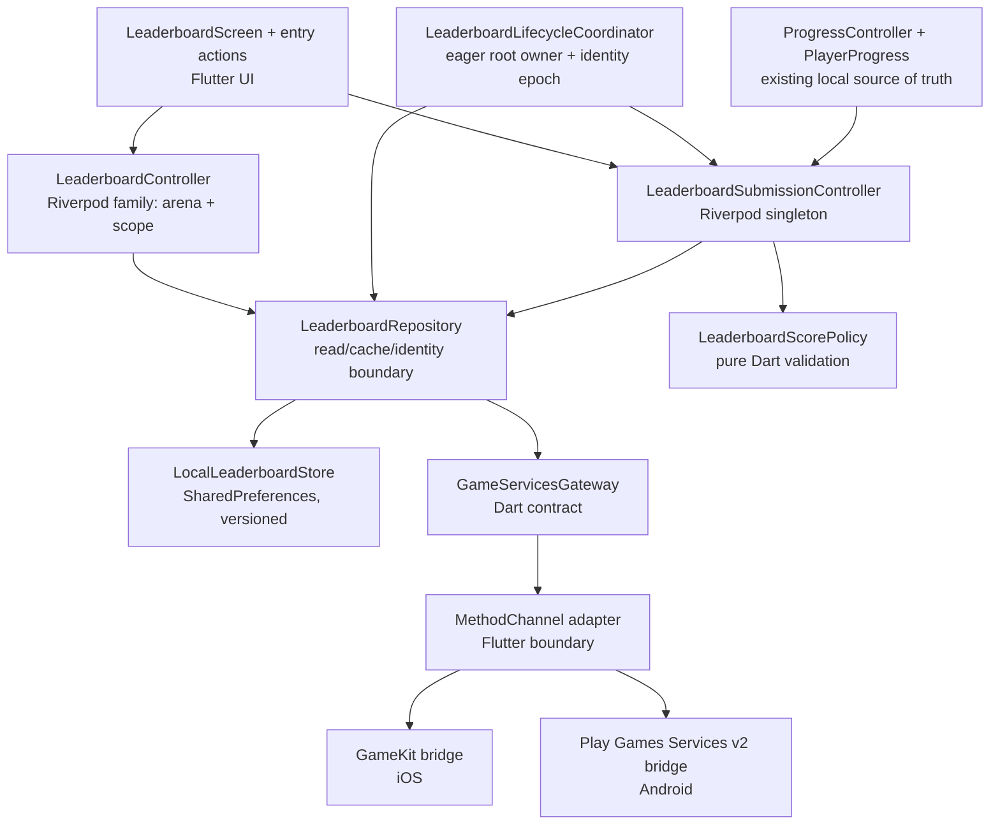
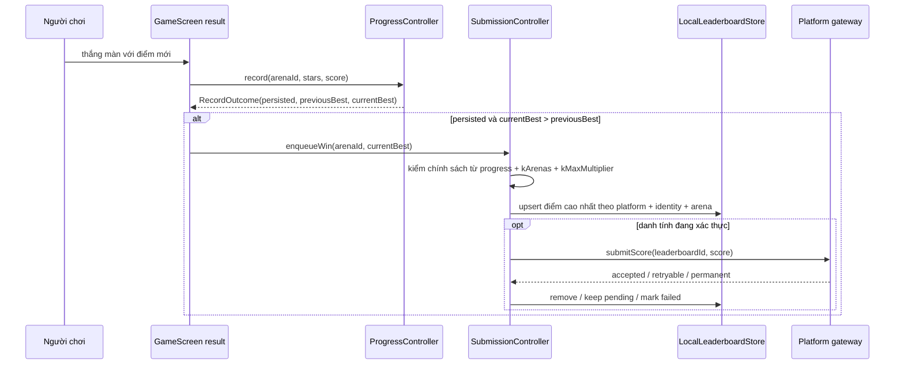

# Design: Bảng xếp hạng theo màn

## Overview

| Review item | Summary |
| --- | --- |
| **Goal and approach** | Thêm 20 bảng điểm theo màn bằng giao diện Flutter riêng; Game Center và Google Play Games chỉ nằm sau một gateway nền tảng. Cache và hàng đợi gửi điểm được lưu cục bộ, tách theo nền tảng và danh tính. |
| **In scope** | Điểm vào từ Chọn màn/Thắng; xác thực theo nhu cầu; Global/Friends, All-time, top 100 và vị trí cá nhân; cache offline; backfill tối đa 20 kỷ lục; retry bền vững; VI/EN; UI karst đã duyệt. |
| **Out of scope** | Backend/Firebase leaderboard, bảng gộp đa nền tảng, native leaderboard UI, bảng ngày/tuần/chương, server-side anti-cheat, thay đổi `lib/sim/` hoặc solver. |
| **Codebase alignment** | Dùng Riverpod như `providers.dart`, kho `SharedPreferences` có schema/ghi tuần tự như `local_player_store.dart`, route `MaterialPageRoute` như các screen hiện tại và native `MethodChannel` theo ranh giới best-effort của `haptic_service.dart`. |

Foundation `codebase-summary.md` và `code-standards.md` không tồn tại. `system-architecture.md` cũng đã cũ ở phần “không Firebase/không platform scaffolding”, test count và network integration; thiết kế này lấy code hiện hành làm nguồn đúng cho các điểm đó. Luật game, pure-Dart boundary của `lib/sim/` và art direction karst vẫn theo foundation.

## Open Questions

| # | Question | Blocking? | Working assumption |
| --- | --- | --- | --- |
| Q1 | 20 leaderboard ID thật trên mỗi console là gì? | No — không đổi kiến trúc; chặn cấu hình release | Mỗi nền tảng cung cấp đúng 20 ID duy nhất qua native resources; build/test cấu hình thất bại nếu thiếu hoặc trùng. |
| Q2 | Browser QA có được chạy lại sau audit mockup không? | No | Handoff giữ trạng thái chính xác `skipped:no-browser-tool`; implementation phải bổ sung widget/golden/device QA cho toàn bộ 8 state. |

## Architecture



- SDK objects, auth UI and platform error codes stay in native bridges. Dart receives normalized identity, rows and errors; Firebase account state is never used as game-services identity.
- `BanBuaTuongApp` eagerly owns a `WidgetsBindingObserver` lifecycle coordinator. It initializes silent identity status without presenting UI, forwards app-resume events, advances the identity epoch on platform-account changes and serializes submission flushes outside gameplay's frame path.
- Startup may initialize/silently inspect platform auth, but cannot present UI or block gameplay. An explanatory Flutter dialog plus explicit user action is the only path allowed to present platform authentication/profile creation.
- Reads and submissions run outside the `Ticker`/`ShotRunner` frame path. A win is committed locally first; only the returned “new high score persisted” outcome may enqueue a submission.
- The Android bridge uses Play Games Services v2 and disables automatic profile-creation prompts at launch. This reconciles the SDK's silent startup authentication with US-2's no-unsolicited-prompt rule. GameKit similarly defers presentation of any authentication view controller until an explicit action.



Nguồn nghiên cứu nền tảng: Apple GameKit authentication/leaderboards trong requirements; tài liệu Android hiện hành xác nhận PGS v2 tự xác thực nền ở startup, Player ID tách khỏi tài khoản trong game, có thể tắt profile prompt tự động, và leaderboard dùng `LeaderboardsClient`/`submitScore`. Vì UI phải là UI riêng và lỗi cần phân loại ổn định, gateway native được chọn thay vì mở leaderboard intent/native UI.

## Components and Interfaces

```text
lib/
├── core/
│   ├── leaderboard_limits.dart                          [NEW] Precedent: lib/core/bb_tokens.dart
│   └── platform_avatar.dart                             [NEW] No precedent; normalized native-photo contract
├── domain/
│   ├── leaderboard_models.dart                          [NEW] Precedent: lib/domain/player_progress.dart
│   └── leaderboard_score_policy.dart                    [NEW] Precedent: lib/domain/economy.dart
├── data/
│   ├── game_services_gateway.dart                       [NEW] Precedent: lib/data/progress_repository.dart
│   ├── identity_hasher.dart                             [NEW] No precedent
│   ├── method_channel_game_services_gateway.dart        [NEW] Precedent: lib/core/haptic_service.dart
│   ├── leaderboard_repository.dart                      [NEW] Precedent: lib/data/firebase_sync_repository.dart
│   └── local_leaderboard_store.dart                     [NEW] Precedent: lib/data/local_player_store.dart
├── state/
│   ├── leaderboard_controller.dart                      [NEW] Precedent: lib/state/sync_controller.dart
│   ├── leaderboard_lifecycle_coordinator.dart           [NEW] Precedent: lib/main.dart root provider ownership
│   └── providers.dart                                   [CHANGED] Precedent: existing repository/controller providers
├── main.dart                                            [CHANGED] Precedent: existing eager app initialization
├── ui/
│   ├── screens/
│   │   ├── leaderboard_screen.dart                      [NEW] Precedent: lib/ui/screens/arena_map_screen.dart
│   │   ├── arena_map_screen.dart                        [CHANGED] Precedent: existing selected-arena detail flow
│   │   └── game_screen.dart                             [CHANGED] Precedent: existing result overlay and local record flow
│   └── widgets/
│       └── leaderboard_widgets.dart                     [NEW] Precedent: lib/ui/widgets/bb_widgets.dart
├── l10n/
│   ├── app_vi.arb                                       [CHANGED] Precedent: existing feature copy
│   └── app_en.arb                                       [CHANGED] Precedent: existing feature copy
android/app/
├── build.gradle.kts                                     [CHANGED] Precedent: existing Firebase/Google dependencies
└── src/main/
    ├── AndroidManifest.xml                              [CHANGED] Precedent: existing Firebase metadata
    ├── kotlin/com/example/ban_bua_tuong/
    │   ├── MainActivity.kt                              [CHANGED] Precedent: existing FlutterActivity
    │   └── GameServicesBridge.kt                        [NEW] Precedent: MainActivity.kt; no existing game-services bridge
    └── res/values/leaderboards.xml                      [NEW] No precedent
ios/Runner/
├── AppDelegate.swift                                    [CHANGED] Precedent: existing plugin registration
├── GameServicesBridge.swift                             [NEW] Precedent: AppDelegate.swift; no existing game-services bridge
├── LeaderboardCatalog.plist                             [NEW] No precedent
├── Info.plist                                           [CHANGED] Precedent: existing platform permission declarations
├── en.lproj/InfoPlist.strings                           [NEW] No precedent
├── vi.lproj/InfoPlist.strings                           [NEW] No precedent
└── Runner.entitlements                                  [CHANGED] Precedent: existing Sign in with Apple entitlement
test/
├── domain/leaderboard_score_policy_test.dart             [NEW] Precedent: test/domain/player_progress_test.dart
├── data/local_leaderboard_store_test.dart                [NEW] Precedent: test/data/local_player_store_test.dart
├── data/leaderboard_repository_test.dart                 [NEW] Precedent: test/data/firebase_sync_repository_test.dart
├── state/leaderboard_controller_test.dart                [NEW] Precedent: test/state/sync_controller_test.dart
└── ui/leaderboard_screen_test.dart                       [NEW] Precedent: test/ui/arena_map_screen_test.dart
```

Platform project files generated by Xcode/Gradle may change when Game Center capability and the official PGS dependency are enabled; they remain configuration changes, not new app-layer behavior.

### Platform catalog, avatar and gateway

```dart
enum GameServicePlatform { gameCenter, playGames }
enum LeaderboardScope { global, friends }

abstract interface class GameServicesGateway {
  Future<PlatformIdentity?> restoreIdentity();
  Future<PlatformIdentity> authenticate({required bool interactive});
  Future<LeaderboardPage> loadLeaderboard({
    required int arenaId,
    required LeaderboardScope scope,
    required int limit,
  });
  Future<Uint8List?> loadAvatar(PlatformAvatarRef avatar);
  Stream<PlatformIdentityEvent> get identityEvents;
  Future<void> submitScore({required int arenaId, required int score});
  Future<void> validateConfiguration();
}
```

Native code is the single authority that maps arena `1..20` to platform leaderboard IDs: Android reads `leaderboards.xml`; iOS reads `LeaderboardCatalog.plist`. `validateConfiguration` rejects missing/duplicate IDs and platform/application-ID mismatch before release tests. Dart never passes or persists a raw leaderboard ID. `restoreIdentity` never presents UI; `authenticate(interactive: true)` is called only after the app explanation and a user action.

The channel name and method payloads are versioned. Native bridges normalize cancellation, restriction, friends-consent-required/unavailable, unauthenticated, retryable transport/service failure, permanent rejection and unsupported-platform into stable Dart error codes. Platform-owned friend-consent UI remains outside the custom route; its outcome maps back to the mockup's Friends-unavailable/error state. iOS declares localized `NSGKFriendListUsageDescription`; Android maps `FriendsResolutionRequiredException` through the same consent outcome.

`PlatformAvatarRef` is an opaque, memory-only token scoped to platform + identity epoch + player hash. GameKit loads `UIImage` natively and returns bounded image bytes; Android resolves the PGS icon through its native client. The Dart loader limits concurrency and byte size, keeps only a small memory/LRU cache, returns a neutral fallback on failure, and applies bytes only when the row's current player hash still matches so recycled rows cannot show another player's avatar.

### Resource limits

| Contract | Limit |
| --- | ---: |
| Leaderboard read/native channel deadline | 10 seconds |
| Score-submit/native channel deadline | 8 seconds |
| Avatar request deadline | 5 seconds |
| Avatar payload | 256 KiB maximum per player |
| Avatar concurrency | 4 requests |
| Avatar memory LRU | 32 entries and 8 MiB total, whichever is reached first |
| Persisted leaderboard snapshot | 128 KiB maximum, including at most 100 rows |
| Persisted snapshot count | 40 per identity, LRU eviction |

`leaderboard_limits.dart` is the single testable source for Dart-side values; native bridges apply the same channel/payload limits and integration tests assert parity. Exceeding a limit yields the existing retryable read/avatar fallback behavior, never an unbounded allocation or retry loop.

### Domain and persistence contracts

```dart
class PlatformIdentity {
  final GameServicePlatform platform;
  final String playerId;
  final String displayName;
  final PlatformAvatarRef? avatar;
}

class LeaderboardEntry {
  final int rank;
  final String playerId;
  final String displayName;
  final PlatformAvatarRef? avatar;
  final int score;
  final bool isCurrentPlayer;
}

class PersistedLeaderboardRow {
  final int rank;
  final String playerHash;
  final String displayName;
  final int score;
  final bool isCurrentPlayer;
}

class LeaderboardPage {
  final List<LeaderboardEntry> leaders;
  final LeaderboardEntry? currentPlayer;
}

enum SubmissionState { pending, permanentlyFailed }

class PendingScore {
  final String identityHash;
  final GameServicePlatform platform;
  final int arenaId;
  final int score;
  final SubmissionState state;
  final String? reasonCode;
}

abstract interface class LeaderboardScorePolicy {
  ScoreValidation validate({
    required int arenaId,
    required int score,
    required PlayerProgress progress,
  });
}
```

The policy accepts only completed wins whose positive integer score equals the persisted per-level high score and does not exceed `targetCount × 100 × kMaxMultiplier`. It reads `kArenas` and `kMaxMultiplier` without modifying or adding dependencies to `lib/sim/`.

```dart
abstract interface class LocalLeaderboardStore {
  Future<LeaderboardSnapshot?> loadSnapshot(LeaderboardCacheKey key);
  Future<void> saveSnapshot(LeaderboardCacheKey key, LeaderboardSnapshot value);
  Future<List<PendingScore>> loadSubmissions(IdentityKey identity);
  Future<void> upsertHighest(PendingScore score);
  Future<void> markPermanentlyFailed(PendingScore score, String reasonCode);
  Future<void> removeSubmission(PendingScore score);
  Future<bool> hasCompletedInitialBackfill(IdentityKey identity);
  Future<void> markInitialBackfillComplete(IdentityKey identity);
  Future<void> saveLastScope(LeaderboardScope scope);
  LeaderboardScope loadLastScope();
}
```

Snapshots are keyed by platform + hashed platform player ID + arena + scope; submissions/backfill markers are keyed by platform + identity hash. Runtime `LeaderboardEntry` objects may carry raw IDs for SDK comparison, but persistence converts them to `PersistedLeaderboardRow` with salted hashes and no avatar token. Cached current-player marking uses the hash. Writes use versioned, per-cache-key envelopes and a serialized tail so a killed or concurrent operation cannot cross identities or leave duplicate per-arena submissions.

Each snapshot is capped at 100 rows and a bounded serialized size; the store applies per-identity LRU eviction with a fixed maximum of 40 arena/scope snapshots. It never rewrites one monolithic all-account blob. Avatar bytes are not persisted by this store.

```dart
abstract interface class IdentityHasher {
  Future<void> initialize();
  String hashPlayerId(String platformPlayerId);
  IdentitySaltState get saltState;
}
```

`IdentityHasher` generates 32 cryptographically random bytes once per installation and stores them in a dedicated app-private `SharedPreferences` key. The same salt is reused across restarts and is removed with application data, matching cache/queue deletion semantics. If the salt is missing or corrupt while leaderboard partitions exist, identity confidence becomes `unknown`; the store purges the now-unaddressable leaderboard namespace, creates a new salt, and neither displays nor submits old personal data.

### Repository and state contracts

```dart
abstract interface class LeaderboardRepository {
  Future<LeaderboardLoadResult> load({
    required int arenaId,
    required LeaderboardScope scope,
    required bool allowMatchingCache,
  });
  Future<PlatformIdentity> authenticateFromUserAction();
  Future<void> enqueueEligibleHistory(PlayerProgress progress);
  Future<void> enqueueNewHighScore({required int arenaId, required int score});
  Future<SubmissionSummary> flushEligibleSubmissions();
  Future<void> retryFailedManually(int arenaId);
}

class LeaderboardController extends StateNotifier<LeaderboardViewState> {
  Future<void> load();
  Future<void> selectScope(LeaderboardScope scope);
  Future<void> retry();
}

class LeaderboardSubmissionController extends StateNotifier<SubmissionSummary> {
  Future<void> onAuthenticated(PlayerProgress progress);
  Future<void> onPersistedWin(RecordOutcome outcome);
  Future<void> onAppResumed();
  Future<void> retryFailed(int arenaId);
}

abstract interface class LeaderboardLifecycleCoordinator {
  Future<void> initializeSilently();
  Future<void> onAppResumed();
  Future<void> dispose();
}
```

`load` returns fresh data, matching stale cache, empty, friends-unavailable, auth-required or service-error as explicit states. Cache eligibility is decided by the identity-confidence contract below; changed or unknown identity clears the active “mine” view and never exposes another identity's cache.

Identity confidence is explicit: `confirmedCurrent`, `lastKnownUnchanged`, `changed`, or `unknown`. Matching cache may be shown for `confirmedCurrent` or `lastKnownUnchanged` only when the native bridge reports no account-change event since the last confirmed identity; `changed` and `unknown` hide personal rows/cache and never submit. This preserves offline fallback without treating inability to reauthenticate as an account change.

The submission controller serializes flushes, deduplicates by identity + arena, replaces pending values only with a higher score and discards late responses after an identity epoch changes. It backfills once per installed platform identity after first successful auth, and retries on app resume, leaderboard open and persisted new high score without showing auth UI.

The lifecycle coordinator is eagerly watched by `BanBuaTuongApp`, not lazily created by the leaderboard route. It performs silent identity initialization, listens to native identity events, forwards resume notifications and invokes the serialized flush only when identity confidence permits; it never runs inside `Ticker`, painter or simulation callbacks.

For Android, one `loadLeaderboard(limit: 100)` request is fulfilled by `loadTopScores` followed by `loadMoreScores` pages of at most 25, deduplicating by player ID and releasing every `LeaderboardScores` buffer. The bridge separately loads the current-player score when it is not present in the top page. iOS performs the equivalent top-range plus local-player request and preserves the platform-provided rank/tie ordering.

```dart
class RecordOutcome {
  final bool persisted;
  final int arenaId;
  final int previousBest;
  final int currentBest;
  final bool completedByWin;
  final PlayerProgress persistedProgress;
}

Future<RecordOutcome> record(int arenaId, int stars, int score);
```

This is the only changed progress contract. `persistedProgress` is the exact immutable post-save snapshot used by `LeaderboardScorePolicy`, so validation cannot read stale provider state. Existing callers may ignore the result; the result screen awaits it once per terminal-result epoch before notifying leaderboard submission, preserving responsiveness, “local first” ordering and duplicate-enqueue protection after rebuilds.

The submission controller binds each validation/enqueue/flush to the current identity epoch. An account-change event advances the epoch atomically; any late validation, avatar, read or submission response from the old epoch is discarded before state or storage mutation.

### Screen contract and navigation

```dart
class LeaderboardScreen extends ConsumerWidget {
  final int arenaId;
  final LeaderboardOrigin origin;
  final int? achievedScore;
}

enum LeaderboardOrigin { arenaMap, winResult }
```

`ArenaMapScreen` pushes the screen from the selected unlocked arena, so its stateful chapter, selection and `ScrollController` survive pop. `GameScreen` pushes it from the terminal win overlay and retains the existing result state; no progress or rewards are recomputed on return. No entry action exists while aiming or while `_runner != null`.

## UI Design Specification

> UI handoff: [mockup.html](./mockup.html)
> Approved visual reference: [leaderboard-reference-v2.png](./design-assets/leaderboard-reference-v2.png)
> UI source of truth: detailed visual structure, interaction states, accessibility markup and token mapping remain in `mockup.html`.

### Implementation-Critical UI Constraints

- Use `BbCanyonBackdrop`, centered safe-area content, `karstDeep`, `karstTeal`, `karstBronze`, `primaryGold`, `cream` and hard `outlineDark` sticker shadows. Do not derive the screen from legacy galaxy/navy names.
- Global/Friends is a two-state control with label, semantic selected state and a non-color cue. All-time is fixed text, not a third filter.
- Current player is represented exactly once: mark the top-100 row when present, otherwise append the separate same-format row. Rank returned by the platform is authoritative, including ties.
- Every control is at least 48dp. Each row's semantic reading order is rank → platform name → score; loading, scope changes, stale data and errors are announced.

### Screen / Component Summary

The screen owns one arena context and one scope. Its view state covers the eight handoff tabs: loaded, loading, empty, service error, offline cache/no-cache, friends unavailable, auth prompt and entry/submission status. Avatar failure degrades per row to a neutral fallback without failing the list.

Authentication uses the app-styled explanatory dialog from the mockup, then delegates to platform UI. Cancelling returns to matching cache when identity can be confirmed unchanged; otherwise it returns to the origin without changing local progress.

### Design System Dependencies

Reuse `BbCanyonBackdrop`, `BbKarstFrameOverlay`, `BbButton`, `BbIconButton`, `BbCard`, `BbBadge`, `BbText`, Baloo 2/Nunito and the semantic karst tokens already in code. New leaderboard widgets must not introduce raw galaxy/navy surfaces or duplicate the general button/dialog system.

### Responsive Notes

Phone portrait is the primary composition at 390 × 844. Content remains centered at approximately 440dp maximum on larger screens. At large text scale, podium/list rows grow or wrap names to two lines; rank, score, Back, filters and Retry must remain visible. Long lists scroll inside the route, and safe-area padding protects top controls and the final current-player row.

The current handoff's browser revalidation is accurately `skipped:no-browser-tool` because localhost was blocked by URL policy. Static structure and an earlier 8-state visual comparison exist, but Phase 4 must create Flutter widget/golden evidence rather than treating that prior pass as final implementation QA.

## Data Models

| Model / store | New or changed fields | Persistence and invariants |
| --- | --- | --- |
| `LeaderboardCacheKey` | platform, identity hash, arenaId, scope | Exact-match reads only; no cache sharing across account, arena, scope or OS. |
| `LeaderboardSnapshot` | persisted rows ≤100, optional current-player row, fetchedAt, schemaVersion | Replaced only after a complete successful read. Contains player hashes, never raw IDs or avatar tokens. |
| `PendingScore` | platform, identity hash, arenaId, highest score, state, reasonCode | At most one item per identity/arena; a higher value replaces a lower one. Permanent failures do not auto-retry. |
| `LeaderboardSettings` | lastScope | Device-local; defaults to Global when absent or invalid. |
| `BackfillMarker` | platform + identity hash | Written only after all eligible local records have been evaluated and durably queued, not after network submission. |
| `PlayerProgress` | No persisted field change | Remains the local source of completed wins and per-level high scores. Firebase merge/account lifecycle does not mutate platform leaderboard identity. |

The local leaderboard envelope has its own versioned keyspace, separate from `progress_v1` and `player_v2_*`. Clearing application data removes it naturally. Corrupt cache is quarantined/ignored; corrupt pending data must not be submitted and is logged with a stable local error category.

## Error Handling

| Scenario | Handling |
| --- | --- |
| Auth cancelled, restricted or failed | Preserve progress; do not re-prompt until the next explicit action. Show matching cache only after same-identity confirmation; otherwise return to origin. |
| Platform account changed | Increment identity epoch, hide old “mine”/submission state and load only the new identity's partition. Late old-account responses are discarded. |
| Loading with no cache | Non-blocking skeleton; Back and scope controls remain usable. |
| Valid empty board | Show localized empty state; never synthesize zero-score rows. |
| Friends unavailable/privacy restricted | Show localized explanation and Global action; do not treat as generic empty. |
| Read offline/transient failure with matching cache | Render stale snapshot and timestamp/caution label; do not claim online status. |
| Read failure without cache | Keep route open with localized no-data/error state, Retry and Back. |
| Avatar unavailable/expired | Render neutral avatar fallback for only that row. |
| Route closed/scope changed/read timed out | Cancel or ignore work through a request epoch; never publish a stale response into the new scope. Native calls and avatar loads have bounded timeouts. |
| Retryable submission failure | Keep durable `pending`; show “Đang chờ”; retry on approved triggers with one serialized flush. |
| Permanent submission rejection | Keep local high score, mark `permanentlyFailed`, store normalized reason and expose manual Retry. |
| Auth revoked during flush | Stop the flush, keep queue, present no prompt, resume only after explicit auth. |
| Invalid score/configuration | Do not queue or send; log a non-sensitive category. Missing/duplicate 20-ID catalog is a configuration failure surfaced before release. |
| Local queue/cache write fails | Never report sent/pending success that was not persisted. Keep gameplay responsive and show a localized “Không gửi được” state where relevant. |
| Unsupported platform/test host | Gateway returns `unsupported`; game remains fully playable and UI tests inject a fake gateway. |

Logs use stable categories and counts only. They redact display names, avatar bytes/tokens, raw or hashed player identifiers and raw leaderboard IDs; platform error messages are normalized before logging. Network reads, avatar loads and channel calls use bounded timeouts and request/identity epochs rather than unbounded retries.

## Testing Strategy

| Test level | What to verify |
| --- | --- |
| Unit | Score validation for arena 1..20, completed/skipped/lost/zero/overflow cases; exact persisted snapshot usage; installation salt stability across restart and purge-on-loss/corruption; cache key isolation; raw-ID-to-hash persistence conversion; 128 KiB/40-snapshot eviction; 32-entry/8 MiB avatar LRU; scope persistence; backfill ≤20; highest-only dedupe; retryable/permanent transitions; identity confidence/epoch protection; 10s/8s/5s timeout and stale-response behavior. |
| Integration | Method-channel payload/error normalization with mock handlers; native 256 KiB avatar byte/fallback and four-request concurrency contract; Dart/native limit parity; local-save-before-enqueue ordering; auth → backfill → serialized flush; eager lifecycle initialization and app-resume/open/win retry triggers; account switch never reads/submits old partitions; exact catalog coverage/uniqueness on both platforms; Android four-page top-100 aggregation, current-player lookup and buffer release. |
| Widget | Both entry points and restoration; all 8 mockup states in VI/EN; top-100/current-player exclusivity; friends fallback; auth dialog only after explicit action; large text, 48dp targets, semantics/live announcements, phone/tablet widths and neutral avatar fallback. |
| Golden | 390 × 844 loaded screen plus representative loading, offline, error and auth states against the approved karst direction; no galaxy/navy shell regression. |
| Device / sandbox E2E | Game Center sandbox and Play Games test accounts: capabilities/application ID and all 20 console definitions; descending high-score ordering; silent startup without blocking prompt; explicit auth/cancel and friend-consent outcomes; Global/Friends all-time load; top 100 + player-centered rank; submit/backfill; offline cache; revoked auth and platform account switch. |
| Regression | `flutter analyze`, full `flutter test`; verify no changes under `lib/sim/`, `tools/solver/` or generated `lib/sim/arenas.dart`. Solver rerun is not required because balance data is untouched. |

## Design Decisions

| Decision | Choice | Alternative rejected | Why (one line) |
| --- | --- | --- | --- |
| Platform integration | First-party GameKit/PGS v2 behind a versioned MethodChannel | Native leaderboard UI or an unverified cross-platform plugin | Custom UI, friends/top-100/player-rank data and stable error classification are explicit requirements. |
| Leaderboard catalog | Native resource catalog keyed by arena ID, validated through gateway | Duplicated Dart/native maps | Keeps console IDs platform-specific with exactly one authority per platform. |
| Avatar transport | Opaque epoch-scoped token + bounded native byte loader | Cross-platform avatar URI | GameKit exposes photos, not portable URIs; row checks prevent recycled-avatar leaks. |
| Identity | Platform Player ID partition, persisted only as hash | Firebase UID or one device-global cache | Requirements explicitly separate platform identity from the in-game/Firebase account. |
| Lifecycle | Eager root coordinator + identity-event stream | Lazy route-owned retry | Resume retry and account invalidation must work even when the leaderboard route is closed. |
| Auth timing | Silent status initialization; interactive presentation only after explicit action | Mandatory startup login or automatic profile prompt | Preserves offline-first play while remaining compatible with PGS v2 startup authentication. |
| Submission ordering | Persist progress → validate → persist queue → attempt SDK | Fire-and-forget directly from win UI | Prevents lost local progress and makes retry crash-safe. |
| Retry | One serialized per-identity queue; highest score per arena | One request per event with duplicate entries | Bounds backfill at 20 and avoids duplicate/cross-account submission. |
| Read cache | Exact platform + identity + arena + scope snapshots | One shared “last leaderboard” blob | Prevents stale or personal data from leaking across contexts. |
| Cache budget | Per-key envelopes, ≤100 rows, 40-snapshot LRU; no avatar bytes | Unbounded monolithic SharedPreferences blob | Bounds serialization cost while retaining both scopes for 20 arenas. |
| Anti-cheat | Pure-Dart local policy using live arena data and `kMaxMultiplier` | Tuned per-level caps or server verification | Matches approved client-only scope without duplicating balance constants. |
| UI source | Link to approved `mockup.html` and karst image | Re-describe or recreate the UI in design.md | Keeps one visual source of truth and prevents style drift. |

## Next Steps

Once this design is approved, proceed to Phase 3: Implementation Planning.

**What to do next:**
1. Use the slash command: `/aidlc.construction.create-tasks`
2. The agent will automatically read `references/phase-3-tasks.md` for detailed workflow instructions
3. Foundation docs will be referenced for implementation patterns

This will create `tasks.md` with actionable task checklist for code implementation.
