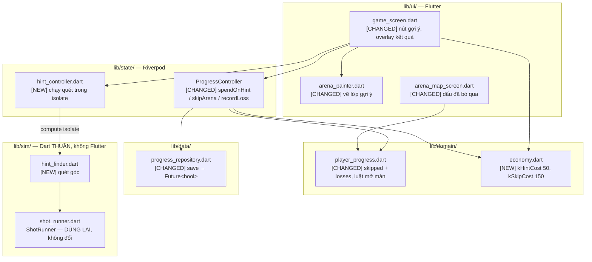
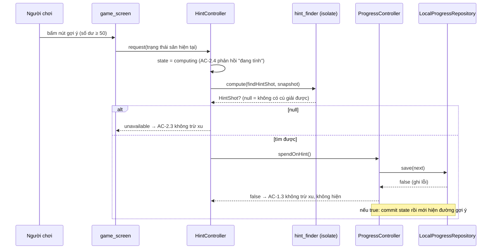

# Design: Đường ra khỏi màn bí

## Overview

| Review item | Summary |
| --- | --- |
| **Goal and approach** | Cho người chơi đường ra khỏi màn không giải được, và biến xu thành tài nguyên tiêu được. Ba thay đổi chịu lực: (1) `LevelResult` nhận hai field mới `skipped` + `losses`, đọc null-tolerant; (2) `ProgressRepository.save` đổi từ `Future<void>` sang `Future<bool>` để giao dịch trừ-xu **quan sát được thành/thất bại**; (3) `lib/sim/hint_finder.dart` mới — phép quét góc Dart thuần chạy `ShotRunner` tới khi bi chết, trong isolate. |
| **In scope** | Mua gợi ý 50 xu vẽ trọn đường carom; bỏ qua màn 150 xu; bộ đếm thua theo màn bền qua lần mở app; lời nhắc ở mốc thua 2 và 3; dấu "đã bỏ qua" tái dùng trên item/node màn; tương thích ngược save cũ. |
| **Out of scope** | Nhóm chương / tiến độ sao theo chương / auto-scroll (Unit 3); hiệu ứng + haptics (Unit 2); đổi cách **thu** xu; mọi thay đổi lên `lib/sim/` làm đổi luật chơi. |

## Open Questions

| # | Question | Blocking? | Working assumption |
| --- | --- | --- | --- |
| Q1 | Đổi `ProgressRepository.save` sang `Future<bool>` có phá ý định của `US-017 AC-1.1` ("never throw up to the UI")? | **Không** | Không phá. Hợp đồng mới **vẫn không throw** — nó trả `false`. "Không throw" được giữ; "không quan sát được" mới là thứ bị bỏ, và requirements AC-2.3 đòi bỏ nó. |
| Q2 | `samples = 361` cho phép quét góc có đủ nhanh trong isolate trên máy tầm thấp? | Không | Đủ cho gợi ý runtime. Pipeline campaign dùng 721 góc để bắt các khe one-shot hẹp; hint vẫn dùng 361 để giữ ngân sách trên thiết bị. Nếu đo thấy chậm, hạ `samples` là tham số, không phải đổi thiết kế. |
| Q3 | Gợi ý nên loại các cú làm bi rơi đáy ngay dù có phá được mục tiêu? | Không | Không loại. D8 định nghĩa "cú giải được" = phá ≥1 mục tiêu còn lại; thêm điều kiện là trượt sang bảo đảm mạnh hơn đã bị loại. |
| Q4 | Bộ đếm thua lưu trong `LevelResult` nghĩa là một màn **chỉ mới thua** cũng sinh entry `LevelResult(stars: 0)`. Có làm sai `completedMax`/`totalStars`? | Không | Không. `completedMax` lọc `stars >= 1 \|\| skipped`; `totalStars` cộng `stars` nên entry 0-sao góp 0. Đã kiểm cả hai getter. |
| Q5 | **Người chơi có bắn lại được đúng cú mà gợi ý vẽ ra không?** Quét 361 góc trên cung ~118° cho độ phân giải ~0.33°/mẫu; tái tạo bằng cách kéo ngón tay là rất khó. | **Không — nhưng là rủi ro sản phẩm cần biết** | **Không thêm snap hay aim-assist.** AC-3.3 cấm tự ngắm hộ, và snap-theo-góc-gợi-ý *là* tự ngắm hộ dưới tên khác. Gợi ý là **bài học hình học**: nó chỉ ra đường carom tồn tại, người chơi tự dò. Preview thụ động hai đoạn đã có **chính là** phản hồi cho biết họ đang gần đúng chưa. **Playtest phải trả lời** liệu 50 xu có đáng khi phải tự dò lại — nếu không, hoặc nới AC-3.3 (đổi requirements) hoặc hạ giá. |
| Q6 | Định vị bản đồ sau khi bỏ qua màn (US-2 AC-2.2 bullet cuối) làm ở Unit 1 hay hoãn sang Unit 3? | Không | **Hoãn sang Unit 3.** Unit 1 chỉ điều hướng **về bản đồ** và truyền `targetArenaId` qua route. Unit 3 sở hữu auto-scroll (US-3) và dựng lại bố cục thành chương — cài định vị lên `ListView` phẳng hôm nay là việc bỏ đi. |
| Q7 | Chơi lại cùng màn trong một lượt vào màn (AC-5.1): hiện lại gợi ý cũ hay tính lại? | Không | **Hiện lại nguyên trạng, miễn phí.** Chơi lại reset sân về đầy, mà gợi ý đã mua vốn được tính cho sân đầy — nó vẫn đúng. Không tính lại, không trừ xu. |
| Q8 | `record`/`reset` có áp commit-sau-save như ba phép mới không? | Không | **Không.** Giữ đúng commit-rồi-save như hôm nay. Commit-sau-save **chỉ** áp cho hai đường tiêu xu. Lý do ở `system-architecture.md` §3.2: "mất một lần ghi tiến trình còn hơn hiện dialog lỗi giữa game" — đảo nó cho `record` nghĩa là một máy ghi prefs lỗi dai dẳng sẽ **không bao giờ ghi nổi màn đã thắng**. Với tiêu xu thì đánh đổi ngược lại mới đúng: mất xu mà vẫn tắc là tệ hơn. |

## Architecture



- **Pattern đang có**: `StateNotifier` giữ state immutable, repository ghi xuống `SharedPreferences` một khoá JSON, `lib/sim/` là Dart thuần test được không cần thiết bị.
- **Delta**: một tầng `economy.dart` mới cho hai hằng số giá; `ProgressController` nhận ba phép ghi mới, mỗi phép **commit state sau khi save thành công**; `hint_finder.dart` là module sim thứ năm và giữ đúng luật không-import-Flutter.
- **Ranh giới bị ảnh hưởng**: `ProgressRepository.save` là hợp đồng công khai — đổi signature chạm `ProgressController.record`/`reset` và mọi implementation tương lai (`FirestoreProgressRepository` được nhắc trong `providers.dart:43-48`).
- **Ràng buộc chịu lực**: phép quét góc **không được chạy trên UI isolate** (AC-2.4, không khung nào vượt 16ms). `compute()` sống ở tầng state, không ở `lib/sim/`.



## Components and Interfaces

```
lib/
├── sim/
│   └── hint_finder.dart              [NEW]      precedent: hình dạng vòng lặp của previewPath() (không gọi nó)
├── domain/
│   ├── economy.dart                  [NEW]      precedent: lib/sim/arena.dart (file hằng số thuần)
│   └── player_progress.dart          [CHANGED]  schema + luật mở màn
├── data/
│   └── progress_repository.dart      [CHANGED]  save → Future<bool>
├── state/
│   ├── providers.dart                [CHANGED]  ProgressController + hintControllerProvider
│   └── hint_controller.dart          [NEW]      precedent: providers.dart SettingsController
└── ui/
    ├── arena_painter.dart            [CHANGED]  lớp đường gợi ý
    └── screens/
        ├── game_screen.dart          [CHANGED]  nút gợi ý, lời nhắc + bỏ qua màn ở overlay kết quả
        └── arena_map_screen.dart     [CHANGED]  dấu "đã bỏ qua" trên item/node màn
lib/l10n/
├── app_vi.arb                        [CHANGED]  chuỗi mới, VI mặc định
└── app_en.arb                        [CHANGED]  cùng bộ khoá
```

### `lib/domain/economy.dart` [NEW]

```dart
const int kHintCost = 50;
const int kSkipCost = 150;
const int kSkipOfferAfterLosses = 3;
const int kHintReminderAfterLosses = 2;
```

Nguồn duy nhất cho giá và mốc nhắc (AC US-1/4.1, US-2/2.5). Tune sau playtest sửa đúng một file.

### `lib/sim/hint_finder.dart` [NEW]

```dart
class ArenaSnapshot {
  final List<Segment> segments;
  final List<TargetSpec> targets;
  final List<bool> alive;
  final V2 origin;
  final int samples;
}

class HintShot {
  final V2 aim;
  final List<V2> path;
  final int targetsDestroyed;
}

HintShot? findHintShot(ArenaSnapshot snapshot);   // top-level, một tham số — hợp đồng của compute()
```

Quét `snapshot.samples` hướng ngắm trong giới hạn `kMinAimUp`, mô phỏng **từng cú tới khi bi chết** bằng `ShotRunner`, và trả cú **đầu tiên** sinh ít nhất một `ShotEventKind.broke`. `null` khi không có cú nào (US-1 AC-2.3). Dart thuần, không import Flutter.

Năm điều kiện đúng đắn mà implementation **không được** làm sai:

1. **Sao lại hình dạng vòng lặp của `previewPath()` (`shot_runner.dart:240-261`), bỏ chặn `vertices < maxBanks`, thêm ghi nhận `broke`. Không *gọi* `previewPath`** — nó cắt ở `maxBanks` đỉnh và **bỏ hết** `ShotEventKind.broke`, tức không nói được cú đó có phá mục tiêu nào không, mà đó chính là tiêu chí chọn (D8). Bốn thứ vòng lặp đó **đã làm đúng** và phải giữ:
   - `origin` là đỉnh số 0;
   - **cả `bank` và `blocked` đều là đỉnh** — comment ngay trong source cảnh báo: bỏ `blocked` thì polyline đi xuyên qua một mục tiêu mà bi thật sự nảy ra khỏi;
   - **vét `probe.pending` mỗi vòng** — nó được thiết kế để tầng trình bày vét mỗi khung, không vét thì nó dồn vô hạn;
   - `alive: List<bool>.of(alive)` — chính là điều kiện 2 dưới đây, và `previewPath` là tiền lệ cho nó.
2. **Mỗi mẫu phải chạy trên `List<bool>.of(alive)` riêng.** `ShotRunner` **ghi thẳng vào** list `alive` của caller (`shot_runner.dart:75-77`, `system-architecture.md` §4.2.4 gọi đây là cái bẫy). Dùng chung một list là 361 mẫu ăn mòn lẫn nhau và làm hỏng trạng thái sân thật.
3. **Thứ tự quét là tăng dần theo góc**, từ biên trái cung `kMinAimUp` sang biên phải. "Cú đầu tiên" chỉ tất định khi thứ tự tất định.
4. **`dt = 1/120`, guard ≥ `1680` vòng.** `ShotRunner.step` substep đúng `1/480`, nên mọi `dt` là bội nguyên của `1/480` cho biên substep y hệt và phép quét tái lập được — `1/120` thoả. Guard phải **buộc vào timeout 14s của `ShotRunner`** (`shot_runner.dart:143`): `14 × 120 = 1680`. Sao chép nguyên con `1500` của `previewPath` sẽ **cắt sớm** các cú dài hơn mức runner tự dừng, khiến một cú carom muộn *giải được thật* bị xếp là không giải được và làm AC-2.3 báo sai.
5. **`path` kết thúc ở vị trí `broke` cuối cùng**, không ở chỗ bi chết. `previewPath` nối `probe.ball.pos` làm điểm cuối (`shot_runner.dart:260`); với một lần chạy tới-khi-chết thì đó là vị trí bi **đã rơi khỏi đáy sân**. Vẽ điểm đó nghĩa là gợi ý trả phí cho người chơi xem bi bay vượt qua mục tiêu cuối nó phá rồi lao ra khỏi màn hình — AC-2.1 nói "tới mục tiêu cuối mà cú đó phá được".

> **`broke` không phải đỉnh.** `_resolveTargets` phá mục tiêu rồi `continue` **không đổi vận tốc** (`shot_runner.dart:195-197`) — bi xuyên qua. Nên `broke` chỉ dùng để *phát hiện*, `bank`/`blocked` mới là *đỉnh*.
>
> **Sai số đã biết, chấp nhận có ý thức**: sự kiện `blocked` mang `t.pos` — **tâm mục tiêu**, không phải điểm chạm bề mặt (`shot_runner.dart:210`). Nên polyline gãy ở tâm mục tiêu, lệch tối đa `kBallRadius + kTargetRadius` mỗi lần nảy vào mục tiêu chưa đủ điều kiện. `previewPath` chấp nhận sai số này cho preview 2 đỉnh; ở đây đường dài hơn nên sai số dồn lớn hơn. Giữ nguyên để **nhất quán với preview đang có** — nhưng ghi ra chứ không thừa hưởng im lặng.

`ArenaSnapshot` sống trong `lib/sim/` cùng `hint_finder`, giữ **bản copy** của `alive`, và chỉ gồm giá trị Dart thuần bất biến (`Segment`, `TargetSpec`, `V2`) nên `compute()` deep-copy được qua ranh giới isolate.

**Độ trung thực chỉ ở mức luật, không ở mức pixel**: `ShotRunner.step` substep 1/480s nhưng substep cuối mỗi khung là phần dư tính từ `dt` của `Ticker`. Quét ở `dt` cố định **không** tái tạo đúng biên substep của cú bắn thật, nên qua một carom 5 lần dội đường có thể lệch. Cam kết là *cùng luật*, không phải *cùng từng pixel*.

### `lib/domain/player_progress.dart` [CHANGED]

```dart
class LevelResult {
  final int stars;
  final int highScore;
  final bool skipped;   // new
  final int losses;     // new
}

class PlayerProgress {
  int get completedMax;                              // changed: stars >= 1 || skipped
  bool isSkipped(int levelId);                       // new
  int lossesFor(int levelId);                        // new
  bool canAfford(int amount);                        // new
  PlayerProgress withCoinsSpent(int amount);         // new
  PlayerProgress withSkipped(int levelId);           // new
  PlayerProgress withLoss(int levelId);              // new
  PlayerProgress withResult(int levelId, int stars, int score);  // changed
}
```

`withSkipped` ghi `skipped: true` + `losses: 0` trong **một** giá trị trả về, nên xu, dấu bỏ qua và bộ đếm cùng đi vào một lần serialize (AC US-2/2.2, ràng buộc C8).

`withResult` **là [CHANGED] và bắt buộc phải sửa**: hôm nay nó dựng `LevelResult(stars: bestStars, highScore: bestScore)` (`player_progress.dart:53`). Thêm hai field mới mà không sửa hàm này thì mỗi lần thắng sẽ **âm thầm** reset chúng về mặc định — tình cờ đúng, nhưng AC US-2/3.3 (thắng lại màn bỏ qua thì bỏ dấu) và AC US-3/1.2 (thắng thì reset bộ đếm) sẽ **không có chủ sở hữu thiết kế nào**. Hợp đồng: `withResult` **xoá `skipped`** và **đặt `losses = 0`**, có chủ đích, có test.

`canAfford` là chỗ kiểm đủ tiền — kiểm **trước** khi gọi `withCoinsSpent`. `withCoinsSpent` vẫn kẹp sàn 0 (AC US-1/1.2) nhưng kẹp là lưới an toàn, **không phải** cơ chế từ chối: kẹp một mình sẽ âm thầm cho phép một giao dịch không đủ tiền đi qua.

`totalStars` và `isCompleted` **không đổi** — màn bỏ qua góp 0 sao (AC US-2/3.2).

### `lib/data/progress_repository.dart` [CHANGED]

```dart
abstract class ProgressRepository {
  Future<PlayerProgress> load();
  Future<bool> save(PlayerProgress progress);   // changed: was Future<void>
}
```

`save` **vẫn không throw** lên UI; nó trả `false` khi ghi thất bại. Đây là thay đổi hợp đồng đắt nhất trong unit và là điều kiện duy nhất để US-2 AC-2.3 có trigger kiểm được (ràng buộc C9).

**`false` được sinh ra từ đâu — phải nói rõ, nếu không việc đổi hợp đồng thành vô nghĩa**: `SharedPreferences.setString` tự nó trả `Future<bool>`. Hợp đồng mới là `return await _prefs.setString(...)` cho đường thành công, và `return false` trong khối `catch` (giữ nguyên `dev.log` đang có). Cách cài dễ sa vào nhất — `try { ... } return true;` — sẽ để AC-2.3 y nguyên tình trạng không kiểm được mà chính thay đổi này sinh ra để sửa.

### `lib/state/providers.dart` [CHANGED]

```dart
enum SpendResult { ok, insufficientCoins, writeFailed }   // new

class ProgressController extends StateNotifier<PlayerProgress> {
  Future<SpendResult> spendOnHint();          // new
  Future<SpendResult> skipArena(int arenaId); // new
  Future<void> recordLoss(int arenaId);       // new
  Future<void> record(int arenaId, int stars, int score); // unchanged write shape
}
```

Hai phép **tiêu xu** theo hình dạng: `canAfford` → dựng state kế tiếp → `save` → **chỉ commit `state` khi `save` trả `true`**.

`SpendResult` thay cho `bool` vì requirements đòi **ba** kết cục khác nhau, không phải hai: `insufficientCoins` → AC US-1/4.2-4.3 và US-2/2.4 (hiện giá + số còn thiếu); `writeFailed` → AC US-1/1.3 và US-2/2.3 (không trừ xu, không hiện/không điều hướng). Một `bool` trộn hai thứ này lại và UI không tách được chúng ra.

`record` và `reset` **giữ nguyên** hình dạng commit-rồi-save như hôm nay (Q8). Commit-sau-save **chỉ** áp cho hai đường tiêu xu. `record` vẫn là [CHANGED] nhưng chỉ vì `withResult` giờ xoá `skipped`/`losses` — không vì đường ghi đổi.

**Chống bấm trùng** (AC US-1/1.2 "kể cả khi hai giao dịch xảy ra sát nhau"): cả hai phép tiêu xu SHALL bỏ qua lời gọi mới khi đang có một lời gọi chưa xong. Không có chốt này thì hai lần chạm nhanh là hai lần trừ xu.

### `lib/state/hint_controller.dart` [NEW]

```dart
enum HintStatus { idle, computing, shown, unavailable, failed, insufficientCoins }

class HintState {
  final HintStatus status;
  final List<V2> path;              // đang hiện — clearOnShot xoá cái này
  final List<V2> purchasedPath;     // BẢN GHI mua — clearOnShot KHÔNG chạm
  final int? purchasedForArenaId;   // AC US-1/5.1-5.2 — null = chưa mua
}

class HintController extends StateNotifier<HintState> {
  Future<void> request(ArenaSnapshot snapshot);
  void clearOnShot();                    // AC US-1/3.6 — chỉ xoá `path`, status về idle
  void onArenaLoaded(int arenaId);       // AC US-1/5.1 + 5.2 — quyết theo id, không theo call site
}
```

**Bản ghi mua phải tách khỏi trạng thái hiển thị**, nếu không AC-5.1 là code chết. Lý do: người chơi **chỉ** tới được nút chơi lại sau khi thua (`_shotsLeft <= 0` sau một cú bắn) hoặc thắng (`remaining == 0` sau một cú bắn) — **mọi** đường đều đi qua một cú bắn, nên `clearOnShot` **luôn luôn** chạy trước. Nếu `clearOnShot` xoá bản sao duy nhất của polyline thì lúc `onArenaLoaded` chạy không còn gì để hiện lại, và dòng "hiện lại miễn phí" trong bảng dưới trông đúng nhưng không bao giờ làm gì.

**Trạng thái "đã mua" phải khoá theo `arenaId`, không theo vòng đời widget** — đây là chỗ bản trước của design sai:

| Trigger | Nguồn trong code | Hành vi |
| --- | --- | --- |
| Người chơi **bắn** | `onPanEnd`/`onTapUp` | `clearOnShot` — xoá `path`, status về `idle`; **giữ** `purchasedPath` + `purchasedForArenaId`. Bấm gợi ý lại **trừ 50 xu** (AC-5.3, D7) |
| **Chơi lại** cùng màn | `setState(() => _load(index))`, `game_screen.dart:457` | `onArenaLoaded(id)` với `id == purchasedForArenaId` → `path = purchasedPath`, **miễn phí** (AC-5.1, Q7) |
| **Sang màn kế** | `setState(() { _guideVisible = false; _load(index + 1); })`, `game_screen.dart:464-467` | `onArenaLoaded(id)` với `id != purchasedForArenaId` → xoá **cả hai** path, `purchasedForArenaId = null` (AC-5.2) |
| Vào màn từ bản đồ | mở `game_screen` | `onArenaLoaded(id)`, cùng luật id |

> **Vì sao không dùng `resetForNewEntry` gắn với mount**: `_load` là **một** method phục vụ **ba** nghĩa — chơi lại ở `index`, sang màn ở `index + 1`, và load lần đầu. Đường sang màn kế chạy `setState` trên **cùng** `_GameScreenState` (`game_screen.dart:464-467`), nên `game_screen` **không remount** và một hàm reset gắn với mount **không bao giờ chạy**. Hậu quả: `purchasedForArenaId` và `path` cũ đi theo sang màn N+1, và người chơi được một đường gợi ý **miễn phí vẽ theo hình học của màn N** — vừa là lỗ rò giá trị vừa là đường vẽ sai. So sánh `arenaId` bắt được cả ba nghĩa của `_load` bằng một luật.

`HintStatus.failed` tách "isolate lỗi" khỏi `unavailable` ("không tồn tại cú giải được") — hai thứ này cần hai thông điệp khác nhau, và chỉ `unavailable` mới là kết cục hợp lệ theo AC-2.3.

**Vòng đời `compute()`**: `request` SHALL bỏ qua lời gọi mới khi `status == computing`, và SHALL không gán state sau khi notifier đã dispose — nếu người chơi thoát `game_screen` giữa lúc quét, future hoàn thành vào một `StateNotifier` đã chết và sẽ throw.

**Ngân sách độ trễ — deadline nằm BÊN TRONG isolate**: `findHintShot` nhận `budget: Duration` và tự kiểm một `Stopwatch` sau mỗi mẫu; hết ngân sách thì dừng quét và trả kết quả tốt nhất tìm được tới lúc đó (`null` nếu chưa có). Ngân sách khởi điểm **2 giây**, một lần gọi, không có tầng thử lại.

> **Vì sao không phải "huỷ rồi hạ `samples`"**: `compute()` trả một `Future` trơn, **không có kill handle** — một isolate đang chạy không huỷ được. "Huỷ và thử lại với 181 mẫu" khi cài đúng nghĩa từng chữ sẽ thành: thôi không `await` nữa trong khi isolate thứ nhất **vẫn đốt CPU tới hết**, rồi spawn isolate thứ hai **chạy song song** — hai phép quét cùng lúc trên đúng cái máy vốn đã quá chậm. Nó làm trường hợp chậm tệ hơn, ngược hẳn ý định. Cùng lý do đó, chốt dispose chỉ bỏ *kết quả*, nó **không** dừng được *công việc*; deadline trong isolate là thứ duy nhất thực sự dừng được công việc.

2s là mốc khởi điểm **chưa đo trên thiết bị** — xem § Điều kiện chưa kiểm.

### `lib/ui/arena_painter.dart` [CHANGED]

```dart
class ArenaPainter extends CustomPainter {
  final List<V2> hintPath;   // new — rỗng khi không có gợi ý
}
```

**Vị trí z-order chính xác** — Unit 2 sẽ chèn tầng hiệu ứng vào cùng hợp đồng này, nên khe phải nói rõ không mơ hồ:

```
nền → (rung) → khung → khối chắn → vạch chéo → vệt ma → [ĐƯỜNG GỢI Ý] → vệt bay
    → mục tiêu → preview ngắm → súng → bóng → hệ số → tem
```

Gợi ý nằm **trên** vệt ma và **dưới** vệt bay, nên cú đang bay vẫn đọc rõ hơn đường gợi ý tĩnh, và mục tiêu + biểu cảm luôn ở trên cả hai (AC US-1/3.5).

**Phân biệt bằng ít nhất hai kênh, không chỉ màu** (AC US-1/3.1). Hệ đích đã
chuyển bóng, trail và impact sang `trajectoryCyan`; vì vậy gợi ý không được tiếp
tục dựa vào `cream` của palette cũ. Chọn tổ hợp sau:

| Lớp | Token đích | Kiểu nét / marker |
| --- | --- | --- |
| Preview ngắm | `trajectoryCyan` | dotted, tối đa hai đoạn, đoạn hai nhạt hơn |
| Vệt ma | `trajectoryCyan` opacity thấp | liền mảnh, không marker |
| Bóng / trail | `trajectoryCyan` | liền sáng, có core |
| Vạch đáy | `dangerRed` | nét đứt, không waypoint |
| **Đường gợi ý trả phí** | **`primaryGold`** | **nét đứt + vòng waypoint tại từng điểm dội** |

`primaryGold` nói đây là thông tin đã mua/chủ động, còn vòng waypoint làm đường
vẫn phân biệt được khi không nhận ra màu. Không dùng `secondaryBlue` vì quá gần
`trajectoryCyan`, và không dùng màu của blocker/deflector vì đường gợi ý sẽ bị đọc
nhầm thành hình học sân.

Độ dày, dash/gap và kích thước waypoint đi qua token hoặc hằng số có tên trong
`ArenaInk`; không ghi alpha/hex trực tiếp trong painter. Dùng lại helper `_dashed`
cho polyline và thêm helper waypoint riêng. Golden phải phủ cả ba lớp cùng lúc:
hint + ghost + target; target và tín hiệu `armed` luôn nằm trên hint.

Gợi ý bị xoá khi người chơi bắn, nên không cạnh tranh với trail đang bay. Nếu vòng
đời này đổi trong tương lai, phải thiết kế lại thay vì dựa vào việc hai lớp tình cờ
không cùng xuất hiện.

**Accessibility**: khi gợi ý hiện, phát live announcement “Đã hiện đường gợi ý”.
Đây là mức tối thiểu theo `uiux-guideline.md` §8; mô tả hình học đầy đủ cho screen
reader nằm ngoài phạm vi unit.

## UI Design Specification

Ràng buộc UI đi từ `uiux-guideline.md`, code đang render và golden hiện hành:

- Nút gợi ý dùng action gold hoặc icon button karst teal có gold accent tuỳ mật độ footer,
  đặt ở **footer màn chơi**, vùng chạm ≥48dp và không đè shooter/vùng bóng bay
  (AC US-1/6.1, 6.4). Không dùng coral/teal từ theme cũ.
- Trạng thái vô hiệu phải theo §4.1: giảm saturation khoảng 70%, opacity 55%, bỏ
  glow nhưng vẫn giữ giá và lý do thiếu xu đọc được; không mặc định component cũ
  đã khớp target nếu chưa có golden.
- Dấu "đã bỏ qua" trên node grid: badge/icon có chữ, không chỉ màu — AC US-2/5.2.
- Xác nhận bỏ qua dùng dialog karst jade/teal có khung bronze, scrim 70–80%, CTA chính gold và CTA
  phụ blue; không tạo style popup riêng.
- Trên màn thua, **Thử lại** giữ `primaryGold`; gợi ý/bỏ qua dùng secondary/utility
  treatment nên không nổi bật hơn đường tiếp tục chơi (AC US-3/3.2).
- Giá và số xu còn thiếu hiện ở badge karst teal/gold cạnh nút, không nhét vào nhãn CTA.
  Nguồn số dư vẫn là `progressProvider`; `HintStatus.insufficientCoins` chỉ là
  trạng thái hiển thị dẫn xuất.

### Trạng thái lời nhắc đã bỏ qua (AC US-3/3.3)

Lời nhắc bị bỏ qua **không** được lưu xuống tiến trình — nó là trạng thái theo phiên, khoá theo **số lần thua hiện tại** của màn đó: `dismissedAtLossCount`. Bỏ qua ở lần thua thứ 2 thì lời nhắc im cho tới khi bộ đếm sang 3. Đây là cách duy nhất thoả "không hiện lại **cho tới lần thua tiếp theo**" mà không thêm field vào schema đã lưu.

### Chuỗi ARB mới (VI + EN, cùng bộ khoá)

| Khoá | Dùng ở |
| --- | --- |
| `hintButtonLabel` | nút gợi ý (AC US-1/6.1) |
| `hintCostBadge` | giá gợi ý, có placeholder số xu |
| `hintInsufficientCoins` | thiếu xu, có placeholder số còn thiếu (AC US-1/4.2) |
| `hintUnavailable` | không tìm được cú giải được (AC US-1/2.3) |
| `hintComputing` | phản hồi "đang tính" (AC US-1/2.4) |
| `hintFailed` | quét lỗi (`HintStatus.failed`) |
| `hintShownAnnouncement` | Semantics announcement khi gợi ý hiện |
| `skipArenaLabel` | lựa chọn bỏ qua màn |
| `skipArenaCostBadge` | giá bỏ qua, placeholder số xu |
| `skipArenaInsufficientCoins` | thiếu xu, placeholder số còn thiếu (AC US-2/2.4) |
| `skipArenaConfirmTitle` / `skipArenaConfirmBody` / `skipArenaConfirmCta` | dialog xác nhận (AC US-2/2.1) |
| `skipArenaWriteFailed` | ghi thất bại (AC US-2/2.3) |
| `arenaSkippedBadge` | dấu "đã bỏ qua" trên item/node màn (AC US-2/5.1) |
| `stuckReminderHint` | nhắc ở lần thua thứ 2 (AC US-3/2.1) |
| `stuckReminderHintAndSkip` | nhắc ở lần thua thứ 3 (AC US-3/2.2) |
| `stuckReminderRetryCta` | lựa chọn thử lại, không kém nổi bật hơn (AC US-3/3.2) |

Liệt kê ở đây vì đây đúng là loại việc âm thầm chỉ có VI (AC US-1/6.3, US-2/5.4, US-3/3.4).

## Data Models

Schema lưu ở `SharedPreferences` khoá `progress_v1`, một chuỗi JSON của `PlayerProgress.toJson()`.

| Field | Vị trí | New/Changed | Đọc từ save cũ |
| --- | --- | --- | --- |
| `coins` | `PlayerProgress` | không đổi | `as int? ?? 0` (đã có) |
| `results` | `PlayerProgress` | không đổi | đã có |
| `stars` | `LevelResult` | không đổi | **phải đổi sang `as int? ?? 0`** — hiện là `as int`, ràng buộc C2 |
| `highScore` | `LevelResult` | không đổi | **phải đổi sang `as int? ?? 0`** |
| `skipped` | `LevelResult` | **new** | `as bool? ?? false` → AC US-2/4.1 |
| `losses` | `LevelResult` | **new** | `as int? ?? 0` → AC US-3/1.6 |

Không có bước migration. Không đổi tên khoá `progress_v1` — đổi tên là làm mất tiến trình của mọi người chơi hiện có.

## Error Handling

| Scenario | Handling |
| --- | --- |
| Số dư < 50 khi mở màn chơi | Nút gợi ý vô hiệu nhưng vẫn thấy, kèm giá và số xu còn thiếu (AC US-1/4.2) |
| Bấm nút gợi ý đang vô hiệu | Không trừ xu, không hiện gợi ý, không rời màn (AC US-1/4.3) |
| `findHintShot` trả `null` | `HintStatus.unavailable`, không trừ xu, thông báo gợi ý không dùng được ở trạng thái này (AC US-1/2.3) |
| `save` trả `false` khi mua gợi ý | Không commit state, không hiện gợi ý — số dư giữ nguyên (AC US-1/1.3) |
| `save` trả `false` khi bỏ qua màn | Không commit state, không mở màn kế tiếp, không trừ xu (AC US-2/2.3) |
| Số dư < 150 khi bỏ qua màn | Lựa chọn bỏ qua vô hiệu kèm giá và số còn thiếu (AC US-2/2.4) |
| Màn đã thắng thật hoặc đã bỏ qua | Không hiện lựa chọn bỏ qua — chặn tính phí hai lần (AC US-2/1.2) |
| Quét góc lâu hơn một khung | `HintStatus.computing` + phản hồi "đang tính", chạy trong isolate nên không rơi khung (AC US-1/2.4) |
| Save cũ thiếu `skipped`/`losses` | Mặc định `false`/`0`, không mất sao/điểm/xu (AC US-2/4.1, 4.2) |
| Save hỏng, không parse được | `load()` rơi về `PlayerProgress()` rỗng — **đã có**, chốt chống hồi quy (AC US-2/4.3) |
| Thoát màn giữa lượt | **Không** tăng bộ đếm thua (AC US-3/1.7) |
| Isolate quét gợi ý throw | `HintStatus.failed`, không trừ xu — tách khỏi `unavailable` vì đây không phải kết cục hợp lệ theo AC-2.3 |
| Quét vượt ngân sách 2s | Deadline **trong** isolate hết → trả kết quả tốt nhất tới lúc đó; `null` nếu chưa có cú nào → xử như AC-2.3. Không có tầng thử lại (`compute()` không huỷ được) |
| Người chơi thoát màn giữa lúc quét | Bỏ kết quả, **không** gán state vào notifier đã dispose |
| Bấm nút gợi ý / xác nhận bỏ qua hai lần liên tiếp | Lời gọi thứ hai bị bỏ qua khi lời gọi đầu chưa xong — chống trừ xu hai lần (AC US-1/1.2) |
| Bỏ qua lời nhắc rồi thua tiếp cùng màn | Lời nhắc hiện lại vì `dismissedAtLossCount` khác bộ đếm mới (AC US-3/3.3) |
| Chơi lại cùng màn sau khi đã mua gợi ý | `path = purchasedPath`, **miễn phí** — sân về đầy nên gợi ý vẫn đúng (AC US-1/5.1) |
| Sang màn kế sau khi đã mua gợi ý ở màn trước | Xoá **cả** `path` và `purchasedPath`, `purchasedForArenaId = null` — không rò gợi ý trả phí, không vẽ đường theo hình học màn cũ (AC US-1/5.2) |

## Testing Strategy

| Test level | What to verify |
| --- | --- |
| Unit — `lib/sim/hint_finder.dart` | Tìm được cú phá ≥1 mục tiêu ở sân đầy và ở sân đã vơi; trả `null` khi không có cú nào; mọi cú trả về tôn trọng `kMinAimUp`; **không mutate `alive` của caller** (chạy quét rồi assert list gốc y nguyên — đây là cái bẫy `ShotRunner` ở `system-architecture.md` §4.2.4); kết quả **tất định** khi gọi hai lần cùng snapshot; không import Flutter |
| Unit — `PlayerProgress` | `withCoinsSpent` không xuống dưới 0; `withSkipped` mở màn kế tiếp với 0 sao; `totalStars` **không** đổi khi có màn bỏ qua; thắng lại màn bỏ qua thì bỏ dấu; parse save cũ thiếu hai field mới |
| Unit — `ProgressController` | `save` trả `false` ⇒ state **không** commit và xu không bị trừ (cả hai đường tiêu xu); `SpendResult` phân biệt được `insufficientCoins` với `writeFailed`; bấm hai lần liên tiếp chỉ trừ xu **một** lần; thắng màn reset bộ đếm thua **và** bỏ dấu `skipped` (qua `withResult`); bỏ qua màn reset bộ đếm thua; `record` **vẫn** commit-rồi-save (không hồi quy sang commit-sau-save) |
| Golden / z-order | Một golden test cho `ArenaPainter` khẳng định đường gợi ý nằm **trên** vệt ma và **dưới** vệt bay, và mục tiêu vẽ trên cả hai. Kiểm mắt golden theo `uiux-guideline.md` §10.3 và §11 để bắt hồi quy z-order do Unit 2 |
| Widget | Nút gợi ý vô hiệu khi thiếu xu; đường gợi ý mất sau khi bắn; lựa chọn bỏ qua chỉ hiện ở lần thua thứ 3 và không hiện với màn đã hoàn thành; lời nhắc ở lần thua 2 và 3; dấu "đã bỏ qua" trên item/node màn |
| Integration | Vòng lưu–đọc qua `SharedPreferences` mock: bỏ qua màn → restart → dấu và bộ đếm còn nguyên |
| Không có E2E | Chưa có hạ tầng E2E trong repo; `flutter test` là mức cao nhất hiện có |

## Design Decisions

| Decision | Choice | Alternative rejected | Why (one line) |
| --- | --- | --- | --- |
| Vẽ trọn lời giải dù preview thường chỉ có hai đoạn | **Cho phép**, giới hạn ở gợi ý **trả phí** | Giữ luật tuyệt đối, gợi ý chỉ vẽ vài đoạn | Người dùng đã được nêu xung đột ở Inception và vẫn chọn: hint **tốn xu và do người chơi chủ động bấm** nên là đánh đổi có giá. `uiux-guideline.md` §2.4, §4.4 và §5.6 vẫn giữ nguyên cho preview thụ động — requirements D5 |
| Nguồn đường carom | Quét góc Dart tại runtime (`hint_finder.dart`) | Bake sẵn lời giải vào `arenas.dart` | AC-2.2 đòi giải **trạng thái sân hiện tại**; dữ liệu bake chỉ phủ được sân đầy lúc mở màn |
| Nền của phép quét | `ShotRunner` chạy tới khi bi chết, phát hiện phá qua sự kiện `broke` | `previewPath()`; hoặc viết lại mô phỏng riêng | `previewPath` cắt ở `maxBanks` đỉnh và **bỏ hết** sự kiện `broke` — không nói được cú đó có phá gì không, mà đó chính là tiêu chí chọn. Mô phỏng riêng thì thành nguồn sự thật thứ hai |
| Độ trung thực của đường vẽ | Cùng **luật**, không cùng từng pixel | Cam kết khớp bit-for-bit cú bắn thật | Substep cuối mỗi khung của `ShotRunner` là phần dư tính từ `dt` của `Ticker`; quét ở `dt` cố định không tái tạo đúng biên đó. Cam kết mạnh hơn là cam kết sai |
| Người chơi tái tạo cú gợi ý | **Không** snap, không aim-assist | Snap hướng kéo về góc gợi ý khi đủ gần | AC-3.3 cấm tự ngắm hộ, và snap *là* tự ngắm hộ dưới tên khác. **Rủi ro đã biết**: độ phân giải quét ~0.33° nên dò lại bằng ngón tay là khó — playtest phải trả lời liệu 50 xu có đáng (Q5) |
| Chỗ chạy phép quét | `compute()` isolate ở tầng state | Chạy đồng bộ trên UI isolate | 361 lần mô phỏng trên UI isolate là rơi khung, phá AC-2.4 |
| Hợp đồng `save` | `Future<bool>` | Giữ `Future<void>`; hoặc throw lên UI | Giữ `void` thì AC-2.3 không có trigger kiểm được; throw thì phá ý định "never throw" của `US-017 AC-1.1` |
| Phạm vi commit-sau-save | **Chỉ** hai đường tiêu xu; `record`/`reset` giữ commit-rồi-save | Áp cho mọi phép ghi | `system-architecture.md` §3.2 chọn "mất một lần ghi còn hơn dialog lỗi giữa game". Đảo nó cho `record` nghĩa là máy ghi prefs lỗi dai dẳng sẽ **không bao giờ ghi nổi màn đã thắng** — với tiêu xu thì đánh đổi ngược lại mới đúng |
| Kiểu trả về phép tiêu xu | `SpendResult` ba nhánh | `bool` | Requirements đòi ba kết cục khác nhau; `bool` trộn "thiếu xu" với "ghi lỗi" và UI không tách ra được |
| Vật liệu đường gợi ý | `primaryGold` **đứt nét + waypoint** | `trajectoryCyan`; hoặc màu blocker/deflector | Cyan đã thuộc bóng/trail/preview; màu hình học sân làm đường dạy bị đọc nhầm thành bề mặt dội. Gold + waypoint phân biệt bằng hai kênh và đúng vai trò thông tin trả phí |
| Ngân sách thời gian quét | Deadline **trong** isolate qua `Stopwatch` | Huỷ `compute()` rồi thử lại với ít mẫu hơn | `compute()` không có kill handle — "huỷ" chỉ là thôi `await` trong khi isolate vẫn đốt CPU, rồi spawn isolate thứ hai **chạy song song**. Làm trường hợp chậm tệ hơn |
| Khoá trạng thái "đã mua gợi ý" | Theo `arenaId` | Theo vòng đời widget (`resetForNewEntry` lúc mount) | Sang màn kế chạy `setState` trên **cùng** State (`game_screen.dart:464-467`) nên không remount — hàm reset gắn mount không bao giờ chạy, và gợi ý trả phí rò sang màn sau kèm đường vẽ sai |
| Định vị bản đồ sau bỏ qua màn | Hoãn sang Unit 3, chỉ truyền `targetArenaId` | Cài auto-scroll ngay trong Unit 1 | Unit 3 dựng lại `arena_map_screen` thành chương và sở hữu auto-scroll — cài lên `ListView` phẳng hôm nay là việc bỏ đi |
| Chỗ chứa `skipped`/`losses` | Field trong `LevelResult` | Hai map riêng ở `PlayerProgress`; hoặc khoá `SharedPreferences` riêng | Cùng một `LevelResult` ⇒ một lần serialize; khoá riêng phá tính nguyên tử C8 |
| Luật mở màn | `completedMax` lọc `stars >= 1 \|\| skipped` | Tặng 1 sao giả cho màn bỏ qua | Sao giả làm `totalStars` đếm sao người chơi chưa lấy, phá tiến độ chương của Unit 3 |
| Dialog xác nhận | `showBbDialog` + `BbDialog` | Tự dựng `Container` overlay như `game_screen` đang làm | Component đúng của hệ đã có sẵn; tự dựng là thêm kiểu popup thứ tư |
| Trần số lần mua gợi ý | Không có trần, 50 xu mỗi lần | Trần N lần mỗi lượt vào màn | Sân đổi sau mỗi cú bắn nên mỗi gợi ý là lời giải khác; tính theo lần là nhất quán và không cần cơ chế đếm |

## Điều kiện chưa kiểm

Nêu ra để Phase 3/4 không đọc các con số dưới đây như đã đo:

| Hạng mục | Trạng thái |
| --- | --- |
| **Chưa chạy trên thiết bị lần nào** | Build APK lần đầu **thất bại** vì ổ C: còn 0.03 GB; đã thu hồi 32 GB, rebuild đang chạy. Hai dòng dưới là kết quả **phân tích tĩnh và test host**, **không phải** xác minh trên máy — đừng đọc bảng này như "đã verify on device" |
| `flutter analyze` | **Sạch** — 0 issue (chạy 2026-08-05, lần biên dịch đầu tiên của repo) |
| `flutter test` | **16/16 pass** (chạy trên host, không cần thiết bị) |
| Ngân sách độ trễ quét 2s, `samples = 361` | **Chưa đo trên thiết bị.** Lý do Q2 viện dẫn (`tools/solver` quét 361 góc) là đo trên Node ở máy dev, không phải điện thoại tầm thấp. Mỗi mẫu là một lần chạy tới khi bi chết — hàng nghìn substep, mỗi substep kiểm toàn bộ segment |
| Golden hint trên nền arena đích | **Chưa kiểm.** Phải kiểm ở 390 × 844 với hint + ghost + target armed; không chốt bằng so sánh palette cũ |
| Chi phí spawn isolate mỗi lần mua gợi ý | Chưa đo. D7 không đặt trần số lần mua nên đây là chi phí lặp trên đường nóng |
| Thiếu foundation doc | `codebase-summary.md` và `code-standards.md` **không tồn tại**. Vị trí `lib/domain/economy.dart` và `lib/state/hint_controller.dart` đặt theo **suy luận tương tự**, không theo quy ước đã ghi. Nên sinh `code-standards.md` trước unit kế tiếp |

---

## Next Steps

Once this design is approved, proceed to Phase 3: Implementation Planning.

**What to do next:**
1. Use the slash command: `/aidlc.construction.create-tasks`
2. The agent will automatically read `references/phase-3-tasks.md` for detailed workflow instructions
3. Foundation docs will be referenced for implementation patterns

This will create `tasks.md` with actionable task checklist for code implementation.
