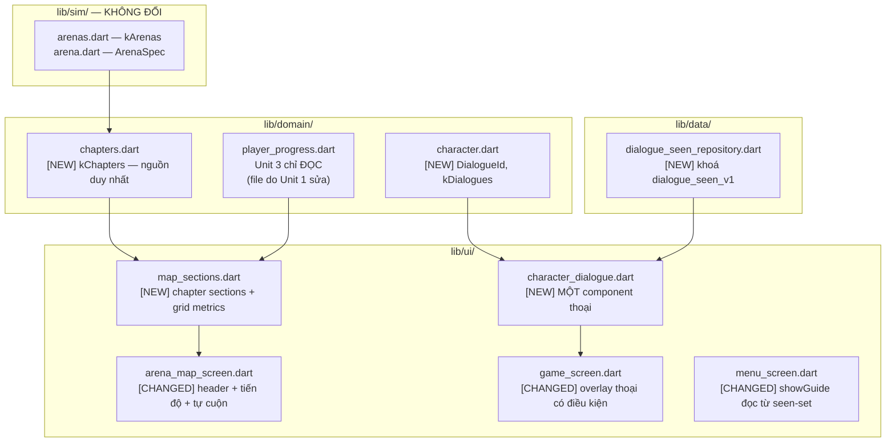

# Design: Giọng và cấu trúc ngoài sân đấu

## Overview

| Review item | Summary |
| --- | --- |
| **Goal and approach** | Cho 20 màn một **cấu trúc** (4 chương, có tiến độ, mở ra là thấy chỗ đang chơi) và cho game một **giọng** (một nhân vật có tên, một component thoại). Toàn bộ nằm **ngoài** sân đấu: `lib/sim/` không đổi một dòng, và sân đấu chỉ nhận thêm một overlay thoại có điều kiện. |
| **In scope** | Định nghĩa chương từ một nguồn duy nhất; tiêu đề chương + tiến độ sao; tự cuộn tới màn đang chơi; nhân vật có tên; component thoại duy nhất; trạng thái "đã xem" bền qua lần mở app; song ngữ đầy đủ. |
| **Out of scope** | Đổi luật mở màn/điểm/sao; asset mascot mới; voice-over; cây hội thoại nhiều nhánh; accessibility của màn không bị unit này chạm tới; hiệu ứng cú bắn (Unit 2); gợi ý/bỏ qua màn (Unit 1). |

## Open Questions

| # | Question | Blocking? | Working assumption |
| --- | --- | --- | --- |
| Q1 | Tên nhân vật là gì? | **Không** | Design chốt **cơ chế**: `characterName(AppLocalizations t) => t.characterName` — một hàm trỏ tới getter sinh sẵn, không chốt tên. AC US-4/1.4 đòi đúng thế: đổi tên phải sửa **một** chỗ. Tên cụ thể là quyết định thương hiệu; Phase 4 điền, và AC US-4/1.3 cấm chuỗi giữ chỗ nên nó không thể trôi ra bản build. |
| Q2 | Tên 4 chương? | Không | Cùng cơ chế: `chapterTitle(Chapter, AppLocalizations)` trong `lib/ui/localized_text.dart`. `Chapter` giữ **thuần** (chỉ khoảng `levelId`). Tên đi qua hai file ARB như mọi chuỗi khác. |
| Q5 | Cổng "lần đầu" cho thoại giới thiệu là `showGuide`/`fresh` hay seen-set? | **Đã chốt** | **Seen-set.** `menu_screen.dart:34` hiện tính `fresh = progress.results.isEmpty` — nhưng sau Unit 1, **một lần thua** cũng sinh `LevelResult` (Unit 1 Q4), nên `fresh` thành `false` và `_guide()` **không bao giờ hiện lại**. Người chơi thua ngay lần đầu sẽ mất luôn phần hướng dẫn. `showGuide` phải đọc `!hasSeen(DialogueId.intro)`. **Trong lúc seen-set còn đang restore**, `showGuide` là `false` — hiện lại hướng dẫn cho người chơi cũ tệ hơn là hiện muộn một khung cho người mới. `markSeen(DialogueId.intro)` gọi từ handler `gotItCta` chỗ đang clear `_guideVisible` (`game_screen.dart:414`). Đây là **thêm một lần đụng call site của Unit 1**. |
| Q3 | Trạng thái "đã xem thoại" lưu vào `progress_v1` hay khoá riêng? | **Đã chốt** | **Khoá riêng `dialogue_seen_v1`.** Unit 1 đã thêm hai field vào `LevelResult` trong `progress_v1`; nhồi thêm một `Set<String>` vào cùng khoá là lần đổi schema thứ ba trên cùng payload trong cùng release. Thoại cũng **không phải tiến trình chơi** — mất nó thì người chơi xem lại một đoạn thoại, không mất sao hay xu. |
| Q4 | `scrollable_positioned_list` có cần thêm không? | **Đã chốt** | **Không.** Dùng layout metrics của section/grid + `initialScrollOffset`, áp trước khung đầu. Metrics được test ở phone/tablet/text scale lớn; không thêm package chỉ cho một lần định vị. |
| Q6 | Level select dùng danh sách, đường mòn hay grid? | **Đã chốt** | **Grid 4 cột trên nền navy.** UI/UX Design Spec 1.0 thay thế composition đường mòn của `ban_bua`; chỉ tái sử dụng state/progress và component primitive, không port `ChapterTrail`/`TrailPainter`. |

## Architecture



- **Pattern đang có**: `arena_map_screen` là `ConsumerWidget` + `ListView.separated` phẳng, `itemCount: kArenas.length`, `itemBuilder` dựng `_ArenaTile`. `showBbDialog` + `BbDialog` đã có.
- **Delta**: danh sách phẳng theo `kArenas` đổi thành danh sách phẳng theo **item** (header hoặc tile); thêm một repository nhỏ và một component thoại.
- **Ranh giới bị ảnh hưởng**: `lib/sim/` **không đổi**. Unit 3 **không ghi** `PlayerProgress` (AC US-2/2.3) — nhưng file đó do **Unit 1** sửa.
- **Ràng buộc chịu lực**: luật mở màn tuyến tính ở AC US-1/2.3 không đổi khi
  nhóm chương. Thoại không xuất hiện lúc chơi thật và không che tín hiệu `armed`.

## Components and Interfaces

```
lib/
├── domain/
│   ├── chapters.dart                    [NEW]      kChapters + targetLevelId — thuần, không l10n
│   └── character.dart                   [NEW]      DialogueId + kDialogues — thuần, không l10n
├── data/
│   └── dialogue_seen_repository.dart    [NEW]      precedent: ProgressController (load async)
├── state/
│   └── providers.dart                   [CHANGED]  + dialogueSeenProvider
└── ui/
    ├── map_sections.dart                [NEW]      sections + MapGridMetrics + offset
    ├── localized_text.dart              [NEW]      MỘT bảng nối id → getter ARB
    ├── character_dialogue.dart          [NEW]      MỘT component thoại (AC US-4/4.2)
    └── screens/
        ├── arena_map_screen.dart        [CHANGED]  header chương, tiến độ, tự cuộn,
        │                                           ConsumerWidget→ConsumerStatefulWidget,
        │                                           _ArenaTile ghim chiều cao cố định
        ├── game_screen.dart             [CHANGED]  (1) thoại trong _guide(),
        │                                           (2) _result() bọc SingleChildScrollView,
        │                                           (3) markSeen(intro) ở gotItCta
        └── menu_screen.dart             [CHANGED]  showGuide đọc từ seen-set (Q5)
lib/l10n/
├── app_vi.arb                           [CHANGED]  tên chương + mọi lời thoại
└── app_en.arb                           [CHANGED]  cùng bộ khoá
```

### `lib/domain/chapters.dart` [NEW]

```dart
class Chapter {
  const Chapter(this.number, this.firstLevelId, this.lastLevelId);
  final int number;          // 1..4
  final int firstLevelId;
  final int lastLevelId;
}   // THUẦN — không biết gì về l10n

const List<Chapter> kChapters = <Chapter>[ /* 1-5, 6-10, 11-15, 16-20 */ ];

Chapter? chapterOf(int levelId);
int chapterMaxStars(Chapter c);      // (lastLevelId - firstLevelId + 1) * 3
int chapterEarnedStars(Chapter c, PlayerProgress p);
```

`kChapters` là **nguồn duy nhất** (AC US-1/1.4): nhóm suy ra từ khoảng `levelId`, không viết cứng ở tầng UI. Thêm màn vào `kArenas` mà không sửa `kChapters` thì màn đó **vẫn hiện** trong một nhóm dự phòng (AC US-1/1.5) — không âm thầm biến mất.

`chapterMaxStars` **tính** từ khoảng chứ không viết cứng 15 (AC US-2/1.2), nên chương có số màn khác vẫn đúng.

`chapterEarnedStars` cộng `starsFor` — màn đã bỏ qua có `stars == 0` nên góp 0, khớp Unit 1 (AC US-2/2.1) **không cần** biết gì về `skipped`.

### `lib/ui/map_sections.dart` [NEW]

```dart
class ChapterSection {
  final Chapter? chapter;          // null = nhóm dự phòng
  final List<ArenaSpec> arenas;
}

List<ChapterSection> buildMapSections({
  List<ArenaSpec> arenas = kArenas,
  List<Chapter> chapters = kChapters,
});

double offsetForLevel(
  List<ChapterSection> sections,
  int levelId,
  MapGridMetrics metrics,
);
```

`MapGridMetrics` gồm extent header, row, khoảng section và padding thật của shell;
không chứa màu hay gameplay state. `targetLevelId(...)` sống ở **`lib/domain/`**,
không ở đây — nó là luật suy ra thuần từ tiến trình.

### Điểm giao từ Unit 1 — `targetArenaId`

Unit 1 **hoãn có chủ đích** việc định vị bản đồ sau khi bỏ qua màn sang unit này, và điều hướng về bản đồ kèm `targetArenaId` trên route (Unit 1 design Q6, tasks 15.5). Unit này **phải nhận** nó, nếu không việc hoãn đó rơi xuống đất và AC US-2/2.2 của Unit 1 không có ai cài:

```dart
class ArenaMapScreen extends ConsumerStatefulWidget {
  const ArenaMapScreen({this.targetArenaId});     // [CHANGED] optional
  final int? targetArenaId;
}
```

`targetLevelId(progress, requestedArenaId: widget.targetArenaId)` **ưu tiên** `requestedArenaId` khi nó hợp lệ (có trong `kArenas`), rồi mới rơi về luật suy ra. Lý do ưu tiên: người chơi vừa trả 150 xu để bỏ qua một màn cụ thể — chỗ họ muốn thấy là **màn kế tiếp màn đó**, không phải chỗ mà `unlockedMax` tình cờ trỏ tới.

`requestedArenaId` không có trong `kArenas` ⇒ bỏ qua nó, dùng luật suy ra (cùng cách xử lý `unlockedMax` sai ở AC US-3/2.2).

> ### Nhận `targetArenaId` là chưa đủ — đường điều hướng của Unit 1 làm nó vô hiệu
>
> `game_screen` về bản đồ bằng `Navigator.pop()` (`game_screen.dart:473`), tức pop về **đúng instance `ArenaMapScreen`** mà `menu_screen` đã push. Một instance được pop-về **không** chạy lại `initState`/`didChangeDependencies`, nên `initialScrollOffset` **không bao giờ** kích và việc định vị sau khi bỏ qua màn **âm thầm không làm gì**.
>
> **Sửa**: đường bỏ qua màn phải `pushReplacement` một `ArenaMapScreen` **mới** mang `targetArenaId`, chứ không `pop`. Đây là thay đổi ở **call site của Unit 1** (`tasks.md:361` của Unit 1), không phải chỉ trong Unit 3 — **cross-unit rework cần được ghi ra**, vì Unit 1 đã có tasks và có thể đã cài.
>
> Đường "về menu" bình thường vẫn `pop` như cũ — chỉ đường bỏ qua màn đổi.

**Luật suy ra khi không có `requestedArenaId`**: màn mở gần nhất **chưa hoàn thành**, tức `completedMax + 1` theo định nghĩa **sau Unit 1** (`stars >= 1 || skipped`). Nghĩa là một màn đã bỏ qua tính là đã xong, nên bản đồ mở ở màn **sau** nó — đúng ý AC US-3/1.1, và bản trước chỉ liệt kê ba ca trả `null` mà không viết ra nhánh này.

## Thiết kế bản đồ đích — UI/UX Design Spec 1.0

Phần composition bản đồ được thay thế ngày 2026-08-09:

- Shell dùng `nightIndigo` + texture sao/chấm nhẹ, header `panelNavy` với Back,
  “CHỌN MÀN” và tổng sao.
- Mỗi chapter là một section có title + `earned/max`; phần level là
  `GridView`/`SliverGrid` **4 cột**, `NeverScrollableScrollPhysics` nếu nằm trong
  một `CustomScrollView` duy nhất.
- Mỗi node có vùng chạm tối thiểu 48dp; số màn ở giữa; hàng 0–3 sao nằm dưới hoặc
  trong đáy node nhưng không làm thay đổi extent giữa các state.
- `current`: gold outline + glow; `completed`: sao vàng; `locked`: navy/gray +
  lock; `skipped`: badge/icon chữ, không chỉ đổi màu.
- Node thứ 5 của mỗi chapter giữ đúng lưới; ô trống không được lấp bằng màn của chapter sau.
- Không port `ChapterTrail`, `TrailPainter`, đường cubic đứt nét, công thức sin
  zig-zag, season/boss hoặc palette lễ hội từ `ban_bua`.
- Tự định vị dùng `ScrollController(initialScrollOffset:)` hoặc sliver key/offset
  đã tính trước khung đầu. Offset phải dựa trên extent section/grid đã test, clamp
  hợp lệ và không animate khi mở màn.

`kChapters`, `targetLevelId`, luật mở tuyến tính, tiến độ sao, `targetArenaId` và
nhóm dự phòng vẫn giữ như phần thiết kế miền ở trên; thay đổi này chỉ thay
composition trình bày.

## Phương án level-select hiện hành

Phương án đường mòn kế thừa `ban_bua` đã bị loại hoàn toàn. Không port
`ChapterTrail`, `TrailPainter`, palette mùa/boss, số học slot zig-zag hoặc card
cream/coral. Level select hiện hành là shell arcade đêm với section chapter và grid
4 cột mô tả ở trên. Mọi tính toán vị trí ban đầu dựa trên extent section/grid thật
và được kiểm ở phone, tablet, text scale lớn.


## Thiết kế nhân vật và thoại

### `lib/domain/character.dart` [NEW]

```dart
enum DialogueId { intro, levelWin, levelLose, levelLoseShort, finalVictory }

class DialogueSpec {
  const DialogueSpec(this.id, {required this.onceOnly});
  final DialogueId id;
  final bool onceOnly;
}   // THUẦN — không biết gì về l10n

const List<DialogueSpec> kDialogues = <DialogueSpec>[
  DialogueSpec(DialogueId.intro,          onceOnly: true),
  DialogueSpec(DialogueId.levelWin,       onceOnly: false),
  DialogueSpec(DialogueId.levelLose,      onceOnly: false),
  DialogueSpec(DialogueId.levelLoseShort, onceOnly: false),
  DialogueSpec(DialogueId.finalVictory,   onceOnly: true),
];

/// lib/ui/localized_text.dart — nơi DUY NHẤT nối id với chuỗi sinh sẵn.
/// Đặt ở lib/ui/ vì nó phụ thuộc l10n, tức là mối quan tâm trình bày.
String dialogueText(DialogueId id, AppLocalizations t) { /* switch */ }
String chapterTitle(Chapter c, AppLocalizations t)     { /* switch */ }
String characterName(AppLocalizations t) => t.characterName;
```

> ### Phân lớp: `Chapter` và `DialogueSpec` giữ **thuần**, bảng nối đặt ở `lib/ui/`
>
> Bản trước đặt `String Function(AppLocalizations)` vào chính `Chapter` và
> `DialogueSpec`, buộc domain import l10n. Điều đó trái phân lớp: localization và
> grid metrics đều là mối quan tâm trình bày, nên nằm ở `lib/ui/`.
>
> Nên `Chapter` chỉ giữ khoảng `levelId`, `DialogueSpec` chỉ giữ `id` + `onceOnly`, và **một** file `lib/ui/localized_text.dart` giữ hai `switch` nối id với getter. Vẫn "một nguồn duy nhất", vẫn vỡ compile khi đổi khoá, mà không đảo phân lớp.
>
> **Hai hàm này phải là top-level hoặc static**, không phải tear-off của instance getter — `AppLocalizations.characterName` không phải một tear-off hợp lệ.

Cùng lý do đó, `targetLevelId` nằm ở `lib/domain/`, không ở `map_sections.dart`.

> ### Cơ chế "khoá ARB" của bản trước **không chạy được**
>
> Bản trước khai `kCharacterNameKey = 'characterName'`, `Chapter.titleKey`, `DialogueSpec.textKey` — toàn là `String`. Nhưng `AppLocalizations` do `flutter gen-l10n` sinh ra là một class **abstract với getter tĩnh** (`app_localizations.dart:64, 105-231`); **không có** tra cứu `key → String`. Nên ba field kia là chuỗi **không thể phân giải** thành text ở runtime, và cả AC US-4/1.4 lẫn AC US-1/1.4 treo trên đó.
>
> **Sửa**: ba resolver top-level nhận `(id, t)` trong `lib/ui/localized_text.dart`, mỗi cái trả về getter sinh sẵn. Vừa an toàn kiểu (đổi tên khoá ARB làm vỡ **compile**, không vỡ ở runtime), vừa giữ đúng ý "một nguồn duy nhất": hai `switch` trong file đó là chỗ duy nhất nối id với chuỗi.

Tên chương đi qua `chapterTitle(Chapter, AppLocalizations)` cùng lý do — và `Chapter` **không** giữ field nào về l10n (xem callout phân lớp ở trên).

`levelLoseShort` là một `DialogueId` **riêng**, không phải một biến thể ẩn của `levelLose` — nó cần khoá ARB riêng và cần chọn được bằng điều kiện tường minh (xem § Xung đột với lời nhắc Unit 1).

### `lib/data/dialogue_seen_repository.dart` [NEW]

```dart
abstract class DialogueSeenRepository {
  Future<Set<DialogueId>> load();
  Future<bool> save(Set<DialogueId> seen);   // bool, không void — theo Unit 1
}

class DialogueSeenController extends StateNotifier<Set<DialogueId>> {
  Future<void> restore();                    // gọi lúc khởi tạo provider
  Future<void> markSeen(DialogueId id);
  bool hasSeen(DialogueId id);
}
```

`dialogueSeenProvider` là `StateNotifierProvider<DialogueSeenController, Set<DialogueId>>`.

> **Tiền lệ đúng là `ProgressController` (`providers.dart:51-66`), không phải `SettingsController`.** Bản trước ghi "precedent: `settings_repository.dart`" — nhưng `SettingsRepository.load()` là **đồng bộ** (`settings_repository.dart:26`) nên `SettingsController` seed được state ngay trong constructor. `DialogueSeenRepository.load()` là `Future`, nên nó cần hình dạng **restore-rồi-notify** như `ProgressController`. Trỏ sai tiền lệ ở đây dẫn tới một controller không bao giờ nạp được trạng thái đã lưu.

`CharacterDialogue` nhận `DialogueId`, tra `kDialogues` lấy `onceOnly`, gọi `dialogueText(id, t)`, và hỏi `dialogueSeenProvider` — đây là đường nối `DialogueId → kDialogues (onceOnly) + dialogueText(id, t) → trạng thái đã xem` mà bản trước để trống.

Khoá `dialogue_seen_v1`, **riêng** với `progress_v1` (Q3). `save` trả `bool` theo đúng hợp đồng Unit 1 đã lập — nhất quán, và một lần ghi thất bại chỉ khiến người chơi xem lại một đoạn thoại (AC US-4/3.4).

Đọc lỗi ⇒ tập rỗng, tức mọi đoạn thoại coi như chưa xem. Hỏng theo hướng "hiện thoại lần nữa", không hỏng theo hướng "mất màn hình".

### `lib/ui/character_dialogue.dart` [NEW]

```dart
class CharacterDialogue extends StatelessWidget {
  final DialogueId id;
  final VoidCallback onDismiss;
}
```

**Một** component cho mọi lần thoại xuất hiện (AC US-4/4.2), với hai presentation:

- `modal`: hướng dẫn/kết chiến dịch, scrim 70–80%, CTA đóng `primaryGold`.
- `embedded`: nằm trong result panel, không scrim riêng và không có CTA gold;
  đóng/bỏ qua bằng icon 48dp hoặc cùng hành động tiếp theo của result.

Cả hai dùng `panelNavy`, chữ white/muted và mascot sẵn có; không dùng card trắng/coral.

| Ràng buộc | Cách thoả |
| --- | --- |
| Bỏ qua được bằng một lần chạm (AC US-4/3.2) | Nút đóng ≥48dp; **không** tự đóng theo thời gian |
| Không hiện khi bi đang bay (AC US-4/3.1) | Chỉ dựng khi `_runner == null` |
| Không che `armed` (AC US-4/3.5) | Chỉ ở **`_guide()`** và **overlay kết quả** — không bao giờ trong lúc đang chơi thật. Menu **không** có thoại: sau khi `intro` chuyển vào `_guide()`, không `DialogueId` nào thuộc menu |
| Screen reader đọc được (AC US-4/4.3) | `Semantics` bọc cả tên nhân vật và lời thoại |
| Reduced-motion (AC US-4/4.3) | Hoạt ảnh xuất hiện gate bằng `disableAnimationsOf`; nội dung vẫn hiện |
| Cỡ chữ hệ thống (AC US-4/4.3) | Tôn trọng `MediaQuery.textScaler`; trong `_result()` phải nằm trong `SingleChildScrollView` |

> ### Luật "không bao giờ trên sân đấu" của bản trước làm AC US-4/2.1 mất chủ
>
> AC US-4/2.1 đòi nhân vật giới thiệu luật dội tường **"ở overlay hướng dẫn hiện có"** — và overlay đó là `_guide()`, vốn nằm **trong `Stack` của sân đấu**, trên `CustomPaint` (`game_screen.dart:260, 382-420`). Bản trước cấm thoại xuất hiện trên sân đấu và chuyển phần giới thiệu sang `menu_screen`, nên `_guide()` giữ nguyên chữ không có giọng và **AC US-4/2.1 không có ai cài**.
>
> Luật đó cũng **chặt quá mức**: `_guide()` không thể cùng tồn tại với bi đang bay — `_fire` return sớm khi `_guideVisible` (`game_screen.dart:203`) — và lúc nó hiện thì chưa có gì `armed`. Nên đặt thoại giới thiệu **vào `_guide()`** vẫn thoả AC US-4/3.1 và 3.5 do cấu trúc.
>
> Luật đúng là: **không hiện thoại khi `_runner != null`, và không hiện trong lúc chơi thật** — chứ không phải "không bao giờ trên sân đấu".

`_guide()` **đã có** `SingleChildScrollView` (`game_screen.dart:386`), nên thêm thoại vào đó không gây overflow.

### Xung đột với lời nhắc của Unit 1 — AC US-4/2.4

Overlay kết quả sau Unit 1 **đã có**: lời nhắc gợi ý (lần thua 2), lời nhắc gợi ý + bỏ qua màn (lần thua 3), và lựa chọn thử lại. Unit 3 thêm thoại nhân vật vào **cùng** overlay đó. Thứ tự dọc **dứt khoát**:

```
kết quả (sao/điểm) → THOẠI NHÂN VẬT → lời nhắc Unit 1 → thử lại → màn kế / về bản đồ
```

Thoại đứng **trên** lời nhắc vì nó là phản ứng cảm xúc với kết quả; lời nhắc là hành động cần làm. Đảo lại thì lời nhắc "hết 150 xu bỏ qua màn" bị một câu thoại vui vẻ chen xuống dưới.

**Khi overlay đông nhất**, thoại thua dùng `DialogueId.levelLoseShort` để nó không thành một bức tường chữ. Không có ràng buộc này thì lần thua thứ 3 — đúng lúc người chơi đang bực nhất — là lúc màn hình nói nhiều nhất.

**Điều kiện chọn biến thể ngắn phải đọc cùng nguồn với Unit 1**:

```dart
final int losses = progress.lossesFor(arena.id);        // Unit 1
final bool crowded = losses >= kSkipOfferAfterLosses;   // Unit 1, KHÔNG viết cứng 3
```

> `game_screen` **không có** bộ đếm thua của riêng nó — `_outcome` là theo từng lần load và `_load()` reset nó (`game_screen.dart:54, 87-101`). Nguồn duy nhất là `PlayerProgress.lossesFor` của Unit 1. Bản trước viết cứng "lần thua thứ 3" trong khi Unit 1 gate lời nhắc bằng `kSkipOfferAfterLosses` — **hai nguồn song song cho một ngưỡng**, thứ mà chính `tasks.md:336` của Unit 1 có một test cấm.

**`_result()` phải được bọc `SingleChildScrollView`.** Hiện nó là `Container(alignment: center)` → `Padding` → `Column(mainAxisSize: min)` **không có** scroll view (`game_screen.dart:428-478`) — khác `_guide()`, vốn đã có (`:386`). Ở lần thua thứ 3, cột phải chứa: kết quả + điểm + thoại + nhắc gợi ý + nhắc bỏ qua màn + thử lại + về menu. Ở text scale 2.0, cột 7 phần tử **hiện tại** đã có nguy cơ overflow. Dùng lại đúng hình dạng của `_guide()` nên đây không phải kiểu popup thứ tư.

## UI Design Specification

Ràng buộc đi từ `uiux-guideline.md` và hình tổng hợp trong
`Cu_Doi_UI_UX_Design_Spec.docx`:

- Shell: nền `nightIndigo`, panel/header `panelNavy`, tổng sao màu
  `primaryGold`; không dùng sky/cream.
- Level layout: grid 4 cột trong từng chapter, một vùng cuộn cấp màn hình; không
  có trail/zig-zag/cubic connector.
- Header chapter: tên + tiến độ `n/15`, canh trái, khác node bằng typography và
  khoảng cách; không phụ thuộc hue.
- Node giữ đủ số màn, sao, trạng thái khoá và dấu bỏ qua. `current` có gold
  outline + glow; locked có icon lock; completed có sao; skipped có nhãn/icon.
- `Semantics` của node là một nhãn đầy đủ gồm màn, tên, sao và trạng thái; nội dung
  trang trí bên trong bọc `ExcludeSemantics` để không đọc lặp.
- Mọi kích thước/màu đi qua token đích; không hex thô và không dùng variant coral
  cũ chỉ vì API tên `primary`.

**Chuỗi ARB mới**: `characterName`; `chapter1Title`..`chapter4Title`; `chapterProgressLabel` (có placeholder n/max); `chapterOtherTitle` (nhóm dự phòng); `dialogueIntro`, `dialogueWin`, `dialogueLose`, `dialogueLoseShort`, `dialogueFinalVictory`. Cả VI và EN, cùng bộ khoá (AC US-1/4.1, US-4/4.1).

## Data Models

| Field | Vị trí | New/Changed | Ghi chú |
| --- | --- | --- | --- |
| `seen: Set<DialogueId>` | khoá `dialogue_seen_v1` | **new**, tách riêng | Lưu dưới dạng list tên enum; tên không khớp ⇒ bỏ qua phần tử đó, không nổ |
| `PlayerProgress` | `progress_v1` | **Unit 3 không ghi**; file là `[CHANGED]` **bởi Unit 1** | Unit này chỉ đọc (AC US-2/2.3). Ghi "không đổi" là sai về file — Unit 1 sửa nó đáng kể |

**Các thành viên `PlayerProgress` sau-Unit-1 mà Unit 3 đọc** — liệt kê ra để nếu Unit 3 được cài **trước** Unit 1 thì vỡ ở compile-time chứ không âm thầm mất hành vi: `starsFor`, `isUnlocked`, `isSkipped`, `lossesFor`, `completedMax` (định nghĩa mới).
| `ArenaSpec` | `lib/sim/arena.dart` | **không đổi** | Chương suy ra từ `levelId`, **không** thêm field vào `ArenaSpec` — nếu thêm thì mỗi màn tự khai chương mình và "một nguồn duy nhất" của AC US-1/1.4 mất |

## Error Handling

| Scenario | Handling |
| --- | --- |
| `kArenas` có màn ngoài mọi chương | Vẫn hiện trong **nhóm dự phòng**: một `ChapterHeaderItem` dùng khoá ARB `chapterOtherTitle`, đặt **sau chương 4**, các màn xếp tăng theo `levelId`. Tiến độ của nhóm này tính max-stars theo **số màn thực có trong nhóm**, nên phép đối chiếu "tổng sao các chương == `totalStars`" ở AC US-2/2.1 vẫn đúng (AC US-1/1.5) |
| `tile > kAutoScrollTileRatio × viewport` | **Bỏ tự cuộn**, trả offset 0, mở ở đầu danh sách — cuộn tới một tile chiếm gần hết màn hình là vô nghĩa |
| Đường bỏ qua màn của Unit 1 dùng `pop()` | Phải đổi sang `pushReplacement` một `ArenaMapScreen` mới; `pop` về instance cũ không chạy lại `didChangeDependencies` nên `targetArenaId` vô hiệu |
| Tiến trình thiếu / đọc lỗi | Tiến độ chương hiện như chưa có sao, màn hình **không** hỏng (AC US-2/1.5) |
| `unlockedMax` trỏ màn không tồn tại | Mở ở đầu danh sách (AC US-3/2.2) |
| Đã hoàn thành cả 20 màn | Mở ở đầu danh sách (AC US-3/1.2) |
| Người chơi mới | Mở ở đầu danh sách (AC US-3/1.3) |
| Người chơi đã tự cuộn | Không tự cuộn lại — `initialScrollOffset` chỉ áp một lần (AC US-3/1.4) |
| Vào bản đồ kèm `targetArenaId` từ Unit 1 (vừa bỏ qua màn) | Ưu tiên `targetArenaId` trên luật suy ra — người chơi vừa trả 150 xu cho **màn đó** |
| `targetArenaId` không có trong `kArenas` | Bỏ qua, dùng luật suy ra — cùng cách xử `unlockedMax` sai |
| Ghi `dialogue_seen_v1` thất bại | Bỏ qua im lặng; hệ quả duy nhất là xem lại một đoạn thoại |
| Enum trong save không khớp `DialogueId` | Bỏ qua phần tử đó, giữ phần còn lại |
| Bi đang bay | Không dựng thoại (AC US-4/3.1) |
| Thoại `onceOnly` đã xem | Không hiện lại (AC US-4/3.3) |
| Thua lần 3 — thoại và lời nhắc Unit 1 cùng muốn hiện | Thoại dùng biến thể **ngắn**; thứ tự dọc cố định (AC US-4/2.4) |
| Thắng màn 20 | Thoại kết chiến dịch, `onceOnly` (AC US-4/2.3) |

## Testing Strategy

| Test level | What to verify |
| --- | --- |
| Unit — `chapters.dart` | 20 màn chia đúng 4 chương 5 màn; `chapterOf` đúng ở biên (1, 5, 6, 20); `chapterMaxStars` **tính** từ khoảng, không phải hằng 15; màn ngoài chương vẫn xuất hiện; `chapterEarnedStars` đếm màn bỏ qua là 0 sao |
| Unit — `map_sections.dart` | `buildMapSections` nhóm đúng 4×5 + fallback; `offsetForLevel` khớp header/row/section metrics và clamp hợp lệ |
| Unit — `targetLevelId` (ở `lib/domain/`) | Trả `null` cho cả ba ca (mới / xong hết / `unlockedMax` sai); ưu tiên `requestedArenaId` khi hợp lệ |
| Unit — layout metrics | `MapGridMetrics` khớp extent header/row/section thật; node và header không overflow ở text scale 1.0/2.0; offset màn 1/8/20 được clamp và đặt trước khung đầu |
| Unit — `offsetForLevel` cộng separator | Offset của tile thứ `n` = tổng extent `n` item trước **+ `n` separator**; kiểm bằng một danh sách nhỏ tính tay, vì bỏ sót separator là lỗi lệch dần khó thấy |
| Unit — `DialogueSeenRepository` | Lưu rồi đọc round-trip; save lỗi ⇒ `false` không throw; enum lạ trong payload bị bỏ qua chứ không nổ; khoá **không** phải `progress_v1` |
| Widget — `arena_map_screen` | 4 tiêu đề chương có mặt; tiến độ khớp tiến trình; **luật mở màn không đổi** (test hồi quy trực tiếp lên `isUnlocked`); chạm thẻ mở ⇒ vào màn; chạm thẻ khoá ⇒ vẫn snackbar cũ; dấu "đã bỏ qua" của Unit 1 vẫn hiện |
| Widget — tự cuộn | Mở với `unlockedMax` giữa danh sách ⇒ offset ban đầu khớp `offsetForLevel`; **khung đầu tiên** đã ở vị trí đúng (không có khung nào ở offset 0 trước đó) |
| Widget — điểm giao Unit 1 | Mở với `targetArenaId` khác `unlockedMax` ⇒ cuộn tới `targetArenaId`, **không** tới `unlockedMax`; `targetArenaId` không tồn tại ⇒ rơi về luật suy ra chứ không nổ |
| Widget — đường điều hướng Unit 1 | Bỏ qua màn ⇒ **`pushReplacement`** một `ArenaMapScreen` mới, **không** `pop`. Test chỉ pump `ArenaMapScreen` với tham số sẽ **xanh dù tính năng chết trong app** — phải test cả call site |
| Unit — `offsetForLevel` cộng `leadingPad` | Offset của tile đầu tiên = `leadingPad` (12.0) + `header`, **không** phải chỉ `header`. Bỏ sót padding trên là lỗi lệch đều 12dp |
| Widget — chốt tạo-một-lần | Sau khi người chơi cuộn, đổi text scale hoặc locale ⇒ `didChangeDependencies` tái chạy nhưng offset **không** được áp lại. Đây là test hồi quy thật của AC US-3/1.4 |
| Unit — luật lùi header và ngưỡng bỏ cuộn | Offset đặt tile đích lùi xuống đúng một `header`; `tile > kAutoScrollTileRatio × viewport` ⇒ offset trả về **0**, và cổng này đánh giá **trước** phép lùi header |
| Unit — nhóm dự phòng | Màn ngoài mọi chương ⇒ một header `chapterOtherTitle` **sau** chương 4, màn xếp tăng theo `levelId`, max-stars tính theo số màn thực có; tổng sao các nhóm == `totalStars` |
| Widget — `Semantics` của thẻ **và** header | Mỗi cái phát **đúng một** nhãn: `ExcludeSemantics` quanh nội dung cả hai, nếu không ellipsis làm lộ thêm một nhãn bị cắt. Nhãn header là **một câu**, không phải hai `Text` nối lại |
| Widget — `_result()` không overflow | Ở `TextScaler.linear(2.0)` với thoại + **cả hai** lời nhắc Unit 1 + thử lại + về menu ⇒ `tester.takeException()` là `null`. Đây là ca chật nhất của unit, và là thứ khiến `SingleChildScrollView` thành bắt buộc |
| Widget — race lúc restore seen-set | Cold start, seen-set **chưa** restore xong ⇒ `showGuide` là `false`; người chơi cũ **không** bị hiện lại hướng dẫn. Sau khi restore xong, người chơi mới **vẫn** thấy nó |
| Unit — cổng tỉ lệ và phép lùi header | Cổng `kAutoScrollTileRatio` đánh giá **trước** phép lùi; kết quả luôn `>= 0`; màn ở chương 1 cho `leadingPad` (12.0), không âm |
| Widget — `CharacterDialogue` | Đóng được bằng một lần chạm, vùng chạm ≥48dp; không tự đóng; `Semantics` đọc được tên và lời; `onceOnly` không hiện lại sau khi đã xem |
| Widget — overlay kết quả | Thứ tự dọc đúng: kết quả → thoại → lời nhắc Unit 1 → thử lại; thua lần 3 ⇒ thoại dùng biến thể ngắn; thoại **không** hiện khi `_runner != null` |
| Ranh giới | `lib/sim/` không đổi; `PlayerProgress` không có phép ghi nào được gọi từ unit này |
| l10n | `app_vi.arb` và `app_en.arb` cùng bộ khoá; **không** còn chuỗi giữ chỗ nào (AC US-4/1.3) |

## Design Decisions

| Decision | Choice | Alternative rejected | Why (one line) |
| --- | --- | --- | --- |
| Nguồn định nghĩa chương | `kChapters` theo khoảng `levelId` | Thêm field `chapter` vào `ArenaSpec` | Field trên từng màn nghĩa là 20 chỗ khai chương, tức "một nguồn duy nhất" của AC US-1/1.4 mất; và nó đổi `lib/sim/`, vốn phải giữ nguyên |
| Cơ chế tự cuộn | `initialScrollOffset` + `MapGridMetrics` | `ensureVisible`; post-frame callback; package mới | Các cách kia vẽ ở vị trí sai rồi mới nhảy. Metrics section/grid được test ở hai mức text scale |
| Vòng đời `ScrollController` | Tạo trong **`didChangeDependencies`** kèm chốt tạo-một-lần | `initState`; hoặc `build` của `ConsumerWidget` hiện tại | `initState` **không** đọc được `MediaQuery` (assertion). `build` thì mỗi lần tiến trình đổi là cuộn lại, phá AC US-3/1.4. `didChangeDependencies` chạy trước khung đầu nhưng **tái chạy** khi text scale/locale đổi, nên chốt `if (_controller != null) return` là thứ giữ AC US-3/1.4 |
| Lưu trạng thái "đã xem thoại" | Khoá **riêng** `dialogue_seen_v1` | Nhồi vào `progress_v1` | Unit 1 đã đổi schema `progress_v1` một lần trong release này; thêm nữa là lần thứ ba trên cùng payload. Và thoại không phải tiến trình chơi — mất nó không mất sao hay xu |
| Tên nhân vật và tên chương | Ba resolver top-level `(id, t) → String` trong `lib/ui/localized_text.dart` | Khoá `String` tra cứu lúc runtime | `flutter gen-l10n` sinh getter tĩnh, **không có** tra cứu theo khoá — khoá `String` không phân giải được. Function reference làm việc đổi khoá vỡ **compile** chứ không vỡ runtime |
| Vị trí thoại | **`_guide()`** và **overlay kết quả** | "Không bao giờ trên sân đấu" | Luật chặt-quá-mức đó làm AC US-4/2.1 mất chủ: AC đòi thoại giới thiệu ở **overlay hướng dẫn hiện có**, mà `_guide()` nằm trong `Stack` sân đấu. Luật đúng: không hiện khi `_runner != null`, không hiện trong lúc chơi thật |
| Thứ tự dọc trên overlay kết quả | Thoại **trên** lời nhắc Unit 1 | Lời nhắc trên thoại | Thoại là phản ứng với kết quả, lời nhắc là hành động cần làm; đảo lại thì lời nhắc bị câu thoại chen xuống dưới |
| Thoại thua khi overlay đông | `DialogueId.levelLoseShort`, gate bằng `lossesFor >= kSkipOfferAfterLosses` của Unit 1 | Viết cứng "lần thua thứ 3"; hoặc bộ đếm riêng | Lần thua 3 là lúc overlay đông nhất (thoại + hai lời nhắc + thử lại) và là lúc người chơi bực nhất — không phải lúc màn hình nói nhiều nhất |
| Hợp đồng `save` của repo mới | `Future<bool>` | `Future<void>` | Nhất quán với hợp đồng Unit 1 đã lập cho `ProgressRepository` |

## Điều kiện chưa kiểm

| Hạng mục | Trạng thái |
| --- | --- |
| App **đã chạy** trên máy ảo (2026-08-05) | Release APK 19.1 MB cài và chạy trên Pixel 7 API 35: menu render, vào Màn 1, bắn được một cú — vệt ma, preview hai đoạn đứt nét, chip yêu cầu số dội, vạch đáy đều đúng. Nhưng đó là **máy ảo x86_64 trên CPU desktop**, không phải thiết bị tầm thấp; và **chưa có gì của unit này** được cài nên chưa đo được gì của nó |
| Hạ tầng test widget cho `arena_map_screen` | **Chưa có.** `test/` hiện chỉ có `app_smoke_test.dart` và `shot_runner_test.dart`; pump `ArenaMapScreen` cần override `sharedPreferencesProvider` (`providers.dart:12` throw nếu không). Phase 3 phải tính công cho harness này, đừng giả định nó có sẵn |
| Công thức extent (`tile` 118.2, `header` 70.2 ở scale 1.0) | **Suy ra từ source, chưa đo trên máy.** Phase 4 phải đối chiếu với chiều cao render thật; test khoá extent ở hai mức text scale là thứ giữ chúng đúng về sau |
| Ngưỡng "tile > nửa viewport" | Cách xử **đã quyết** (bỏ tự cuộn, mở ở đầu), nhưng **chưa đo** ngưỡng thật. Nguồn chiều cao **đã chốt** (suy ra số học từ `MediaQuery.sizeOf` trừ SafeArea trừ hàng tiêu đề — `LayoutBuilder` không dùng được vì controller tạo trước layout). Chỉ còn **tỉ lệ 0.5 chưa đo** |
| Tự cuộn có "cảm giác đúng chỗ" | Chưa kiểm trên máy. Luật **đã chốt**: lùi xuống một khoảng bằng `header` để tiêu đề chương còn trong viewport |
| Tên nhân vật và tên 4 chương | **Chưa chốt** (Q1, Q2) — quyết định thương hiệu. Cơ chế đã xong nên điền vào là đủ; AC US-4/1.3 cấm chuỗi giữ chỗ trôi ra bản build |
| Thứ tự dọc overlay kết quả | Chưa kiểm trên máy. Nó phụ thuộc Unit 1 đã cài xong lời nhắc — nếu Unit 3 làm trước Unit 1 thì chỗ chèn chưa tồn tại |
| Thiếu foundation doc | `codebase-summary.md` và `code-standards.md` không tồn tại. `map_sections.dart` ở `lib/ui/` vì biết grid metrics; luật chapter/target level vẫn ở domain |

---

## Next Steps

Once this design is approved, proceed to Phase 3: Implementation Planning.

**What to do next:**
1. Use the slash command: `/aidlc.construction.create-tasks`
2. The agent will automatically read `references/phase-3-tasks.md` for detailed workflow instructions
3. Foundation docs will be referenced for implementation patterns

This will create `tasks.md` with actionable task checklist for code implementation.
