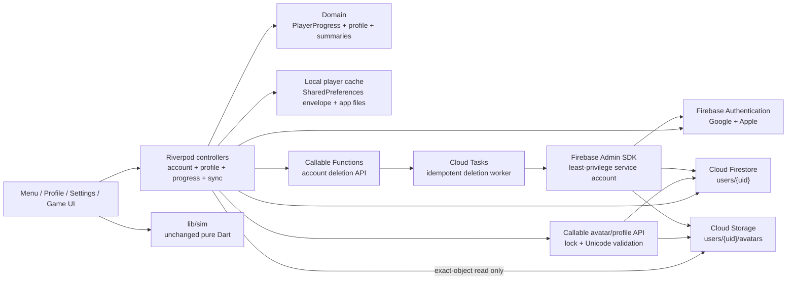
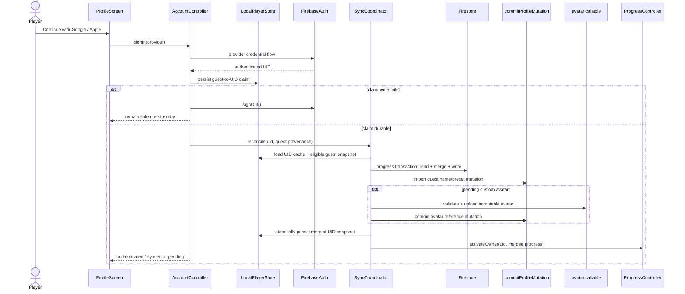

# Design: Hồ sơ người chơi

## Overview

| Review item | Summary |
| --- | --- |
| **Goal and approach** | Thêm màn Hồ sơ local-first, danh tính khách hoặc Firebase UID, Google/Apple, avatar cục bộ/cloud, thống kê/huy hiệu suy ra và đồng bộ tất định. Cache bền vững trên máy là nguồn phục vụ UI/gameplay; Firebase là bản sao đồng bộ, không nằm trên đường nóng của game. |
| **In scope** | US-1..US-7; cache tách theo chủ sở hữu; Firestore/Auth/Storage; backend xóa tài khoản có checkpoint; VI/EN; accessibility; emulator/rules tests. |
| **Out of scope** | Firebase anonymous auth, provider khác, leaderboard/social/analytics, lịch sử từng lượt, camera, huy hiệu có bộ đếm mới, sửa `lib/sim/`, luật mở màn/campaign/balance, và luồng xóa riêng toàn bộ tiến trình của một tài khoản đang tồn tại. |

Thiết kế giữ chiều phụ thuộc hiện có `ui → state → data → domain`; `lib/sim/` không đổi và không import Flutter/Firebase. `codebase-summary.md` và `code-standards.md` không có trong foundation, nên các hợp đồng dưới đây dựa trực tiếp trên code hiện tại: `ProgressController`, `ProgressRepository`, `PlayerProgress`, `kChapters`, `MenuScreen`, `BbTokens`, `BbCard`, `BbButton`, ARB và test helpers.

## Open Questions

Không có câu hỏi chặn duyệt thiết kế. Các đầu vào phát hành chưa có quyền quyết định trong repo được cô lập như sau:

| # | Question | Blocking? | Working assumption |
| --- | --- | --- | --- |
| Q1 | Firebase project production, Android application ID, iOS bundle ID và Apple Team/Services ID cuối cùng là gì? | Không chặn thiết kế/test emulator; chặn build đăng nhập production | Dùng Emulator Suite với project ID `demo-cu-doi`; chạy `flutterfire configure` chỉ sau khi chủ tài khoản chốt ID, không commit secret Apple. |
| Q2 | Kênh hỗ trợ production là URL nào? | Không | `SUPPORT_URL` được cấu hình lúc build. Fallback cụ thể là `https://github.com/recca0201/cu-doi/issues/new?labels=account-deletion`; nếu không mở được, UI cho sao chép URL và mã yêu cầu xóa. |

## Architecture



- `ProgressController` remains the compatibility surface watched by gameplay/menu. Mutations are serialized per owner; every load/save/listener/upload/transaction carries `(OwnerKey, ownerEpoch, deletionEpoch)` and revalidates all three immediately before local commit, cloud commit and state publication. A freeze increments the epoch, so late callbacks become no-ops and cannot recreate UID state.
- Firestore persistence alone is not the app cache contract: on Android/iOS it caches remote documents and uses last-write-wins for conflicting document updates. The feature therefore owns a local envelope and an explicit merge transaction when online. Firestore transactions are never placed on the offline gameplay path ([offline persistence](https://firebase.google.com/docs/firestore/manage-data/enable-offline), [transactions](https://firebase.google.com/docs/firestore/manage-data/transactions)).
- Firebase initializes after SharedPreferences and local owner restoration. If the active pointer names a Firebase UID, its UID envelope is restored as `cachedAccountOffline` even when Firebase initialization/auth restoration is unavailable; it is never reclassified as an unclaimed guest. Guest fallback is used only when there is no persisted account owner or after explicit sign-out/deletion.
- Account deletion is not tied to the app process. An authenticated `beginAccountDeletion` callable creates a durable lock/job and Cloud Tasks retries a privileged worker; a separate receipt-authorized `getAccountDeletionStatus` callable remains usable after Auth is disabled/deleted. Server Admin SDK access is protected by IAM because server SDKs bypass client Security Rules ([task queues](https://firebase.google.com/docs/functions/task-functions), [Admin user management](https://firebase.google.com/docs/auth/admin/manage-users)).

### Sign-in and deterministic sync



Login/linking obtains a provider credential and uses Firebase `signInWithCredential`/`linkWithCredential`; `credential-already-in-use` is a conflict, never an invitation to merge UIDs. Google native flow uses the official `google_sign_in` plugin; Apple uses `AppleAuthProvider`. Ordinary sign-in credentials are never retained; deletion obtains a fresh authorization code, exchanges it server-side and stores only the KMS-encrypted revocation credential in the locked deletion job ([Flutter federated auth](https://firebase.google.com/docs/auth/flutter/federated-auth), [account linking](https://firebase.google.com/docs/auth/flutter/account-linking)).

### Resumable account deletion

```mermaid
sequenceDiagram
    actor P as Player
    participant App as AccountController
    participant Local as LocalPlayerStore
    participant Fn as beginAccountDeletion
    participant Job as deletion job / lock
    participant Task as accountDeletionWorker
    participant Cloud as Storage / Firestore / providers / Auth

    P->>App: confirm + recent reauthentication
    App->>Local: persist guest snapshot + deletionPending
    App->>App: freeze UID queues; activate guest copy
    App->>Fn: fresh ID token + provider proof
    Fn->>Job: create idempotent job + write lock
    Fn->>Job: encrypt Apple revoke credential if linked
    Fn->>Task: enqueue requestId
    Fn-->>App: opaque receipt
    loop checkpointed retries
        Task->>Cloud: delete Storage avatar prefix
        Task->>Cloud: recursively delete users/{uid}
        Task->>Cloud: revoke every required provider grant
        alt proof expired or provider unavailable after retry window
            Task->>Job: providerRecoveryRequired; keep Auth + lock
            App->>Fn: refreshDeletionProof(receipt, fresh Apple proof)
        end
        Task->>Cloud: revoke Firebase refresh tokens + disable Auth
    Task->>Cloud: delete Auth user last
    Task->>Cloud: wait cached-token window + final sweep
    end
    Task->>Job: remove UID job/lock; create short-lived receipt status
    App->>Fn: poll status with bearer receipt + App Check while guest
```

`beginAccountDeletion` requires Firebase Auth, enforced App Check, recent `auth_time` and a stable idempotency key; it accepts no caller-supplied UID/path. It returns a random 256-bit bearer receipt plus a separate non-secret public request ID. Only a hash of the receipt is stored. `getAccountDeletionStatus` requires App Check + receipt, not Firebase Auth; it is rate-limited to 30 requests/minute per receipt/app instance/IP, returns no UID/profile data, and the receipt does not expire while the job is nonterminal. It expires seven days after a terminal result. Duplicate begin calls for the same locked UID return the existing job and rotate a status receipt after reauthentication. Polling starts after 5 seconds, backs off exponentially to 60 seconds and uses a 10-second request deadline.

Firestore client rules deny writes while the admin-only deletion lock exists. Storage Rules cannot read a Firestore lock, so direct client Storage create/update/delete is denied for all users; avatar writes/deletes go through lock-aware callables, while owner-scoped exact-object reads remain allowed. The worker follows durable checkpoints in the approved order: delete the Storage avatar prefix, recursively delete Firestore user data, revoke every required provider grant, revoke Firebase refresh tokens and disable Auth, then delete the Auth record last. It keeps the lock for a conservative 70-minute cached-token window before a final sweep and success. If provider recovery is required after the first two checkpoints, deleted data stays deleted: the lock rejects Firestore recreation and clients never have Storage write permission.

For every Apple-linked UID, deletion requires a fresh Apple reauthentication even when Google is also linked. `beginAccountDeletion` exchanges the one-time code synchronously; failure aborts before job creation. The resulting revocation credential is encrypted with Cloud KMS, stored only in the deletion job with a 26-hour TTL (the 24-hour retry window plus safety margin), and erased immediately after successful revocation. Firebase does not retain Apple tokens, and Apple requires revocation for account deletion ([Firebase Apple token revocation](https://firebase.google.com/docs/auth/ios/apple), [Apple TN3194](https://developer.apple.com/documentation/technotes/tn3194-handling-account-deletions-and-revoking-tokens-for-sign-in-with-apple)). If Apple remains unavailable or the credential expires, the job enters `providerRecoveryRequired`: its deletion lock and Firebase Auth user remain intact, and the app asks for fresh Apple reauthentication. The Auth + App Check protected `refreshDeletionProof` callable resolves the UID from the still-authenticated context, verifies the receipt belongs to that locked job, exchanges and encrypts the fresh proof, and resumes the worker. Google requests basic identity only; Firebase refresh tokens are revoked and the native Google session is disconnected best-effort. No provider credential enters Firestore user documents, logs or local cache.

## Components and Interfaces

```text
lib/
├── domain/
│   ├── player_progress.dart                    [CHANGED] merge/validation contracts; precedent: existing immutable model
│   ├── player_profile.dart                     [NEW] precedent: lib/domain/player_progress.dart
│   └── profile_summary.dart                    [NEW] precedent: lib/domain/chapters.dart
├── data/
│   ├── progress_repository.dart                [CHANGED] owner-scoped cache; precedent: existing LocalProgressRepository
│   ├── local_player_store.dart                 [NEW] precedent: lib/data/progress_repository.dart
│   ├── avatar_repository.dart                  [NEW] no precedent
│   ├── avatar_cache_repository.dart            [NEW] no precedent
│   ├── firebase_account_repository.dart        [NEW] precedent: ProgressRepository abstraction only
│   ├── firebase_sync_repository.dart           [NEW] precedent: ProgressRepository abstraction only
│   └── account_deletion_repository.dart        [NEW] no precedent
├── state/
│   ├── providers.dart                          [CHANGED] Firebase/data/controller wiring; precedent: existing provider seams
│   ├── account_controller.dart                 [NEW] precedent: lib/state/hint_controller.dart
│   ├── profile_controller.dart                 [NEW] precedent: ProgressController in lib/state/providers.dart
│   └── sync_controller.dart                    [NEW] precedent: ProgressController in lib/state/providers.dart
├── ui/
│   ├── screens/
│   │   ├── menu_screen.dart                    [CHANGED] tappable identity card; precedent: current _PlayerHud
│   │   ├── settings_screen.dart                [CHANGED] guard signed-in reset; precedent: current reset CTA
│   │   ├── profile_screen.dart                 [NEW] precedent: lib/ui/screens/settings_screen.dart
│   │   └── avatar_editor_screen.dart           [NEW] precedent: lib/ui/screens/how_to_play_screen.dart
│   └── widgets/
│       └── player_avatar.dart                  [NEW] precedent: menu_screen.dart current mascot avatar
├── l10n/
│   ├── app_vi.arb                              [CHANGED] Hồ sơ/auth/sync/delete strings; precedent: current ARB
│   ├── app_en.arb                              [CHANGED] exact key parity; precedent: current ARB
│   └── app_localizations*.dart                 [CHANGED] generated by flutter gen-l10n
└── main.dart                                   [CHANGED] optional Firebase bootstrap/emulator wiring; precedent: current bootstrap
pubspec.yaml                                    [CHANGED] FlutterFire/auth/image/file dependencies
android/app/build.gradle.kts                    [CHANGED] Google services + final application ID
android/settings.gradle.kts                     [CHANGED] Google services plugin declaration; precedent: current Flutter pluginManagement block
android/app/src/main/AndroidManifest.xml         [CHANGED] network/provider callbacks only; no eager media permission
android/app/google-services.json                 [NEW, GENERATED] no precedent; production project mapping, no provider secrets
ios/Runner/Info.plist                           [CHANGED] URL schemes/photo-purpose copy/portrait constraints
ios/Runner/Runner.entitlements                  [NEW] no precedent; Sign in with Apple capability
ios/Runner.xcodeproj/project.pbxproj             [CHANGED] entitlements/capability and generated Firebase plist membership
ios/Runner/GoogleService-Info.plist              [NEW, GENERATED] no precedent; production project mapping, no Apple private key
lib/firebase_options_emulator.dart               [NEW] no precedent; non-secret `demo-cu-doi` FirebaseOptions
lib/firebase_options.dart                        [NEW, GENERATED] no precedent; production identifiers only, generated after IDs are chosen
assets/images/auth/google_sign_in.png            [NEW] official Google brand kit, no repo precedent
assets/images/auth/apple_sign_in.png             [NEW] official Apple brand resource, no repo precedent
firebase.json                                   [NEW] no precedent
firestore.indexes.json                           [NEW] no precedent
firestore.rules                                 [NEW] no precedent
storage.rules                                   [NEW] no precedent
functions/package.json                          [NEW] no precedent
functions/tsconfig.json                         [NEW] no precedent
functions/src/index.ts                          [NEW] no precedent
functions/src/account_deletion.ts               [NEW] no precedent
functions/src/avatar_service.ts                  [NEW] no precedent
functions/src/profile_mutations.ts               [NEW] no precedent
functions/src/avatar_cleanup.ts                  [NEW] no precedent
functions/src/runtime_config.ts                  [NEW] no precedent
test/domain/profile_summary_test.dart            [NEW] precedent: test/domain/chapters_test.dart
test/data/local_player_store_test.dart           [NEW] precedent: test/data/progress_repository_test.dart
test/data/progress_merge_test.dart               [NEW] precedent: test/domain/player_progress_test.dart
test/state/account_controller_test.dart          [NEW] precedent: test/state/progress_controller_test.dart
test/state/profile_controller_test.dart          [NEW] precedent: test/state/progress_controller_test.dart
test/ui/profile_screen_test.dart                 [NEW] precedent: test/ui/how_to_play_screen_test.dart
test/ui/profile_screen_golden_test.dart          [NEW] precedent: test/ui/arena_map_golden_test.dart
test/ui/menu_profile_entry_test.dart             [NEW] precedent: test/app_smoke_test.dart
test/rules/firestore.rules.test.ts               [NEW] no precedent
test/rules/storage.rules.test.ts                 [NEW] no precedent
functions/test/account_deletion.test.ts          [NEW] no precedent
functions/test/avatar_service.test.ts            [NEW] no precedent
functions/test/avatar_cleanup.test.ts            [NEW] no precedent
functions/test/profile_mutations.test.ts         [NEW] no precedent
tools/firebase/verify_config.mjs                 [NEW] no precedent
```

Generated production files (`lib/firebase_options.dart`, `android/app/google-services.json`, `ios/Runner/GoogleService-Info.plist`) are created by `flutterfire configure` after IDs are selected; Apple private keys, KMS material and provider secrets remain outside source control. `firebase_options_emulator.dart` contains non-secret dummy API key/app IDs for project `demo-cu-doi`; bootstrap selects it with `--dart-define=USE_FIREBASE_EMULATOR=true` and calls `use*Emulator` before repository construction, making the emulator path reproducible without production credentials ([FlutterFire setup](https://firebase.google.com/docs/flutter/setup)).

Production provider checklist is explicit but value-free: Android application ID + SHA-1/SHA-256 OAuth clients and Google Services Gradle plugin; iOS bundle ID, URL scheme, Sign in with Apple entitlement, Apple Team/Key/Services IDs and Firebase OAuth return URL; Google/Apple providers enabled in Firebase; App Check registrations; billing, Functions region, Tasks queue, KMS key and IAM bindings. Missing values fail a release-config test, not guest gameplay or emulator builds.

### Domain and persistence contracts

```dart
enum OwnerKind { unclaimedGuest, uidDerivedGuest, firebaseUid }

abstract interface class OwnerKey {
  OwnerKind get kind;
  String get opaqueId;
  String? get sourceUidHash;
}

enum AvatarKind { preset, custom }

abstract interface class PlayerProfile {
  String? get customDisplayName;
  AvatarKind get avatarKind;
  String get avatarRef;
}

abstract interface class PlayerSnapshot {
  int get schemaVersion;
  OwnerKey get owner;
  int get ownerEpoch;
  int get deletionEpoch;
  PlayerProgress get progress;
  PlayerProfile get profile;
  List<PendingMutation> get pendingMutations;
  SyncMetadata get sync;
}

PlayerProgress mergeProgress(PlayerProgress left, PlayerProgress right);
PlayerSnapshot mergeSnapshots(PlayerSnapshot local, PlayerSnapshot cloud);
```

`customDisplayName == null` means “use the localized default” and prevents persisting locale-specific fallback text. `avatarRef` is a validated preset ID or an app-private/cloud object identifier, never an arbitrary network URL.

`mergeProgress` iterates level IDs 1..20: max stars/highScore/losses; `skipped` is false when merged stars ≥ 1, otherwise logical OR; coins are non-negative max. Unlock, totals, chapter status and badges are recomputed from the merged result.

```dart
abstract interface class ProgressRepository {
  Future<PlayerProgress> load(OwnerKey owner);
  Future<bool> save(OwnerKey owner, PlayerProgress progress);
}

abstract interface class LocalPlayerStore {
  Future<PlayerSnapshot> load(OwnerKey owner);
  Future<bool> commit(PlayerSnapshot snapshot);
  Future<bool> claimGuest(OwnerKey guest, String firebaseUid);
  Future<OwnerKey> createGuestCopyFromUid(String firebaseUid);
  Future<void> quarantineCorruptEnvelope(OwnerKey owner);
}

abstract interface class OwnerLease {
  OwnerKey get owner;
  int get ownerEpoch;
  int get deletionEpoch;
  bool isCurrent();
}
```

`commit` is serialized by a per-owner mutex. It writes generation `N+1`, validates read-back, then compare-and-switches the active-generation pointer only when the prior generation and lease epochs still match. Crash before pointer flip leaves generation `N` active; crash after flip leaves `N+1` complete. It never erases the last known-good envelope on failure. `ProgressController` funnels `record`, `recordLoss`, spend, skip and reset through the same queue instead of today's overlapping fire-and-save behavior. UID namespaces use `base64url(sha256(uid))`; raw Firebase UID and provider tokens are not preference keys.

Every async repository call receives an `OwnerLease`. Completion handlers, listeners, avatar transfers and retries call `isCurrent()` immediately before commit/publish. Sign-out increments `ownerEpoch`; deletion increments both epochs and freezes the UID queue. Stale work is canceled when possible and otherwise discarded without local publication. An epoch cannot cancel an SDK transaction already handed to Firestore: the server deletion lock/rules provide deletion safety, while the epoch prevents result publication or namespace switching. A late progress transaction can therefore affect only the same UID namespace and can never become the active guest/other-UID snapshot.

The old `progress_v1` payload migrates once into `unclaimedGuest` schema v2. The migration preserves all existing results/coins, introduces default profile/sync metadata, validates before marking complete, and retains the old key until the v2 read-back succeeds.

### Identity, sync and deletion contracts

```dart
enum AuthProviderId { google, apple }
enum AccountPhase { restoring, guest, authenticating, authenticated, cachedAccountOffline, signingOut, deletionPending }
enum SyncPhase { localOnly, pending, syncing, synced, retryableError }

abstract interface class FirebaseAccountRepository {
  Stream<AccountIdentity?> authStateChanges();
  Future<AccountIdentity> signIn(AuthProviderId provider);
  Future<AccountIdentity> link(AuthProviderId provider);
  Future<ReauthenticationProof> reauthenticate(AuthProviderId provider);
  Future<void> signOut();
}

abstract interface class FirebaseSyncRepository {
  Future<PlayerSnapshot> reconcile(OwnerLease lease, PlayerSnapshot local);
  Future<void> commitProfileMutation(OwnerLease lease, PendingMutation mutation);
  Future<void> retry(OwnerLease lease);
}

abstract interface class AvatarCacheRepository {
  Future<LocalAvatar> resolvePreset(String presetId);
  Future<LocalAvatar> downloadCustom(OwnerLease lease, CloudAvatarRef ref);
  Future<CloudAvatarRef> uploadCustom(OwnerLease lease, LocalAvatar avatar);
  Future<LocalAvatar> copyToGuest(LocalAvatar source, OwnerKey guestOwner);
}

abstract interface class AccountDeletionRepository {
  Future<DeletionReceipt> begin(ReauthenticationProof proof);
  Future<void> refreshProviderProof(
    DeletionReceipt receipt,
    ReauthenticationProof proof,
  );
  Future<DeletionStatus> status(DeletionReceipt receipt, AppCheckToken appCheck);
}
```

`AccountController` is the sole owner of identity transitions. It serializes sign-in/link/logout/delete, freezes the old owner's write queue before switching, and publishes authenticated state only after a safe local snapshot exists. During `deletionPending`, auth-state events for the deleting UID are ignored for profile activation and gameplay remains on the guest copy. The Firebase session is suppressed but retained solely for deletion proof recovery until status confirms provider revocation/Auth disable or terminal completion; only then is it signed out locally. In `providerRecoveryRequired`, the account card exposes Apple reauthentication and calls `refreshProviderProof`; an auth callback can never reactivate the frozen UID as the gameplay/profile owner.

Startup reads the active-owner pointer before interpreting `authStateChanges`. A persisted UID envelope opens as `cachedAccountOffline`; if Firebase later restores the same UID it upgrades to `authenticated`, while a different UID requires the normal serialized switch. Absence of Firebase configuration/network does not mutate owner provenance.

`SyncController` retries on app resume, successful auth, explicit user retry and successful local mutation; exponential backoff is capped and persists across restarts. No connectivity plugin is needed, and transient network errors never block gameplay.

`AvatarCacheRepository.downloadCustom` fetches the exact Storage path from the validated Firestore reference, requires owner/path match, JPEG/WebP metadata, ≤2 MB transfer, ≤1024×1024 decoded bounds and a SHA-256 match. It streams to a temp file, decodes with a 64 MB memory ceiling, fsyncs/renames into the owner's app-private namespace, then atomically publishes the local reference. Failure keeps the previous/default avatar and deletes temps. Uploads and deletes use lock-aware callable functions; direct client Storage writes are denied.

Publishing a custom cloud avatar always requires a valid app-private cached file first. Logout and deletion synchronously `copyToGuest` before switching/removing UID state; therefore the guest copy never points into a UID namespace. A failed copy aborts the identity transition and preserves the signed-in account.

### Presentation contracts and screen hierarchy

```text
ProfileScreen
├── safe-area header (Back, localized title)
└── vertical scroll
    ├── identity card (PlayerAvatar, display name, edit action)
    ├── account/sync card
    │   ├── guest: Google + Apple branded actions
    │   └── signed in: providers, last sync, retry, link provider
    ├── summary metrics (stars/60, coins, completed/20, best score)
    ├── chapter progress (4 × completed/5, stars/15, status)
    ├── badges (8 fixed derived badges and numeric progress)
    ├── per-level best records (20 localized rows)
    └── account actions (sign out, destructive delete)

AvatarEditorScreen
├── 6 preset variants (all unlocked) with selected icon/label
├── system image picker action
├── square crop preview
└── Cancel / Confirm
```

The header follows `SettingsScreen`; cards/buttons/tokens reuse `BbCard`, `BbButton`, `BbIconButton`, `BbTokens` and `BbText`. The screen uses arcade-night colors, a 440dp content max on phones and the existing tablet content-width helper. It scrolls vertically, reflows stat tiles at large text scale, keeps every control ≥48dp and pairs color with text/icon/shape.

The six preset IDs are code-native combinations over existing assets, so no unverified raster art is invented: `pangolinGold|Blue|Purple` use `assets/images/mascot/cu_doi_mascot_pangolin_v1.png`; `galaxyGold|Blue|Purple` use `assets/images/mascot/cu_doi_mascot_galaxy_v3.png`. The suffix selects an existing semantic frame/background palette. All six are unlocked; selected state uses check icon + outline + semantics, and fallback is `pangolinGold`.

Google and Apple actions are visible on both Android and iOS. Google uses native `google_sign_in`; Apple uses Firebase `signInWithProvider(AppleAuthProvider())` (native Apple sheet on iOS, provider browser flow on Android). Brand artwork comes only from the provider kits at the tree paths above; unavailable/misconfigured provider state remains visible with a localized retry/config error rather than silently hiding a required choice.

`PlayerAvatar` renders preset assets, app-private files or a safe fallback. Interactive instances expose one semantic button; decorative instances are excluded from semantics. The menu wraps the complete identity panel/avatar in one 48dp+ semantic control and preserves the separate settings button and counters.

Visible states are explicit: stable restoring skeleton; empty progress with zeros/encouragement; guest; auth/link in progress; authenticated synced/pending/retryable error; avatar picking/processing/failure; and deletion `confirming → submitting → serverProcessing → retryableSubmissionFailure | providerRecoveryRequired | supportNeeded → completed`. `providerRecoveryRequired` keeps guest gameplay available while showing the Apple reauthentication action, request ID and support fallback. Once a restored snapshot is shown, the same screen instance never falls back to an empty profile.

The 20 records use four accessible chapter expansion panels of five rows; the current/incomplete chapter starts expanded, only one panel expands by default, and rows are built lazily with `ListView.builder` inside the page scroll contract. Expansion headers expose state/position to semantics and remain keyboard/switch-access operable.

Name input normalizes leading/trailing/internal whitespace and counts Unicode grapheme clusters through `characters`; empty or >20 graphemes remains editable with inline error. Avatar processing runs off the UI isolate where practical: bake orientation, crop square, max edge 1024, encode JPEG/WebP ≤2 MB, write a temp file, fsync/rename, then swap the profile reference and delete the old file.

The first-completion sign-in reminder is a persisted local flag owned by the guest envelope. `GameScreen` hosts it as a compact result-overlay bottom sheet only after star/result animation is stable; dismiss/sign-in records it once and never interrupts a flying ball. “Đăng nhập” navigates to `ProfileScreen` with the account card focused and the provider actions announced.

The existing Settings “Xóa tiến trình” action remains available for guests. For `authenticated`, `cachedAccountOffline` and `deletionPending` it is replaced by explanatory disabled copy linking to Hồ sơ; max-merge would otherwise restore cloud progress. A cloud-safe account-preserving reset is the separate out-of-scope flow named in requirements. Account deletion stays available in Hồ sơ, with widget regression coverage for every account phase.

## Data Models

### Local cache and provenance

| Data | Contract |
| --- | --- |
| Active-owner pointer | `player.activeOwner.v2`; switches only after target envelope read-back succeeds. |
| Envelopes | `player.envelope.v2.<ownerOpaqueId>` plus generation number; contains schema, owner/provenance, owner/deletion epochs, profile, sparse local `PlayerProgress`, pending mutations and sync state. |
| Fresh guest | `OwnerKind.unclaimedGuest`; can be claimed exactly once. Claim `guest → uidHash` is durable before any merge/upload. |
| Logout guest | `OwnerKind.uidDerivedGuest` with `sourceUidHash`; only the same UID can reabsorb it. Multiple UID-derived guest caches may coexist; another UID never reads them. |
| Avatar files | App-private `avatars/<ownerOpaqueId>/<mutationId>.(jpg|webp)`; temp names are not referenced by committed envelopes. |
| Deletion | Local guest snapshot plus `deletionPending {uidHash, requestId, receipt, phase}`. New gameplay writes target the guest snapshot, not the frozen UID envelope. |

Inactive UID caches are retained for 90 days to support account switching, then purged only when they are not active, have no pending mutation/deletion and a valid cloud acknowledgement exists. The active guest, deletion snapshot and any pending queue have no time-based purge. Safe structured logs retain request/mutation IDs and error codes for 30 days; they never contain UID, name, token or avatar URL.

### Firestore schema v2

```text
users/{uid}
  schemaVersion: 2
  progress:
    coins: int
    levels: map<string levelId, {stars:int, highScore:int, skipped:bool, losses:int}>
  profile:
    customDisplayName: string|null
    avatar: {kind:string, ref:string}
    nameOrder: {serverCommittedAt:timestamp, mutationId:string}|null
    avatarOrder: {serverCommittedAt:timestamp, mutationId:string}|null
  updatedAt: timestamp

users/{uid}/mutations/{mutationId}
  schemaVersion: 1
  kind: "displayName"|"avatar"
  payload: map
  serverCommittedAt: timestamp

accountDeletionLocks/{uid}                 admin-only; deletionEpoch + state
accountDeletionJobs/{requestIdHash}        admin-only; UID + checkpoints + encrypted Apple credential when needed
accountDeletionReceipts/{receiptHash}      admin-only; status + public request ID, no UID, TTL expiry

Storage: users/{uid}/avatars/{mutationId}.jpg|webp
```

The cloud serializer always writes a dense `levels` map with keys exactly `1`..`20`; missing sparse local entries become `{stars:0, highScore:0, skipped:false, losses:0}`. Cloud parsing rejects extra/missing/non-numeric keys; local models remain sparse. Concrete numeric bounds are `coins`, `highScore`, `losses` in `0..2147483647`, `stars` in `0..3`, and schema version exactly `2`. A newer cloud schema is read-only/quarantined for this client; it never writes back or down-converts.

Direct client Firestore writes are limited to the dense progress fields through a transaction and validated by rules. Name/avatar mutations go through `commitProfileMutation`, an Auth + App Check callable that performs Unicode grapheme validation (1..20 after normalization), validates preset/path payloads, assigns trusted commit time and transactionally writes the immutable mutation + canonical profile. This avoids pretending Firestore Rules can count extended grapheme clusters. Firestore Rules enforce allowlists/types/ranges, immutable mutation ID grammar `^[A-Za-z0-9_-]{22,64}$`, progress timestamps via `request.time`, and deletion-lock denial using `keys().hasOnly`, `diff().affectedKeys()`, `is` and `getAfter` ([field-level rules](https://firebase.google.com/docs/firestore/security/rules-fields)).

Security boundaries:

- Authenticated clients may read only `users/{auth.uid}` and its mutations. They may transactionally write only schema-valid progress and only while no deletion lock exists; profile/mutation writes are callable-only. All other paths deny by default.
- Guest data never reaches Firebase. Admin-only deletion collections deny all client reads/writes.
- Storage permits own-UID exact-object `get` only; client `list/create/update/delete` are denied. Lock-aware avatar callables validate owner epoch, deletion lock, immutable filename, JPEG/WebP content type, SHA-256 and size ≤2 MB before Admin SDK writes. Cross-UID and arbitrary path access are denied ([Storage Rules reference](https://firebase.google.com/docs/reference/security/storage)).
- Begin/profile/avatar callables accept the authenticated UID from context only and enforce App Check. Status accepts only App Check + bearer receipt hash. Worker service accounts receive only required Auth, Firestore, Storage, KMS/Secret Manager and Cloud Tasks permissions.
- No analytics, advertising, arbitrary download URL, provider token, raw photo or Firebase UID appears in logs. Logs use request/mutation IDs and structured phase/error codes.

### Merge and mutation ordering

1. Validate/migrate local and cloud schema; never replace a valid local snapshot with an invalid/partial remote payload.
2. Merge each level and coins using the approved max/OR rules. The accepted consequence remains explicit: an older higher coin balance can restore spent coins; balances are never summed.
3. On the first claim, cloud custom name/avatar wins when present; otherwise eligible unclaimed guest customization is imported. UID-derived guest data participates only for its source UID.
4. Profile edits create a stable base64url UUID mutation and commit locally first. `commitProfileMutation` runs one Admin transaction over the canonical user doc and immutable mutation doc after server-side Unicode/payload validation.
5. The callable captures one trusted server timestamp once, before entering the retryable transaction closure, and reuses it for that first-seen mutation. If the mutation document exists, the callable returns its stored order/result without rewriting. Otherwise the transaction compares `(serverCommittedAt, mutationId)` to the canonical order and updates canonical profile only when the new tuple is greater. Transaction retries re-read both documents without creating a newer timestamp, so a concurrent later mutation cannot be rolled back. Pending local mutations remain until their ID/order is observed remotely.
6. Custom avatar upload uses a new immutable object through the avatar callable. Firestore switches the reference only after upload succeeds; the previous object is deleted only after the reference commit. Preset/default changes use the same reference-first deletion order.

A daily scheduled `avatar_cleanup` function examines unreferenced objects older than 24 hours. Before deleting, it transactionally rechecks the canonical avatar reference, pending mutations and deletion lock; currently referenced or pending objects are never removed. Cleanup uses idempotent object generation checks and emits count/error metrics only.

Schema readers support v1 local progress and future unknown optional fields only through explicit version migration. A newer unsupported schema is quarantined and shown as a recoverable sync error, not down-converted destructively. The first cloud-enabled release is the only writer of schema v2; pre-Firebase releases write only local `progress_v1`. Future releases must advertise `minWriterSchema` and older clients become cloud read-only before any incompatible writer is deployed.

Deployable Firebase ownership is explicit: `firebase.json` maps Firestore/Storage rules, indexes, Functions source and Emulator ports; `functions/src/runtime_config.ts` owns queue/region/timeout names; `functions/src/index.ts` exports callables, task worker and scheduled cleanup. Environment-specific project IDs live in `.firebaserc`/CI variables; Apple keys use Secret Manager/KMS; IAM bindings and Cloud Tasks queue creation are deployment prerequisites verified by `tools/firebase/verify_config.mjs`, not hard-coded credentials.

## Error Handling

| Scenario | Handling |
| --- | --- |
| Local restore pending | Stable skeleton; no zero-value flash. Keep first valid snapshot for the screen lifetime. |
| Corrupt/failed cache read | Use last-known-good generation; quarantine corrupt generation; never erase another owner or gameplay data. |
| Local commit/guest claim fails | Do not publish edit/identity switch. Keep prior state and draft; sign out newly authenticated Firebase session when claim fails. |
| Name invalid/write failed | Inline empty/>20-grapheme validation; retain draft and old saved name; retry. |
| Picker canceled/permission denied | No state change and no blocking error. Permission is requested only by the system picker action. |
| Image invalid/processing/commit failed | Delete temps, keep old avatar, explain and allow reselection. Never enqueue >1024px, >2 MB or non-JPEG/WebP output. |
| Local custom avatar missing | Fall back to default visual without touching progress; retain repair/retry action. |
| Cloud avatar restore/download invalid | Validate exact owner path, metadata, hash, size and decoded bounds; delete temp, preserve previous/default cache and expose retry. |
| Firebase unavailable at bootstrap with active UID | Restore UID envelope as `cachedAccountOffline`; keep writes UID-scoped/pending and show retry. Never reclassify as guest. |
| Firebase unavailable at bootstrap without active UID | Continue unclaimed guest; auth/sync card shows retry. Menu/gameplay remain usable. |
| Auth canceled | Return to unchanged guest/account state without severe error. |
| Auth/provider config/network failure | Keep current owner and snapshot; localized retryable message. Do not present a partial cloud profile as signed in. |
| Link credential belongs to another UID | Preserve current UID; explain conflict; no email-based merge, sign-out or cache switch. |
| Cloud snapshot invalid/rules denied | Keep local snapshot/pending mutations; show retryable sync error; log only safe error code. |
| Offline or app killed during sync | Durable queue remains pending; resume on next launch/auth/resume. Gameplay writes remain local. |
| Late callback after owner/deletion switch | Lease epoch mismatch cancels/discards completion before local commit, cloud commit or provider publication. |
| Avatar upload succeeds but metadata fails | Keep cloud canonical avatar old; retain pending object/mutation for retry and later garbage collection. |
| Metadata succeeds but old avatar delete fails | New avatar remains valid; enqueue idempotent cleanup of old object. |
| Logout offline/with pending writes | Freeze UID queue/cache, create UID-derived guest copy, sign out locally; only same UID resumes pending cloud work. |
| Recent login required for deletion | Reauthenticate with a linked provider before any local `deletionPending` or cloud deletion. |
| Local deletion snapshot cannot commit | Abort before cloud mutation; remain signed in and intact. |
| Deletion worker partial failure | Persist checkpoint, retry idempotently with backoff, do not delete Auth before prior steps, and keep app in playable guest mode. |
| Apple proof expires/provider outage | Keep lock and Auth user, enter `providerRecoveryRequired`, ask for fresh Apple reauthentication, rotate encrypted proof through `refreshDeletionProof`, then resume the same job. |
| Deletion retry exhausted | Show pending/support state with Retry, request ID, configured support URL and copy fallback; never claim success. |
| App removed/device lost during deletion | Server job continues independently; receipt is only for status/support, not for execution. |
| App Check unavailable before enforcement | Debug/emulator provider is explicit in non-production; production shows retry and does not bypass protected callables. Read-only local gameplay remains available. |

### Operational limits

| Area | Bound / policy |
| --- | --- |
| Sync queue | One coalesced progress snapshot + at most 100 profile/avatar mutations per UID; duplicate mutation IDs collapse. Backoff starts at 1s, doubles with ±20% jitter, caps at 5min and persists across restarts. Each online attempt has a 15s deadline; SDK transaction retries remain bounded by that deadline. |
| Avatar input | Picker file ≤20 MB and decoded image ≤40 megapixels; sampled decoding/processing uses ≤64 MB working memory. Upload/download deadline 30s; temp/orphan local files older than 24h are removed only if unreferenced. Disk-full keeps prior avatar. |
| Gameplay performance | Image processing uses a background isolate; Firebase listeners/controllers do no work in `Ticker`/`CustomPainter`. A performance test requires 60fps gameplay budget unchanged while sync is pending. |
| Deletion | Begin response target ≤3s. When providers are healthy, 99% reach provider/data/Auth deletion within 15min; verified terminal completion occurs only after the 70min cached-token sweep and targets ≤90min. Provider calls retry exponentially for up to 24h, then enter nonterminal `providerRecoveryRequired`; fresh proof resumes the same job. Locks and receipts persist while nonterminal; terminal receipts expire after 7 days and failed-job audit metadata after 30 days. Status polls start at 5s, back off to 60s and time out each request after 10s. |
| App Check | Debug provider only for emulator/test builds. Production starts in metrics/unenforced rollout, then enforced for callables after Android Play Integrity and Apple App Attest/DeviceCheck registrations pass device E2E; no runtime bypass flag ships. |
| Privacy | Apple revocation credential is KMS-encrypted, TTL 26h and erased immediately after successful revoke; deletion/public status contains no profile data; safe logs 30 days; orphan cloud avatars 24h; inactive acknowledged UID caches 90 days. |
| Operations | Alerts on deletion job age >15min, dead-letter count >0, cleanup failures and App Check rejection spikes. Operator recovery accepts public request ID, resolves server-side job internally and never requests the bearer receipt/provider token from the user. |

## Testing Strategy

| Test level | What to verify |
| --- | --- |
| Unit — domain | Exact 1..20 merge truth table, coin max/non-negative behavior, skipped/completed distinction, localized default name sentinel, grapheme validation, 4 chapter summaries, 8 badge conditions/progress caps and record display state. |
| Unit — local data | `progress_v1` migration; sparse-local→dense-cloud serializer; two-generation CAS commit/read-back; process death before/after pointer flip; corrupt fallback; owner isolation; one-time guest claim; UID-derived provenance/custom-avatar copy; durable pending mutations/deletion; cache retention; avatar temp cleanup and replacement ordering. |
| Unit — controllers | Restore without empty flash; UID cache restore when Firebase is unavailable; serialized overlapping gameplay saves; owner/deletion epoch invalidation at every async boundary; auth cancel/failure; link conflict; offline queue/restart/cap; logout copy; deletion freeze/auth-listener suppression and guest continuation. |
| Widget | Menu full-card semantics/navigation; Profile guest/auth/loading/empty/pending/error states; name edit validation; provider/link/logout/delete dialogs; 20 records; avatar semantics; first-win reminder timing/dismiss-once. |
| Golden/accessibility | 390×844, small phone, tablet, text scale 1.0/2.0; arcade-night tokens; scroll/reflow; 48dp hit targets; semantics; status not color-only. |
| Integration — Emulator Suite | Auth, Firestore, Storage and Functions wiring; deterministic emulator FirebaseOptions; offline→online reconcile; concurrent device transactions; mutation idempotence/order/no rollback; avatar download validation/cache and upload-reference-delete; restart at each sync/avatar stage. Local Emulator Suite supports Auth, Firestore, Storage and Functions ([Emulator Suite](https://firebase.google.com/docs/emulator-suite)). |
| Rules | Own-UID read/progress-write allow; direct Storage writes, profile writes, cross-UID/guest/unknown-field deny; dense keys and exact numeric/type checks; deletion-lock deny; server timestamp/mutation atomicity; avatar exact-read/path checks. Run with `firebase emulators:exec`; server/Admin/IAM behavior gets separate tests because Admin SDK bypasses rules ([rules emulator](https://firebase.google.com/docs/firestore/security/test-rules-emulator)). |
| Backend avatar/cleanup | Callable auth/App Check/epoch/lock/Unicode/MIME/hash/size checks; exact download; direct-write denial; canonical reference race; orphan >24h cleanup never deletes current/pending object. |
| Backend deletion | Begin auth/App Check/recent-login and status receipt-only auth; receipt guessing/rate limits/nonterminal persistence/terminal TTL; duplicate begin; checkpoint resume at each step; 26h encrypted Apple credential expiry; `providerRecoveryRequired` and authenticated `refreshDeletionProof`; assert the complete Storage → Firestore → all-provider grants → Firebase refresh-token revoke/disable → Auth-record-delete order; Auth disable/delete is rejected unless all preceding checkpoints are complete; cached-token Firestore/Storage recreation attempts; 70min sweep; dead-letter/operator recovery; no UID/token in logs. |
| Device E2E | Real Google and Apple sign-in/link/reauth on Android and iOS; Apple revoke/delete on iOS; provider brand UI; OS image picker/crop/orientation; cloud-avatar restore on second device; airplane-mode account-cache play/edit/relaunch/reconnect; account deletion. Emulator cannot validate provider UI, App Check attestation or Apple revocation. |
| Performance | 60fps gameplay with pending listeners/sync; 20MB/40MP image rejection; ≤64MB avatar processing; queue-cap/coalescing and no `Ticker`/painter regression. |
| Regression | Full `flutter analyze`, `flutter test`, ARB parity/boundary tests; `lib/sim/` has no new import/change; no solver regeneration because campaign/balance are untouched. |

### Requirements Traceability

| Requirement | Design coverage | Primary verification |
| --- | --- | --- |
| US-1 | Menu identity control, Profile hierarchy, stable restore, responsive/a11y/VI-EN states | Widget + golden/accessibility |
| US-2 | Nullable localized default, grapheme normalization, local-first mutation, v1 migration | Domain/data/controller tests |
| US-3 | Six preset variants + picker/crop/processing, validated cross-device avatar cache, guest-copy and orphan cleanup | Unit/widget/device + Storage/Functions emulator |
| US-4 | `profile_summary.dart`, fixed 4 chapters/20 records/8 badges, no event log | Domain/widget tests |
| US-5 | Guest default, provider flows, first-win reminder, cancellation/failure isolation | Controller/widget/device E2E |
| US-6 | Owner-scoped cache, epochs/provenance, offline UID restore, deterministic merge, server-validated ordered mutations, security boundaries | Merge/controller/integration/rules tests |
| US-7 | Linking conflict, atomic avatar/progress guest copy, logout suppression, receipt-authorized durable deletion with support fallback | Controller/device/backend deletion tests |

## Design Decisions

| Decision | Choice | Alternative rejected | Why (one line) |
| --- | --- | --- | --- |
| UI handoff | No `mockup.html`/Figma; implement from requirements + existing night-arcade system | Invent a standalone visual handoff | `mockup_status=not-applicable`; existing screens/tokens provide concrete precedent. |
| Local source | Versioned owner-scoped app cache | Firestore SDK cache as sole local store | Explicit provenance, migrations, deletion freeze and deterministic restore need app-owned state. |
| Cloud shape | One canonical `users/{uid}` doc + immutable mutation subcollection | Per-level docs or blind LWW | Fixed 20 levels keep transactions small; immutable mutations make profile retries idempotent. |
| Cloud progress shape | Dense fixed keys `1`..`20`; local remains sparse | Permit arbitrary sparse cloud maps | Gives executable Rules bounds and deterministic defaults without changing `PlayerProgress`. |
| Offline sync | Local queue, online transaction reconcile | Firestore offline blind writes | Firestore conflicts default to LWW and transactions fail offline; approved merge is field-specific max/OR. |
| Identity state | Serialized `AccountController`; existing progress provider remains compatibility surface | Let each screen listen directly to FirebaseAuth | Prevents owner-crossing writes and limits churn across game UI. |
| Async isolation | Owner/deletion epochs + per-owner commit queue | Capture OwnerKey only | Invalidates writes/listeners already in flight when identity/deletion changes. |
| Profile validation | Auth/App Check callable assigns Unicode-safe value and server order | Direct profile writes guarded only by Rules | Rules cannot reliably count extended grapheme clusters or assign total order. |
| Avatar access | App-private validated cache; callable writes/deletes; exact owner read | Direct mutable Storage SDK access | Makes deletion lock effective and gives atomic cross-device restore/cleanup. |
| Apple auth | Firebase Auth Apple provider, capture fresh auth code at deletion reauth | Persist Apple provider tokens in profile/local storage | Firebase/Apple require fresh revocation; profile token storage violates data minimization. |
| Account deletion | Callable + deletion lock + Cloud Tasks worker + Admin SDK + delayed sweep | Client-only sequential deletes or Delete User Data extension | Must survive app/device loss, keep Auth last and expose checkpoints; the extension triggers after Auth deletion ([Delete User Data extension](https://firebase.google.com/docs/extensions/official/delete-user-data)). |
| Deletion status | App Check + 256-bit bearer receipt, no Auth dependency | Poll with Firebase ID token | Status must survive Auth disable/delete without exposing UID/profile. |
| Support | Build-configured HTTPS URL; repo issue URL fallback + copyable request ID | Email-only/manual deletion | Concrete and testable fallback while keeping in-app retry primary, consistent with Apple deletion guidance ([account deletion](https://developer.apple.com/support/offering-account-deletion-in-your-app/)). |
| Avatar toolkit | `image_picker` + Flutter crop UI + `image` processing in app-private storage | Broad gallery permission, camera, raw upload | Meets system-picker/privacy/format/size requirements without full-library startup permission. |
| Preset art | Six code-native frame/palette variants over two existing mascot assets | Generate six new unreviewed raster portraits | Meets scope now while preserving established art provenance. |
| Network detection | Retry from operations/lifecycle/manual action; no connectivity package | Gate sync on connectivity status | Connectivity does not prove Firebase reachability; handling actual operation results is reliable and leaner. |
| Signed-in reset | Hide current local reset while authenticated | Let max-merge silently resurrect reset progress | Account-preserving cloud reset is explicitly a separate flow; guest reset remains unchanged. |
| Firebase config | Emulator project now; `flutterfire configure` after final IDs | Invent production credentials/IDs | Production identifiers and Apple secrets are external account inputs, not safe design assumptions. |

New runtime dependencies are limited to `firebase_core`, `firebase_auth`, `firebase_app_check`, `cloud_firestore`, `firebase_storage`, `cloud_functions`, `google_sign_in`, `image_picker`, `image`, `path_provider`, `path`, `characters`, `crypto`, `uuid` and `url_launcher`. Firebase/Google first-party plugins are preferred over custom OAuth; a Flutter crop surface plus `image` avoids a second native crop SDK. Cloud Functions TypeScript uses Firebase Functions/Admin SDK, Cloud Tasks and Cloud KMS client; production deployment requires billing and least-privilege IAM.

## Next Steps

Once this design is approved, proceed to Phase 3: Implementation Planning.

**What to do next:**
1. Use the slash command: `/aidlc.construction.create-tasks`
2. The agent will automatically read `references/phase-3-tasks.md` for detailed workflow instructions
3. Foundation docs will be referenced for implementation patterns

This will create `tasks.md` with actionable task checklist for code implementation.
