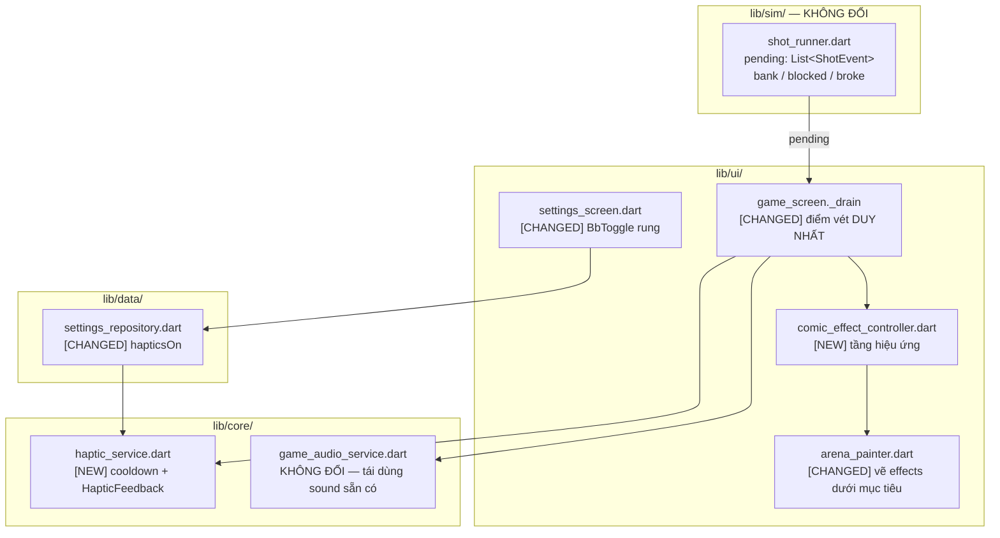
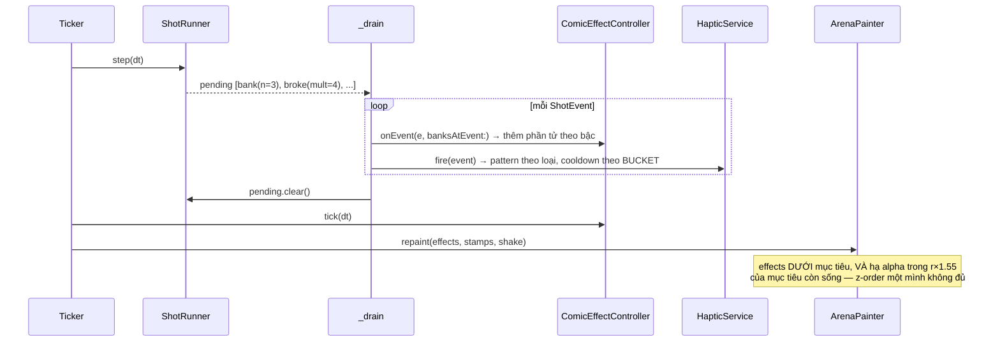

# Design: Phản hồi cú bắn

## Overview

| Review item | Summary |
| --- | --- |
| **Goal and approach** | Làm cú bắn *cảm* được qua hai kênh xuất của **một** dòng sự kiện. Điểm móc đã tồn tại: `game_screen._drain` (`game_screen.dart:143-171`) vét `runner.pending` một lần mỗi tick và đã xử `bank`/`blocked`/`broke`. Unit này thêm hai consumer vào đúng chỗ đó — `ComicEffectController` (hình) và `HapticService` (rung) — chứ không dựng đường phát hiện va chạm thứ hai. |
| **In scope** | Thang cường độ đơn điệu theo số lần dội; cường độ phá mục tiêu theo hệ số BỪA; hiệu ứng kết màn; rung 4 mốc sự kiện với cooldown hai tầng (`levelEnd` miễn); công tắc rung trong Cài đặt; bảo vệ tín hiệu `armed` như điều kiện chấp nhận. **Rung màn giữ nguyên** — chỉ `broke`, không mở sang `bank`. |
| **Out of scope** | Đổi điểm/sao/`kMaxBanks`/`kMinAimUp`/`kMaxMultiplier`; asset ảnh hoặc âm thanh mới; Flame game loop; sửa khoảng trống accessibility A1–A8; nhân vật có tên (Unit 3); gợi ý/bỏ qua màn (Unit 1). |

## Open Questions

| # | Question | Blocking? | Working assumption |
| --- | --- | --- | --- |
| Q1 | Hình thức thị giác cụ thể của tầng hiệu ứng là gì? | **Đã chốt** | **Chùm vạch va đập** — các đoạn thẳng ngắn toả ra từ điểm va chạm, mờ dần theo tuổi. Màu `frame`, không asset mới, không hạt, không chữ mới, **không** đụng tới rung màn. `uiux-guideline.md` G1 và requirements A-open đều giao việc này cho Phase 2 — hoãn tiếp là để hai AC không có biên chấp nhận và `kMaxEffectElements` không quyết được. Chốt luôn, kèm bảng giá trị cụ thể ở § `comic_effect_controller`. |
| Q2 | Rung có cần thêm package? | Không | Không. `HapticFeedback` của `flutter/services.dart` là built-in. **Nhưng** bốn pattern có thật sự cho bốn cảm giác phân biệt được hay không thì phụ thuộc thiết bị và OS — đã chuyển sang § Điều kiện chưa kiểm, không còn là "đã trả lời chắc". |
| Q3 | Cooldown 60ms áp cho **toàn bộ** rung hay theo từng loại? | **Đã chốt** | **Theo bucket.** Ba sự kiện gameplay dùng chung 60ms; `levelEnd` được **miễn**. Một cooldown chung cho tất cả sẽ **bỏ mất** rung kết màn — xem lý lẽ ở § `haptic_service`. |
| Q5 | Thiết bị tham chiếu cho mốc 60fps của AC US-3/3.1? | **Đã chốt** | **Android 11+, 4 lõi A53-class, 3 GB RAM** (ví dụ Samsung Galaxy A12). `system-architecture.md` §5.5 xác nhận dự án chưa khai sàn thiết bị/OS nào, nên phải chọn chứ không suy ra được. Máy ảo x86_64 API 35 **không** thay thế được — nó chạy trên CPU desktop. AC này chỉ đóng được sau khi có APK và có máy thật. |
| Q4 | Reduced-motion có tắt luôn rung? | Không | **Không.** `disableAnimationsOf` là về **hoạt ảnh**, và rung không phải hoạt ảnh — người tắt animation vì say chuyển động vẫn có thể muốn rung. Rung có công tắc **riêng** (US-5). Reduced-motion chỉ gate tầng hình (AC US-3/4.1). |

## Architecture



- **Pattern đang có**: sân đấu là `CustomPainter` + `Ticker`; `_drain` chuyển `ShotEvent` thành `Stamp` và `_shake`; `game_audio_service` có cooldown theo sound với nguồn thời gian **tiêm được**.
- **Delta**: `_drain` phát cho **hai** consumer mới thay vì tự xử tất; `ComicEffectController` giữ danh sách phần tử hiệu ứng có trần; `HapticService` là bản sao pattern cooldown của audio.
- **Ranh giới bị ảnh hưởng**: `lib/sim/` **không đổi một dòng** — cả hai kênh chỉ **đọc** `pending`. `ArenaPainter` nhận một field mới và một draw call, chèn vào hợp đồng z-order.
- **Ràng buộc chịu lực**: tín hiệu `armed` là `[Confirmed]` design law và là "tính năng dễ đọc quan trọng nhất trong game". Hiệu ứng nằm **dưới** lớp mục tiêu là **cần nhưng không đủ** — quầng `armed` là lớp trong suốt, xem § `arena_painter`. Và bật `armed` không được trễ vì hiệu ứng.



## Components and Interfaces

```
lib/
├── core/
│   └── haptic_service.dart              [NEW]      precedent: lib/core/game_audio_service.dart
├── data/
│   └── settings_repository.dart         [CHANGED]  + hapticsOn
├── state/
│   └── providers.dart                   [CHANGED]  + setHaptics, hapticServiceProvider
└── ui/
    ├── comic_effect_controller.dart     [NEW]      No precedent trong repo này (bản ban_bua chưa port, và phải thiết kế lại quanh bank count)
    ├── arena_painter.dart               [CHANGED]  + effects (default const []), + banks cho _paintMultiplier
    └── screens/
        ├── game_screen.dart             [CHANGED]  _drain phát cho hai consumer
        └── settings_screen.dart         [CHANGED]  + BbToggle rung
lib/l10n/
├── app_vi.arb                           [CHANGED]  nhãn công tắc rung
└── app_en.arb                           [CHANGED]  cùng khoá
```

### `lib/ui/comic_effect_controller.dart` [NEW]

```dart
class EffectTier {
  final int level;          // domain-neutral: bank count HOẶC hệ số, tuỳ event kind
  final double duration;
  final int spokeCount;
  final double spokeLength;
  final double spokeWidth;
}

class EffectElement {
  final V2 pos;
  final EffectTier tier;
  double age;
}

class ComicEffectController {
  List<EffectElement> get elements;
  bool get isNotEmpty;
  void onEvent(ShotEvent e, {required int banksAtEvent});
  void tick(double dt);
  void endShot(ShotEndReason reason);
  void clear();
}
```

**Hình thức thị giác đã chốt** (giải quyết Q1 bằng cách chọn, không bằng cách hoãn): **chùm vạch va đập** — `spokeCount` đoạn thẳng ngắn toả ra từ điểm va chạm, dài `spokeLength`, dày `spokeWidth`, mờ dần theo tuổi. Màu `frame`. Không hạt, không chữ mới, không asset mới (D1). Đây đúng là từ vựng "hiệu ứng truyện tranh" mà unit được đặt tên theo.

> **Vì sao vạch toả, không phải vòng tròn.** Bản trước chọn một **vòng xung kích** — đường tròn viền nở ra. Đó là **cùng primitive, cùng hue, dải bán kính chồng nhau** với chính tín hiệu `armed`: vòng viền `armed` là đường tròn viền ở `r × 1.24` ≈ 5.7u dày `fit.u(0.5)` (`arena_painter.dart:236-239`), còn vòng xung kích chạy 3.0–9.5u. Trên một mục tiêu vàng (`frame` **cũng là** `targets[2]`, `uiux-guideline.md:138`), mắt sẽ thấy hai đường tròn vàng đồng tâm. Ràng buộc hạ alpha trong `r × 1.55` chặn được **chồng lấn** nhưng không chặn được **kề cận**: một lần dội vào tường cách mục tiêu armed 10u sinh một vòng vàng kết thúc ngay sát ngoài quầng.
>
> Đổi hue không giải quyết được: `deflector` là màu **bề mặt dội thật** (đúng sai lầm đã bị loại ở Unit 1), `cream` là vật liệu bóng và là đường gợi ý của Unit 1, `danger` là vạch đáy và tem "Bắn thẳng à?". Không hue nào trống. **Đổi primitive** thì hue thôi trở thành mắt xích chịu lực — vạch thẳng toả ra không lẫn được với đường tròn, dù cùng màu vàng.

`EffectTier` bỏ `textScale` và `shakeBoost` của các bản trước: `textScale` không có đường nối nào tới `_paintMultiplier`, còn `shakeBoost` xem ghi chú dưới.

> **Vì sao bỏ `shakeBoost`.** Bản trước cho `EffectTier` một mức tăng biên độ rung màn. `_shake` hiện **chỉ** được đặt khi `broke` (`game_screen.dart:166`), và `uiux-guideline.md` A6 ghi đúng chữ: "`_shake` chạy vô điều kiện khi phá mục tiêu" — tức nó là đường **chưa được gate** reduced-motion. Cho `bank` events nuôi nó nghĩa là rung màn sẽ nổ ở **phần lớn** lần dội tường thay vì chỉ khi phá mục tiêu, tức làm **tệ hơn** đúng cái đường A6 đã chỉ ra — trái ràng buộc C7 ("không được làm nó tệ hơn"). Thêm nữa `_shake` là một scalar đơn được đặt `= 1` rồi giảm dần, nên "boost" không có phép hợp thành xác định và có thể vượt trần biên độ mà AC US-2/2.1 **đóng băng**. Chùm vạch tự nó đã tải được thang leo; bỏ `shakeBoost` xoá một lúc: hồi quy reduced-motion, xung đột với hành vi bị đóng băng, và một phép hợp thành không định nghĩa. **Rung màn giữ nguyên: chỉ `broke`, đúng như hôm nay.**

**Một input duy nhất cho mỗi loại sự kiện** — `banksAtEvent` là nguồn có thẩm quyền, `e.bankCount` chỉ dùng để đối chiếu:

| `ShotEventKind` | `EffectTier.level` lấy từ | Lý do |
| --- | --- | --- |
| `bank` | `banksAtEvent` (= `e.bankCount`) | Thang leo theo số lần dội |
| `broke` | **hệ số BỪA lúc phá** = `min(1 + banksAtEvent, kMaxMultiplier)` | AC US-2/1.1 |
| `blocked` | `banksAtEvent` | `e.bankCount` **luôn là 0** trên event này (`shot_runner.dart:210` không truyền nó), nên đọc `e.bankCount` sẽ luôn ra bậc "không phát" |

`level` được đặt tên trung tính vì hai miền khác nhau đi qua nó: số lần dội `0..5` cho `bank`/`blocked`, hệ số `1..6` cho `broke`.

> **Thang `broke` chốt ở ×5, không ×6.** Hệ số ×6 đòi `banks == 5`, mà `banks` đạt 5 là bi chết ở cuối cùng `_advance` đó (`shot_runner.dart:140-142`); `_resolveTargets` chạy **trước** kiểm tra ấy (`:136`), nên một cú phá ở ×6 đòi va tường **và** va mục tiêu trong **cùng một substep 1/480s**. Trần thực tế của một cú phá là ×5. Requirements nói "cú ×6 khó nhất game" — đúng về mặt điểm, nhưng ×6 là ca hiếm chứ không phải bậc thường; nó dùng lại bậc ×5.

**Thang cường độ — giá trị cụ thể** (AC US-1/1.5, US-3/3.5). Miền là `0..kMaxBanks` **bao gồm cả hai đầu**:

| `level` | duration (s) | spokeCount | spokeLength (u) | spokeWidth (u) | Ghi chú |
| --- | --- | --- | --- | --- | --- |
| 0 | — | — | — | — | **Không phát.** AC US-1/2.2 — hệ số không hiện ở ×1 |
| 1 | 0.18 | 3 | 2.0 | 0.30 | |
| 2 | 0.24 | 4 | 3.0 | 0.40 | |
| 3 | 0.30 | 5 | 4.0 | 0.50 | |
| **4** = `kMaxBanks - 1` | **0.44** | **8** | **6.5** | **0.80** | **Bậc đỉnh** — bước nhảy lớn hơn hẳn ba bước trước (AC US-1/1.3) |
| 5 = `kMaxBanks` | 0.44 | 8 | 6.5 | 0.80 | **Bậc chết.** Dùng lại đúng bậc 4, không leo thêm |

Đơn điệu tăng qua `level` 1→4 ở **mọi** tham số. Bước 3→4 lớn hơn bước 2→3 ở cả bốn tham số, nên "rõ rệt hơn hẳn" là thứ **đo được**, không phải cảm nhận.

> **Vì sao có bậc 5, và vì sao lý lẽ `kMaxBanks - 1` của bản trước sai**: `_resolveSegments` emit `ShotEvent(bank, bankCount: banks)` ở `shot_runner.dart:170` **trước**, rồi `_advance` mới kiểm `banks >= kMaxBanks` để giết bi ở `:140`. `_onTick` gọi `_drain` ngay sau `step()` trong **cùng** tick (`game_screen.dart:118-121`), nên một sự kiện `bank` với `bankCount == 5` **có** tới `_drain` — và nó tới ở **mọi** cú bắn hết ngân sách dội, tức ca thường gặp. Bản trước của design viện PDR §8.3 để đặt miền `0..kMaxBanks-1`; §8.3 bó **`requiredBanks`** (mục tiêu có phá được không), **không** bó dòng sự kiện. Bậc 4 vẫn là **bậc đỉnh** vì đó là ngưỡng mọi mục tiêu đều phá được (AC US-1/1.3); bậc 5 chỉ là lần dội cuối trùng với lúc cú bắn kết thúc, nên nó **dùng lại** bậc 4 chứ không thưởng thêm.

**Trần phần tử**: `kMaxEffectElements = 24`. Suy luận: **chỉ một cú bắn bay tại một thời điểm** — `_fire` return sớm khi `_runner != null` (`game_screen.dart:203-207`) — nên ca đồng thời xấu nhất là một cú ở màn 20: 5 lần dội + 6 mục tiêu vỡ ≈ **11** phần tử trong cửa sổ 0.44s. 24 là dư gấp đôi. Vượt trần thì loại phần tử **cũ nhất**.

**Reduced-motion** (AC US-3/4.1): đọc `MediaQuery.disableAnimationsOf(context)` trong `game_screen.build`, truyền xuống `ComicEffectController`. Ngữ nghĩa gate là **chặn sinh phần tử trong `onEvent`** — không phải zero tham số `EffectTier`, không phải bỏ draw call. Chặn ở nguồn nghĩa là danh sách rỗng, `dirty` không bị kích, và không có phần tử nào tồn tại để rò qua đường khác. `_shake` **không** nằm trong phạm vi gate này vì unit này không mở rộng nó (xem ghi chú `shakeBoost`); khoảng trống A6 vẫn là việc riêng, chưa được duyệt.

### `lib/core/haptic_service.dart` [NEW]

```dart
enum HapticEvent { bank, targetBroken, blockedShot, levelEnd }

class HapticService {
  HapticService({required bool enabled, DateTime Function()? now});
  void setEnabled(bool value);
  void fire(HapticEvent event);
}
```

`fire` map từng `HapticEvent` sang một pattern `HapticFeedback` **khác nhau** (AC US-4/1.1-1.4): `bank` → `selectionClick`, `blockedShot` → `mediumImpact`, `targetBroken` → `heavyImpact`, `levelEnd` → `vibrate`.

**Cooldown hai tầng** — `HapticEvent → bucketId`, rồi dấu thời gian **theo bucket**:

```dart
static const Map<HapticEvent, int> _bucket = { bank: 0, blockedShot: 0, targetBroken: 0, levelEnd: 1 };
static const Map<int, Duration> _cooldown = { 0: Duration(milliseconds: 60), 1: Duration.zero };
final Map<int, DateTime> _lastFired = {};   // theo BUCKET, không theo event
```

| Bucket | Sự kiện | Cooldown |
| --- | --- | --- |
| 0 | `bank`, `blockedShot`, `targetBroken` | **60ms dùng chung** — ba sự kiện chia **một** cửa sổ |
| 1 | `levelEnd` | **0**, miễn cooldown |

> **Vì sao không phải `Map<HapticEvent, Duration>` như audio.** `game_audio_service.dart:85-96` là cooldown **theo từng key**, tra bằng `_lastStarted[sound]` (`:98`). Cài theo hình dạng đó thì `bank`, `blockedShot` và `targetBroken` mỗi cái có **timer 60ms riêng** — đúng thiết kế per-event mà Q3 đã loại, và nó mở lại ca xấu nhất ban đầu: một lần dội, một lần bắn thẳng bị chặn và một lần phá mục tiêu đều có thể nổ trong cùng một substep. Bản trước của design nói prose là "dùng chung" nhưng ghi type là per-key; hai thứ đó **không khớp**, và implementer sẽ build theo type.

> **Vì sao `levelEnd` phải được miễn — bản trước của design làm mất chính rung mà AC US-4/1.4 đòi.** Chuỗi thắng màn: `_drain` phát `targetBroken` cho cú `broke` cuối; bi **vẫn còn sống**, nên `_finishShot` → `_onWin` chạy ở một tick **sau**, thường cách 16ms. 16ms < 60ms ⇒ `levelEnd` bị **bỏ**. Tệ hơn, nó **không tất định**: phụ thuộc bi còn bay bao lâu sau khi xuyên qua mục tiêu cuối, nên bug này sẽ lúc có lúc không. `game_audio_service` cho `win`/`lose` một bucket 500ms **riêng** đúng vì lý do này — kết quả cuối màn không được bị tiếng ồn gameplay che.

**Nuốt lỗi phải là async.** `HapticFeedback.*` trả `Future<void>`, nên `try`/`catch` đồng bộ quanh nó **không bắt được gì** — trên máy không có bộ rung, Future bị reject thành unhandled async error thay vì no-op im lặng, và AC US-4/3.1 sai đúng ở chỗ nó cần đúng. `fire` là `void` nên hình dạng bắt buộc là:

```dart
unawaited(HapticFeedback.selectionClick().catchError((_) {}));
```

`now` tiêm được, đúng pattern `game_audio_service.dart:47` — đó là thứ khiến cooldown **test được không cần thiết bị** (AC US-4/2.2).

### `lib/data/settings_repository.dart` [CHANGED]

```dart
class AppSettings {
  final bool soundOn;
  final bool musicOn;
  final String localeCode;
  final bool hapticsOn;    // new, default true

  AppSettings copyWith({bool? soundOn, bool? musicOn, String? localeCode, bool? hapticsOn});  // changed
}
```

`load()` đọc `_prefs.getBool('hapticsOn') ?? true` — cùng hình dạng ba khoá đang có, nên **tương thích ngược sẵn**, không cần migration (ràng buộc C5).

### `lib/state/providers.dart` [CHANGED]

```dart
class SettingsController extends StateNotifier<AppSettings> {
  void setHaptics(bool value);   // new
}

final hapticServiceProvider = Provider<HapticService>((ref) { /* ... */ });   // new
```

`hapticServiceProvider` theo **đúng** khuôn `gameAudioProvider` (`providers.dart:83-96`): đọc `settingsProvider` **một lần** bằng `ref.read`, rồi `ref.listen` để đồng bộ. Cố ý **không** `ref.watch` — watch sẽ dựng lại service mỗi lần người chơi lật công tắc.

### `lib/ui/arena_painter.dart` [CHANGED]

```dart
class ArenaPainter extends CustomPainter {
  final List<EffectElement> effects;   // new
}
```

**Vị trí z-order** — hợp đồng hiện tại của `paint()` giữ **nguyên**:

```
nền → (rung) → khung → khối chắn → vạch chéo → vệt ma → [HIỆU ỨNG] → vệt bay
    → mục tiêu → preview ngắm → súng → bóng → hệ số → tem
```

Thứ tự **dứt khoát**, không điều kiện — Unit 1 đi trước và đã architect-pass:

```
... → vệt ma → [GỢI Ý (Unit 1)] → [HIỆU ỨNG (Unit 2)] → vệt bay → mục tiêu → ...
```

Hiệu ứng **phủ vùng sân** nằm dưới lớp mục tiêu (AC US-3/1.3, 1.4). Các lớp **chữ** sẵn có — hệ số và tem — giữ đúng vị trí hiện tại **trên** mục tiêu.

**`effects` mặc định `const []`** trong constructor `ArenaPainter`, để golden test của Unit 1 **không phải sửa** — ảnh sinh ra byte-identical khi danh sách rỗng.

**Kiểm hue hai chiều.** (1) **Không dùng `cream`** — Unit 1 dựng lập luận phân biệt đường gợi ý trên việc "cream đứt nét + quầng" là tổ hợp chưa lớp nào dùng. (2) `frame` **trùng hue** với vòng viền `armed`, chip số dội, hệ số và `targets[2]` — nhưng chùm vạch là **primitive khác hẳn** (đoạn thẳng toả, không phải đường tròn), nên hue không còn là kênh chịu lực. Đây là kiểm mà bản trước bỏ sót: nó kiểm `frame` với Unit 1 nhưng không kiểm với vòng `armed`.

> ### Z-order KHÔNG bảo vệ được tín hiệu `armed` — đây là chỗ bản trước của design sai
>
> Quầng `armed` là một lớp **trong suốt**: `arena_painter.dart:232` vẽ `base` ở alpha **`0x28`** trên bán kính `r × 1.55`, và `:236-239` vẽ vòng viền `0x96`. Alpha-compositing nghĩa là thứ vẽ **bên dưới** vẫn hiện lên qua nó ở ~84%. Nên vẽ hiệu ứng dưới lớp mục tiêu chỉ chặn được việc **che** thân và mặt mục tiêu (AC US-3/1.3 — thoả), **không** bảo vệ được **tính đọc được** của quầng (AC US-3/1.1 — "nhìn thấy rõ **kể cả khi hiệu ứng đang phát ở cùng vùng**").
>
> **Ràng buộc dương bù vào**: `ComicEffectController.onEvent` SHALL **không** sinh phần tử có tâm nằm trong `r × 1.55` của một mục tiêu **còn sống**; và khi một vạch toả **cắt qua** vùng đó, phần đoạn nằm trong bán kính ấy SHALL bị hạ alpha xuống dưới `0x28`. Golden test phải có một case **cố ý** đặt hiệu ứng chồng lên một mục tiêu `armed` — không có case đó thì AC US-3/1.1 không được kiểm.

### `lib/ui/screens/game_screen.dart` [CHANGED]

`_drain` (`game_screen.dart:143-171`) giữ nguyên vai trò **điểm vét duy nhất**, thêm hai lời gọi cho mỗi sự kiện:

| `ShotEventKind` | Đang làm | Thêm |
| --- | --- | --- |
| `bank` | `Stamp` mốc dội, `×N` mỗi 3 lần | `effects.onEvent`, `haptics.fire(bank)` |
| `blocked` | `Stamp` "Bắn thẳng à?" màu `danger` | `effects.onEvent`, `haptics.fire(blockedShot)` |
| `broke` | `_shake = 1`, `Stamp` `+điểm` | `effects.onEvent` theo hệ số, `haptics.fire(targetBroken)` |
| kết màn | `_onWin` / hết lượt | `effects` hiệu ứng kết màn, `haptics.fire(levelEnd)` |

**`endShot` phải nhận `ShotEndReason`** — enum này **đã tồn tại** (`shot_runner.dart:4-13`: `exitedBottom` / `banksExhausted` / `timeout`) và `system-architecture.md` §4.2 gọi `endReason` là discriminator đã được kiến trúc hoá:

```dart
effects.endShot(runner.endReason);   // câu lệnh ĐẦU TIÊN của _finishShot (game_screen.dart:173-191)
```

Phải là câu lệnh **đầu tiên**: `_finishShot` tự tính `remaining` và gọi `_onWin` trong thân nó, nên thứ tự "hiệu ứng kết màn phát sau `endShot` và không bị nó dọn" chỉ đúng khi `endShot` chạy trước.

| `endReason` | Hành vi |
| --- | --- |
| `exitedBottom` | Dọn sạch phần tử đang sống, **không** ăn mừng, **không** rung phá mục tiêu (AC US-1/2.3, US-4/2.4) |
| `banksExhausted` | Để phần tử đang sống chạy hết tuổi — cú bắn hết ngân sách dội vẫn có thể đã phá được mục tiêu |
| `timeout` | Như `banksExhausted` |

> **Vì sao cần discriminator**: `_finishShot` chạy khi **bất kỳ** kiểu chết nào xảy ra. Bản trước của design chỉ có `endShot()` không tham số và nói nó nghĩa là "không hiệu ứng ăn mừng" — gọi ở chỗ duy nhất có thể là `_finishShot` thì nó sẽ **xoá luôn** hiệu ứng của cú thắng, mâu thuẫn trực tiếp AC US-2/1.3 (hiệu ứng kết màn riêng biệt). AC US-1/2.3 chỉ bó việc chặn ăn mừng cho **bi rơi đáy sân**, không cho mọi kiểu chết. Hiệu ứng kết màn phát từ `_onWin`, **sau** `endShot`, và không bị nó dọn.

**`_onTick` và cờ `dirty`** — `system-architecture.md` §4.5 gọi `dirty` là cơ chế NFR chịu lực, và bản trước của design bỏ sót nó:

- Thêm `effects.tick(dt)` vào `_onTick`.
- Thêm `effects.isNotEmpty` vào điều kiện `dirty`.

Không có hai dòng này thì hiệu ứng **đóng băng giữa animation**: hiệu ứng kết màn phát sau khi `_runner = null` (`game_screen.dart:176`), và khi tem cuối hết tuổi ở 1.1s màn hình ngừng repaint trong lúc phần tử hiệu ứng vẫn còn sống.

**`clear()` gọi từ `_load()`** (`game_screen.dart:87-101`) — cùng chỗ `_stamps.clear()`, `_shake = 0`, `_ghost` đang được reset. Đây là chỗ hiệu ứng cũ sống sót qua lần đổi màn nếu bỏ sót.

**`hapticServiceProvider` phải được capture trong `initState`** cạnh `_audio` (`game_screen.dart:70`) — comment ở `:41-44` giải thích đọc provider từ `dispose()` là không an toàn. `ref.read` lười bên trong `_drain` sẽ đăng ký `ref.listen` muộn.

Không phát rung khi đang kéo ngắm (AC US-4/2.5) — thoả **do cấu trúc**: preview ngắm dùng một `ShotRunner` probe riêng (`shot_runner.dart:251-258`) mà `_drain` không đọc, nên không sự kiện nào của nó đi vào kênh rung. Cũng vì lý do đó, móc rung ở tầng sim sẽ phát ~60 lần/giây trong lúc ngắm và phá AC này ngay — đó là lập luận **ủng hộ** fan-out ở tầng UI.

**AC US-1/1.2 — hệ số BỪA rõ dần** có chủ riêng, không đi qua `EffectTier`: `arena_painter.dart` `_paintMultiplier` (`:407-417`, hiện cố định `fit.u(11)` alpha `0x59`) nhận thêm tham số `banks` và tăng cỡ chữ theo bậc. Phần tử hiệu ứng vẽ **dưới** mục tiêu còn hệ số vẽ **trên**, nên hai thứ này là hai đường code khác nhau — bản trước của design để `textScale` trong `EffectTier` mà không có đường nối nào tới `_paintMultiplier`, tức AC US-1/1.2 không có chủ.

## UI Design Specification

Ràng buộc UI đi từ `uiux-guideline.md` và hình tổng hợp trong
`Cu_Doi_UI_UX_Design_Spec.docx`:

- Công tắc rung đặt cùng panel `panelNavy` với Âm thanh và Nhạc nền, phát
  `Semantics.toggled`. Track on/off phải khớp theme tối mới và có tín hiệu vị trí/
  icon ngoài màu; không giữ `bbTeal` chỉ vì đó là màu code cũ.
- Tầng hiệu ứng dùng `trajectoryCyan` cho spark/ring/trail, `primaryGold` cho
  multiplier/score emphasis, `dangerRed` cho blocked/fail và token target hiện có;
  không hex thô.
- Tín hiệu `armed` (glow + outline + đổi biểu cảm) luôn nằm trên comic effect.
- Multiplier là capsule dọc bên phải, `×1…×6`, punch 120–200ms khi tăng; không
  dùng chữ mờ giữa sân làm nguồn thông tin duy nhất.
- Âm thanh: chỉ `wallImpact` và `comicImpact` đã có; đi qua cooldown của `game_audio_service`, không dựng đường phát âm riêng (AC US-1/3.2).

- Hàng công tắc rung đặt **sau Nhạc nền, trước Ngôn ngữ** trong cùng panel settings
  (AC US-5/1.1).

**Chuỗi ARB mới**: **một** khoá `hapticsLabel`, dùng cho **cả** nhãn nhìn thấy và `semanticLabel`. Đúng quy ước đang có (`soundLabel`, `musicLabel`, `languageLabel`) và đúng cách mọi `BbToggle` hiện tại đang làm — `settings_screen.dart:59-61` và `:67-69` truyền **cùng** một chuỗi cho hai chỗ. Bản trước của design đề xuất thêm khoá `*Semantics` riêng; nó không có tiền lệ nào trong repo và trái AC US-5/2.2 ("theo đúng hợp đồng `BbToggle` hiện tại").

## Data Models

| Field | Vị trí | New/Changed | Đọc từ save cũ |
| --- | --- | --- | --- |
| `hapticsOn` | `AppSettings` / khoá `hapticsOn` | **new** | `getBool('hapticsOn') ?? true` → AC US-5/1.2, 2.1 |
| `soundOn`, `musicOn`, `localeCode` | `AppSettings` | không đổi | đã có |

`SettingsRepository.save()` (`settings_repository.dart:33-37`) **cũng phải ghi** `hapticsOn` — bảng trên chỉ mô tả đường **đọc**, và bỏ sót đường ghi là cách AC US-5/1.3 ("lưu lựa chọn") và 1.4 (khôi phục khi mở lại) im lặng thất bại.

`PlayerProgress` **không đổi** — unit này không ghi tiến trình.

## Error Handling

| Scenario | Handling |
| --- | --- |
| Thiết bị không có bộ rung / không cho phép | `HapticFeedback` trả Future bị reject → `unawaited(... .catchError((_) {}))`. `try`/`catch` **đồng bộ** không bắt được gì (AC US-4/3.1) |
| Cú `broke` cuối rồi kết màn 1 tick sau | `levelEnd` **miễn** cooldown nên vẫn phát — 16ms < 60ms sẽ bỏ mất nó nếu dùng cooldown chung (AC US-4/1.4) |
| Hiệu ứng nằm trong `r × 1.55` của mục tiêu còn sống | Không sinh phần tử ở đó; đoạn vạch cắt qua vùng đó bị hạ alpha dưới `0x28` — quầng `armed` là lớp **trong suốt** nên z-order một mình không bảo vệ nó (AC US-3/1.1) |
| Bi chết vì `banksExhausted` / `timeout` | Để phần tử đang sống chạy hết tuổi — cú đó vẫn có thể đã phá được mục tiêu (khác `exitedBottom`) |
| Phần tử hiệu ứng còn sống sau khi tem cuối hết tuổi | `dirty` gồm `effects.isNotEmpty` nên màn hình vẫn repaint; thiếu điều này là hiệu ứng **đóng băng giữa animation** |
| Người chơi tắt rung | `HapticService.enabled == false` → `fire` return ngay (AC US-4/3.2) |
| Nhiều va chạm trong 60ms | Rung sau bị bỏ; ba sự kiện gameplay chia **một** cửa sổ bucket 0 (AC US-4/2.1) |
| Bi rơi khỏi đáy sân | `endShot(exitedBottom)` — dọn phần tử đang sống, không ăn mừng, không rung phá mục tiêu (AC US-1/2.3, US-4/2.4) |
| Đang kéo để ngắm | Không phát rung (AC US-4/2.5) |
| Cú bắn mới khi hiệu ứng cũ còn dở | Hiệu ứng cũ bị kết thúc/nhường; cú bắn mới **không** bị hoãn (AC US-3/2.2) |
| Cú bắn chưa dội lần nào | Không hiện chỉ số hệ số (AC US-1/2.2) |
| Bi dội vào **mục tiêu** chưa đủ điều kiện | Không tăng bậc cường độ — dội mục tiêu không tính công dội (AC US-1/2.1, PDR §8.4) |
| Số phần tử hiệu ứng vượt trần | Loại phần tử **cũ nhất**; danh sách không vượt `kMaxEffectElements` (AC US-3/3.5) |
| Reduced-motion bật | Tầng hình gate bằng `disableAnimationsOf`; chip số dội và HUD **vẫn** truyền đạt số dội và hệ số (AC US-3/4.1, 4.4). Rung **không** bị gate (Q4) |
| Không đọc được `hapticsOn` đã lưu | Mặc định **bật**, màn Cài đặt không hỏng (AC US-5/1.5) |

## Testing Strategy

| Test level | What to verify |
| --- | --- |
| Unit — `ComicEffectController` | Thang **đơn điệu tăng** qua `level` 1..4 ở **mọi** tham số; bước 3→4 lớn hơn bước 2→3; `level == 0` không phát; `level == 5` (bậc chết) dùng lại đúng bậc 4 và **không** leo thêm; `broke` lấy cường độ theo hệ số lúc phá, trần ×5; nhiều `broke` liên tiếp **cộng dồn**, không xoá nhau; `endShot(exitedBottom)` dọn sạch **nhưng** `endShot(banksExhausted)` để phần tử chạy hết tuổi; `blocked` lấy `banksAtEvent` **không** `e.bankCount` (vốn luôn 0); trần 24 phần tử |
| Unit — `HapticService` | Bốn `HapticEvent` cho bốn pattern **khác nhau**; cooldown 60ms kiểm bằng `now` **tiêm được** (không cần thiết bị); **`levelEnd` phát được ngay sau `targetBroken` cách 16ms** — đây là test bắt được lỗi cooldown chung; `enabled == false` ⇒ không phát; Future bị reject ⇒ không có unhandled async error |
| Widget — `dirty` flag | Hiệu ứng còn sống sau khi tem cuối hết tuổi ⇒ màn hình **vẫn** repaint; `_load()` ⇒ `clear()` được gọi, không còn phần tử của màn cũ |
| Widget — reduced-motion | `disableAnimationsOf == true` ⇒ `onEvent` **không sinh** phần tử nào (danh sách rỗng, `dirty` không bị kích); chip số dội và hệ số trên HUD **vẫn** hiện đúng số dội (AC US-3/4.1, 4.4) |
| Unit — rung màn không hồi quy | `_shake` chỉ được đặt bởi `broke`, **không** bởi `bank` — chốt chống việc mở rộng nó (ràng buộc C7, khoảng trống A6) |
| Unit — `AppSettings` | `hapticsOn` mặc định `true`; save cũ không có khoá ⇒ `true`; `copyWith` giữ ba field kia |
| Golden — `ArenaPainter` | Hiệu ứng vẽ **dưới** mục tiêu; mục tiêu `armed` (quầng + biểu cảm hoảng + chip) **nhìn rõ** khi hiệu ứng phủ cùng vùng; tem `Bắn thẳng à?` giữ màu `danger` |
| Widget — `settings_screen` | Công tắc rung cùng nhóm Âm thanh/Nhạc nền; lật ⇒ áp ngay và lưu; mở lại ⇒ khôi phục; `Semantics.toggled` đúng |
| Widget — `game_screen` | Bắn khi hiệu ứng đang chạy **không** bị hoãn; kéo ngắm không bị chặn; `armed` bật đúng tick đạt `requiredBanks`, không trễ vì hiệu ứng |
| Ranh giới | `lib/sim/` **không** import Flutter; `kMaxBanks`/`kMinAimUp`/`kMaxMultiplier` **không đổi giá trị** (test khoá hằng số) |
| Không đo được bằng test | 60fps ở màn 20 và cooldown 60ms có "đúng cảm giác" — cần thiết bị, xem § Điều kiện chưa kiểm |

## Design Decisions

| Decision | Choice | Alternative rejected | Why (one line) |
| --- | --- | --- | --- |
| Điểm móc sự kiện | Mở rộng `_drain` sẵn có thành fan-out hai consumer | Mỗi kênh tự phát hiện va chạm; hoặc móc ở tầng sim | Hai đường phát hiện là hai nguồn sự thật và bất biến `armed` bị kiểm hai lần độc lập. Móc ở tầng sim còn phát ~60 lần/giây trong lúc ngắm (preview dùng runner probe riêng) và phá AC US-4/2.5 ngay |
| Hình thức thị giác | **Chùm vạch va đập** toả từ điểm va chạm, màu `frame` | Vòng xung kích (đường tròn viền); hoặc hoãn sang Phase 4 | Đường tròn là **cùng primitive, cùng hue, dải bán kính chồng** với vòng `armed` ở `r × 1.24` — trên mục tiêu vàng thành hai đường tròn vàng đồng tâm. Hoãn thì hai AC không có biên chấp nhận và `kMaxEffectElements` không quyết được |
| Miền thang cường độ | `0 .. kMaxBanks` **bao gồm cả hai đầu**, bậc đỉnh ở `kMaxBanks - 1`, bậc 5 dùng lại bậc 4 | `0 .. kMaxBanks - 1` | `shot_runner.dart:170` emit `bank` với `bankCount == 5` **trước** khi `:140` giết bi, và `_drain` chạy cùng tick — nên bậc 5 **có** xảy ra, ở mọi cú hết ngân sách dội. PDR §8.3 bó `requiredBanks`, **không** bó dòng sự kiện |
| Rung màn | **Giữ nguyên**: chỉ `broke`, không thêm boost từ `bank` | `EffectTier.shakeBoost` nuôi từ `bank` events | `_shake` là đường **chưa gate** reduced-motion (`uiux-guideline.md` A6); cho `bank` nuôi nó là làm tệ hơn đúng đường đó, trái ràng buộc C7. Và "boost" trên một scalar giảm dần không có phép hợp thành xác định, có thể vượt trần mà AC US-2/2.1 đóng băng |
| Cấu trúc cooldown rung | **Hai tầng**: `HapticEvent → bucketId` + dấu thời gian theo bucket. Ba sự kiện gameplay chia **một** cửa sổ 60ms; `levelEnd` miễn | `Map<HapticEvent, Duration>` như audio; hoặc một cooldown chung cho cả bốn | Per-key như audio cho mỗi sự kiện một timer riêng — mở lại ca ba rung trong một substep. Cooldown chung cho cả bốn thì **bỏ mất** `levelEnd` (16ms < 60ms sau cú `broke` cuối) |
| Nguồn thời gian cooldown | Tiêm `DateTime Function()` | `DateTime.now()` trực tiếp | Đúng pattern `game_audio_service.dart:47`; đây là thứ biến cooldown thành test được không cần thiết bị |
| Dependency rung | `HapticFeedback` built-in | Thêm package haptics | Built-in đủ cho 4 mốc và không tốn dependency. Bốn pattern có **thật sự** cho bốn cảm giác phân biệt được thì **chưa kiểm** — xem § Điều kiện chưa kiểm |
| Nuốt lỗi rung | `unawaited(... .catchError(...))` | `try`/`catch` đồng bộ | `HapticFeedback.*` trả `Future<void>`; catch đồng bộ quanh nó **không bắt được gì**, và `fire` là `void` nên Future bị reject thành unhandled async error |
| Discriminator kết thúc cú bắn | `endShot(ShotEndReason)` | `endShot()` không tham số | `_finishShot` chạy khi **bất kỳ** kiểu chết nào; không có discriminator thì nó xoá luôn hiệu ứng của cú thắng, mâu thuẫn AC US-2/1.3 |
| Provider rung | `ref.read` + `ref.listen`, capture trong `initState` | `ref.watch(settingsProvider)` | Giữ **nhất quán** với `gameAudioProvider`. Lưu ý: lý do gốc ở `providers.dart:78-82` là tránh phá **player pool** của audio — `HapticService` chỉ giữ một timestamp nên rebuild không tốn gì; đây là nhất quán, không phải cùng một lý do |
| Reduced-motion và rung | Chỉ gate tầng **hình** | Gate cả rung | Rung không phải hoạt ảnh; người tắt animation vì say chuyển động vẫn có thể muốn rung, và rung đã có công tắc riêng |
| Tương phản hệ số | Nghĩa vụ **không hồi quy** + đo-và-ghi | Đặt mốc 3:1 | Hệ số **đang** ở 2.45:1, dưới cả ngưỡng chữ lớn — "không xuống dưới 3:1" là tiêu chí không thể sai cũng không thể đúng; và làm chữ to hơn không đổi tương phản chút nào |

## Điều kiện chưa kiểm

| Hạng mục | Trạng thái |
| --- | --- |
| **Chưa chạy trên thiết bị lần nào** | Build APK chưa qua được bước đóng gói (cache Gradle hỏng, xem ghi chú Unit 1). `flutter analyze` sạch và `flutter test` 16/16 là **phân tích tĩnh + test host**, không phải xác minh trên máy |
| 60fps ở màn 20, không khung vượt 16ms | **Chưa đo, và không đóng được trong môi trường này.** Thiết bị tham chiếu đã chốt ở Q5 (Android 11+, 4 lõi A53, 3 GB) nhưng chưa có APK và chưa có máy thật. AC US-3/3.1 phải mang sang Phase 4 như một hạng mục xác minh mở, **không** được liệt kê như một ràng buộc design đã thoả |
| Bốn pattern `HapticFeedback` có cho bốn cảm giác phân biệt được? | **Chưa kiểm.** Phụ thuộc thiết bị và OS: `selectionClick` map sang system tick mà người dùng Android có thể tắt trong cài đặt hệ thống, và `light`/`medium`/`heavy` bị nén đáng kể trên actuator máy rẻ. Đây là một cược hợp lý (và đúng hơn là thêm dependency), không phải một sự thật |
| Cooldown rung 60ms | **Chưa tune.** Con số khởi điểm (A6b), không phải giá trị đã đo |
| Trần `kMaxEffectElements = 24` | Giá trị đã chốt theo suy luận một-cú-bắn-một-lúc (~11 phần tử đồng thời), **chưa đo** dưới tải thật |
| `endShot(exitedBottom)` cắt vạch đang toả giữa lúc mờ dần | Đây đúng chữ AC US-1/2.3 đòi ("kết thúc tầng hiệu ứng của cú đó"), nhưng rơi khỏi đáy sân là kiểu chết **thường gặp nhất** — nên phần lớn cú bắn sẽ bị cắt hiệu ứng thay vì để nó mờ hết. Nếu cầm máy thấy khó chịu, "ngừng sinh phần tử mới nhưng để phần tử đang sống mờ hết" **cũng** thoả ý định của AC (ý định là chặn *ăn mừng*, không phải cắt phản hồi đang chạy). Chỉ biết được khi có máy |
| Tương phản chỉ số hệ số sau khi US-1 AC-1.2 làm nó rõ hơn | **Chưa đo.** Nếu đổi alpha thì phải đo lại và ghi số vào đây |
| Thiếu foundation doc | `codebase-summary.md` và `code-standards.md` **không tồn tại**. Vị trí `comic_effect_controller.dart` (ở `lib/ui/` chứ không `lib/state/`) đặt theo suy luận: nó chỉ giữ state trình bày do `Ticker` lái, cùng tầng với `Stamp`/`_shake` đang sống trong `game_screen` |

---

## Next Steps

Once this design is approved, proceed to Phase 3: Implementation Planning.

**What to do next:**
1. Use the slash command: `/aidlc.construction.create-tasks`
2. The agent will automatically read `references/phase-3-tasks.md` for detailed workflow instructions
3. Foundation docs will be referenced for implementation patterns

This will create `tasks.md` with actionable task checklist for code implementation.
